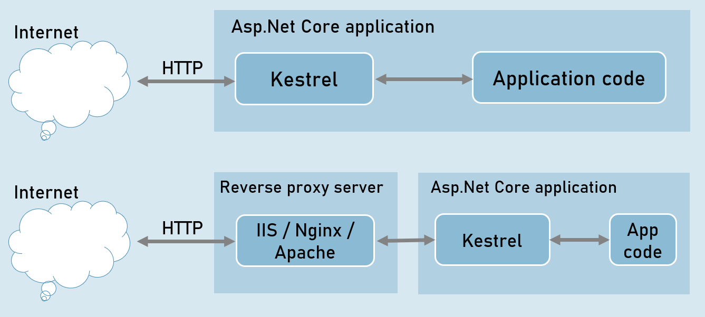


# Kestrel and Other Servers
## Application Servers   

- Kestrel

## Reverse Proxy Servers

- IIS

- Nginx   

- Apache

## Benefits of Reverse Proxy Servers

- Load Balancing

- Caching

- URL Rewriting

- Decompressing the requests

- Authentication

- Decryption of SSL Certificates

## IIS express

- HTTP access logs

- Port sharing

- Windows authentication

- Management console

- Process activation

- Configuration API

- Request filters

- HTTP redirect rules