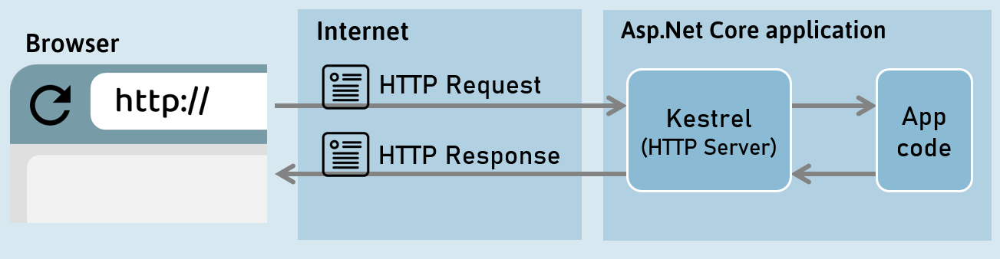
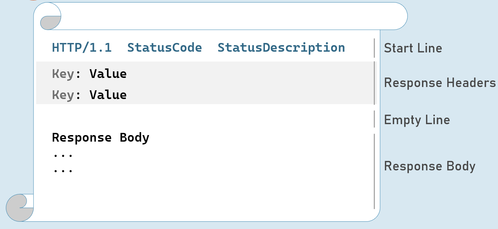
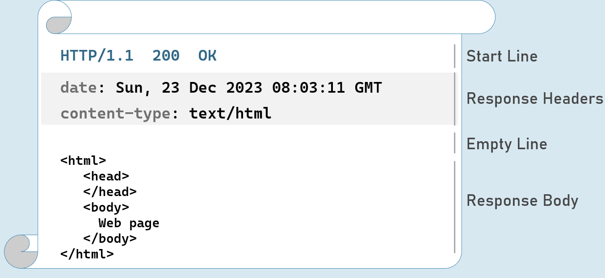
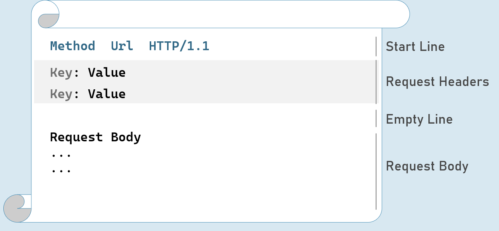
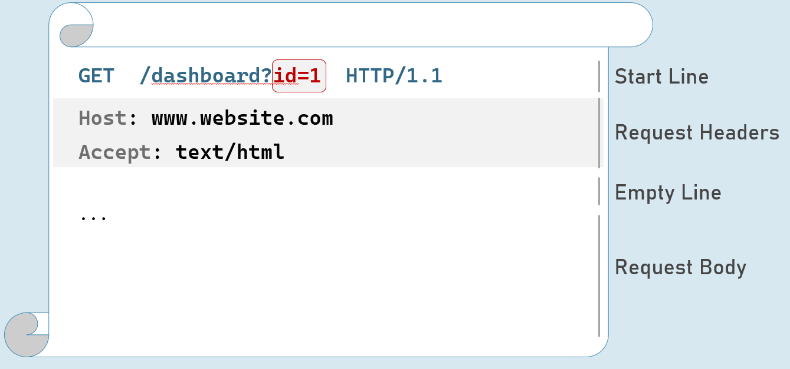

# Kestrel and Other Servers
## Application Servers   

- Kestrel

## Reverse Proxy Servers

- IIS

- Nginx   

- Apache

## Benefits of Reverse Proxy Servers

- Load Balancing

- Caching

- URL Rewriting

- Decompressing the requests

- Authentication

- Decryption of SSL Certificates

## IIS express

- HTTP access logs

- Port sharing

- Windows authentication

- Management console

- Process activation

- Configuration API

- Request filters

- HTTP redirect rules

## Interview Questions
- What is Kestrel and what are advantages of Kestrel in Asp.Net Core?
Kestrel is a cross-platform web server for ASP.NET Core applications. It is the default web server for ASP.NET Core projects. Some of the advantages of Kestrel are: it is fast, lightweight, supports multiple protocols (HTTP/1.x, HTTP/2, and WebSocket), and can run on any .NET Core supported platform.

- What is the difference between IIS and Kestrel? Why do we need two web servers?
IIS (Internet Information Services) is a Windows-based web server that can host ASP.NET Core applications using a reverse proxy module called ASP.NET Core Module (ANCM). The difference between IIS and Kestrel is that IIS is a full-featured web server that provides additional services such as security, performance, caching, logging, and management, while Kestrel is a minimalistic web server that only handles application requests. We need two web servers because Kestrel is not designed to be exposed directly to the internet, as it lacks some security and reliability features. Therefore, we use IIS as a front-end web server that forwards requests to Kestrel, which runs the ASP.NET Core application.

- What is the purpose of launchSettings.json in asp.net core?
launchSettings.json is a configuration file that specifies how to launch an ASP.NET Core application in different environments, such as development, staging, or production. It contains settings such as the application URL, environment variables, launch profiles, and launch commands.

- What is generic host or HostBuilder in .NET Core?
Generic host or HostBuilder is a feature of .NET Core that allows creating and configuring a host for any kind of application, not just web applications. A host is an object that encapsulates the application’s resources, such as configuration, logging, dependency injection, and lifetime management. The generic host simplifies the common tasks of creating and running an application, and provides a consistent way of configuring and hosting different types of applications.

- What is the purpose of the .csproj file?
The .csproj file is a project file that contains information about the project, such as the target framework, dependencies, build options, and output files. It is used by the .NET Core SDK tools to build, run, test, and publish the project.

- What is IIS?
IIS (Internet Information Services) is a Windows-based web server that can host web applications, web services, and static files. It supports various protocols, such as HTTP, HTTPS, FTP, and SMTP. It also provides features such as authentication, authorization, compression, caching, logging, and management.

- What is the “Startup” class in ASP.NET core prior to Asp.Net Core 6?
The Startup class is a class that configures the services and middleware for an ASP.NET Core application. It has two methods: ConfigureServices, which registers the services that the application requires, and Configure, which defines the request pipeline that handles each request. The Startup class is specified in the Program.cs file using the UseStartup method.

- What does WebApplication.CreateBuilder() do?
WebApplication.CreateBuilder() is a method that creates and returns a WebApplicationBuilder object, which is a builder for web applications in ASP.NET Core 6. It simplifies the creation of a web host and a web application by combining the functionality of HostBuilder and WebHostBuilder. It also provides a default configuration for the web application, such as logging, routing, and endpoints.

# Introduction to HTTP

HTTP is an application-protocol that defines set of rules to send request from browser to server and send response from server to browser.

Initially developed by Tim Berners Lee, later standardized by IETF (Internet Engineering Task Force) and W3C (World Wide Web Consortium)

## HTTP Response

## Response Start Line
Includes HTTP version, status code and status description.

`HTTP Version:` 1/1 | 2 | 3

`Status Code:` 101 | 200 | 302 | 400 | 401 | 404 | 500

`Status Description:` Switching Protocols | OK | Found | Bad Request | Unauthorized | Not Found | Internal Server Error

## HTTP Response Status Codes
### 1xx | Informational

101           Switching Protocols

### 2xx | Success

200          OK

### 3xx | Redirection

302          Found

304          Not Modified

### 4xx | Client error

400           Bad Request

401            Unauthorized

404           Not Found

### 5xx | Server error

500           Internal Server Error

## HTTP Response Headers
### Date                                

Date and time of the response. Ex: Tue, 15 Nov 1994 08:12:31 GMT

### Server                            

Name of the server.

Ex: Server=Kestrel

### Content-Type               

MIME type of response body.

Ex: text/plain, text/html, application/json, application/xml etc.

### Content-Length            

Length (bytes) of response body.

Ex: 100

### Cache-Control                 

Indicates number of seconds that the response can be cached at the browser.

Ex: max-age=60

### Set-Cookie                        

Contains cookies to send to browser.

Ex: x=10

### Access-Control-Allow-Origin              

Used to enable CORS (Cross-Origin-Resource-Sharing)

Ex: Access-Control-Allow-Origin: http://www.example.com

### Location                           

Contains url to redirect.            

Ex: http://www.example-redirect.com

Further reading: https://developer.mozilla.org/en-US/docs/Web/HTTP/Headers

## HTTP Request

## HTTP Request - with Query String

                                                          

## HTTP Request Headers
Accept                            

Represents MIME type of response content to be accepted by the client. Ex: text/html

### Accept-Language       

Represents natural language of response content to be accepted by the client. Ex: en-US

### Content-Type                

MIME type of request body.

Eg: text/x-www-form-urlencoded, application/json, application/xml, multipart/form-data

### Content-Length           

Length (bytes) of request body.

Ex: 100

### Date                                 

Date and time of request.

Eg: Tue, 15 Nov 1994 08:12:31 GMT       

 

### Host                               

Server domain name.

Eg: www.example.com

### User-Agent                   

Browser (client) details.

Eg: Mozilla/5.0 Firefox/12.0

### Cookie                          

Contains cookies to send to server.

Eg: x=100

Further reading: https://developer.mozilla.org/en-US/docs/Web/HTTP/Headers

## HTTP Request Methods
### GET                      

Requests to retrieve information (page, entity object or a static file).

### Post                     

Sends an entity object to server; generally, it will be inserted into the database.

### Put                     

Sends an entity object to server; generally updates all properties (full-update) it in the database.

### Patch               

Sends an entity object to server; generally updates few properties (partial-update) it in the database.

### Delete                

Requests to delete an entity in the database.     

## HTTP Get [vs] Post
## Get: 

- Used to retrieve data from server.

- Parameters will be in the request url (as query string only).

- Can send limited number of characters only to server. Max: 2048 characters

- Used mostly as a default method of request for retrieving page, static files etc.

- Can be cached by browsers / search engines.

## Post:

- Used to insert data into server

- Parameters will be in the request body (as query string, json, xml or form-data).

- Can send unlimited data to server.

- Mostly used for form submission / XHR calls

- Can't be cached by browsers / search engines.

- What is HTTP?
HTTP (Hypertext Transfer Protocol) is a protocol that defines how clients and servers communicate over the web. It allows clients to request resources from servers, and servers to respond with the requested resources or error messages.

- What is the format of a Request Message?
A request message consists of the following components:

    - A request line that specifies the HTTP method, the resource URI, and the HTTP version. For example: GET /index.html HTTP/1.1
    - Zero or more header fields that provide additional information about the request. For example: Host: www.example.com
    - An optional empty line that separates the header and the body.
    - An optional message body that contains the data sent by the client. For example: name=John&age=25

- What are the important HTTP methods (or HTTP verbs) – (GET, POST, PUT, PATCH, HEAD, DELETE)?
    - GET: used to retrieve a resource from the server. For example: GET /index.html
    - POST: used to create a new resource on the server. For example: POST /users
    - PUT: used to update or replace an existing resource on the server. For example: PUT /users/1
    - PATCH: used to modify a part of an existing resource on the server. For example: PATCH /users/1
    - HEAD: used to get the header information of a resource without the body. For example: HEAD /index.html
    - DELETE: used to delete an existing resource from the server. For example: DELETE /users/1

- What are the important HTTP status codes?
    - 200 OK: indicates that the request was successful and the response contains the requested resource.
    - 301 Moved Permanently: indicates that the requested resource has been moved to a new URI and the client should use the new URI for future requests.
    - 400 Bad Request: indicates that the request was malformed or invalid and the server could not process it.
    - 401 Unauthorized: indicates that the request requires authentication and the client did not provide valid credentials.
    - 403 Forbidden: indicates that the server understood the request but refused to authorize it due to insufficient permissions.
    - 404 Not Found: indicates that the server could not find the requested resource.
    - 500 Internal Server Error: indicates that the server encountered an unexpected error and could not fulfill the request.

- What is Content Negotiation in HTTP?
Content negotiation in HTTP is a mechanism that allows clients and servers to agree on the best format of the resource to be exchanged. It involves the use of header fields such as Accept, Content-Type, Accept-Language, and Content-Language to specify the preferences and capabilities of the client and the server. For example, a client can request a resource in JSON format by sending the header Accept: application/json, and the server can respond with the header Content-Type: application/json to indicate that the resource is in JSON format.

- Explain how HTTP protocol works?
    - A client initiates a request by sending a request message to the server.
    - The server receives the request and processes it according to the HTTP method, the resource URI, and the header fields.
    - The server sends a response message to the client that contains the status code, the header fields, and the optional message body.
    - The client receives the response and interprets it according to the status code, the header fields, and the optional message body.

- What is a web server?
A web server is a software or hardware that hosts web resources and responds to HTTP requests from clients. It listens on a specific port (usually 80 for HTTP and 443 for HTTPS) and handles incoming requests by sending back the appropriate response. A web server can also perform other functions such as authentication, authorization, caching, logging, and compression. Some examples of web servers are Apache, Nginx, IIS, and Kestrel.