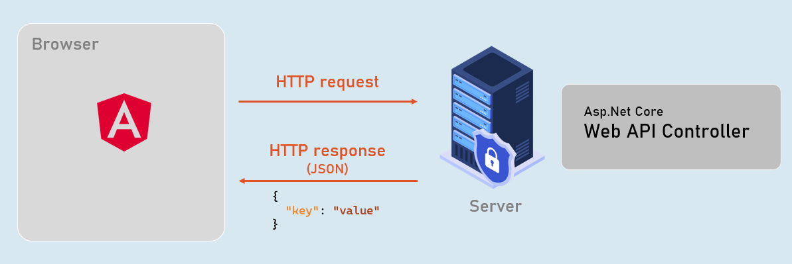
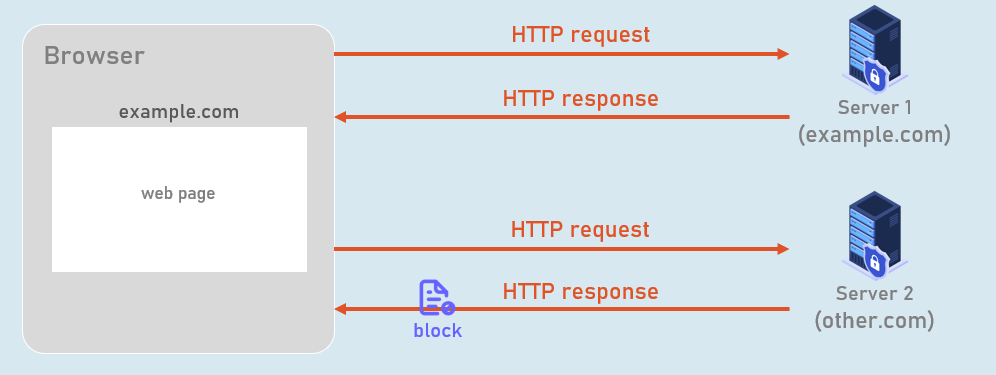
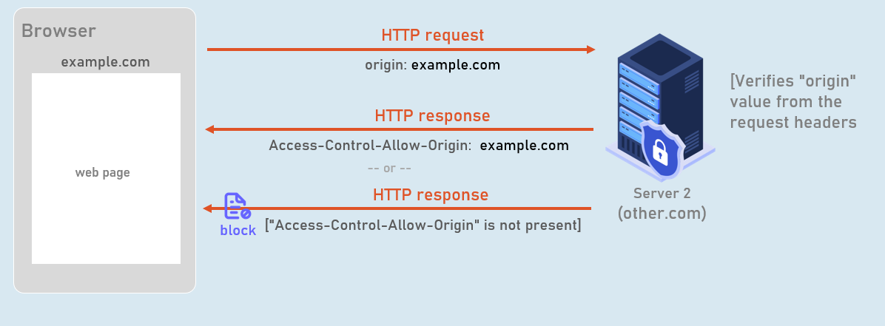
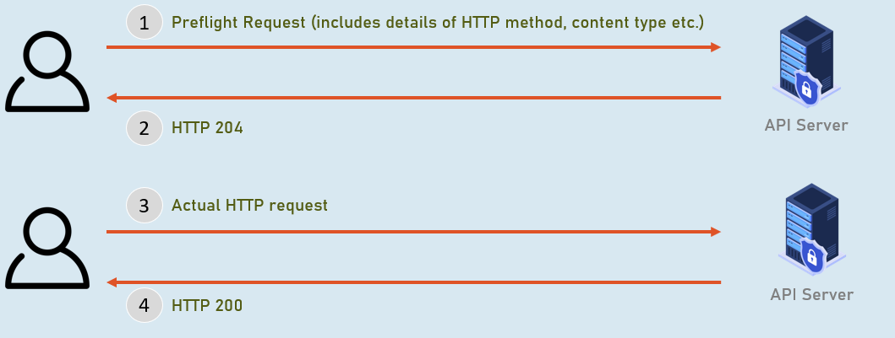

# Angular and CORS Section Cheat Sheet 

## Angular

Angular is a TypeScript-based, free and open-source web application framework that is used to create dynamic, single-page web applications that run on the browser.





## CORS

CORS (Cross-Origin Resource Sharing) is a security feature implemented by web browsers to allow or deny a web page from making requests to a different domain than the one that served the web page.




## How CORS works?




## Preflight Request

It is an HTTP OPTIONS request that is sent by the browser to the Web API server before the actual request is made.

The preflight request is used to determine whether the Web API server is willing to accept the actual request.





## Clean Architecture


# Interview Questions

## How can you invoke Web API services from an Angular application for CRUD operations? Can you explain with sample code for all GET, POST, PUT and DELETE HTTP methods.


To invoke Web API services from an Angular application for CRUD operations, you can follow these steps:


1. Import the HttpClient module from @angular/common/http in your Angular component or service.
```typescript
import { HttpClient } from '@angular/common/http';
```


2. Inject the HttpClient into the constructor of your component or service.
```typescript
constructor(private http: HttpClient) { }
```


3. Use the http object to make HTTP requests to the Web API endpoints. Here's an example for each CRUD operation:


**GET**: To retrieve data from the Web API, use the http.get() method. Provide the API endpoint URL as a parameter and subscribe to the returned Observable to handle the response.
```typescript
this.http.get('https://api.example.com/posts').subscribe((data) => {
// Handle the response data
});
```

**POST**: To create data, use the http.post() method. Provide the API endpoint URL and the data to be sent as parameters. Subscribe to the returned Observable to handle the response.

const newPost = { title: 'New Post', content: 'Lorem ipsum dolor sit amet.' };
```typescript
this.http.post('https://api.example.com/posts', newPost).subscribe((data) => {
// Handle the response data
});
```


**PUT**: To update existing data, use the http.put() method. Provide the API endpoint URL, the data to be updated, and any necessary identifiers as parameters. Subscribe to the returned Observable to handle the response.
```typescript
const updatedPost = { id: 1, title: 'Updated Post', content: 'New content.' };
this.http.put('https://api.example.com/posts/1', updatedPost).subscribe((data) => {
// Handle the response data
});
```


**DELETE**: To delete data, use the http.delete() method. Provide the API endpoint URL with the identifier of the resource to be deleted as a parameter. Subscribe to the returned Observable to handle the response.
```typescript
this.http.delete('https://api.example.com/posts/1').subscribe((data) => {
// Handle the response data
});
```

4. Make sure to handle errors and perform appropriate error handling logic using the error callback within the subscribe() method.


By following these steps, you can easily invoke Web API services from your Angular application for CRUD operations.

## What is CORS (Cross-Origin Resource Sharing)?
Cross-Origin Resource Sharing (CORS) is a security mechanism implemented in web browsers that allows restricted resources on a web page to be requested from a different domain. The same-origin policy enforced by web browsers restricts web pages from making requests to a different domain. However, CORS provides a way to relax this restriction and enable controlled access to resources from different origins.


When a web page makes a cross-origin request, the browser sends an HTTP OPTIONS preflight request to the server to check if the server allows the actual request. The server responds with CORS headers that specify the allowed origins, methods, headers, and other parameters for incoming requests. If the server allows the request based on the specified CORS policies, the browser allows the cross-origin request and the requested resource is accessible.

## Why is CORS necessary?
CORS (Cross-Origin Resource Sharing) is necessary because web browsers enforce a security policy known as the same-origin policy. The same-origin policy restricts web pages from making requests to a different domain, which helps protect users from potential security vulnerabilities.


However, there are legitimate scenarios where web applications need to access resources or consume APIs from different domains. This is where CORS comes into play. CORS allows controlled and secure access to resources from different origins while still maintaining the fundamental security provided by the same-origin policy.


Here are a few reasons why CORS is necessary:

1. **Cross-Domain Communication**: Many modern web applications are built using a client-server architecture, where the client-side code (such as JavaScript) runs in a web browser and needs to interact with APIs or services hosted on different domains. CORS enables the client-side code to make cross-domain requests to retrieve data or perform actions on behalf of the user.


2. **API Consumption**: Web applications often consume data or services from third-party APIs. These APIs might be hosted on different domains or subdomains. CORS allows the web application to make requests to these APIs and retrieve the data it needs to display or process.


3. **Microservices and Distributed Systems**: In complex systems composed of multiple microservices or distributed components, each component may have its own domain or endpoint. CORS allows the components to communicate and exchange data securely across different domains, enabling a scalable and modular architecture.


4. **Third-Party Integration**: Web applications may integrate with external services or embed content from other websites. CORS enables these integrations by allowing the web application to make cross-origin requests to fetch data, embed iframes, or interact with the integrated services.


By enabling CORS, web developers can selectively specify which domains or origins are allowed to access their resources or APIs. CORS provides a mechanism to define fine-grained policies that determine the origins, HTTP methods, headers, and other parameters that are permitted for cross-origin requests, ensuring controlled access and maintaining security while facilitating seamless integration between different web resources.
## How CORS works internally?
Internally, CORS (Cross-Origin Resource Sharing) works as a series of steps involving the web browser and the server to facilitate controlled cross-origin requests. Here's a high-level overview of how CORS works:


**1. Origin Determination:**

When a web page makes a request to a different domain, the browser considers the origin of the request. The origin consists of the combination of the protocol (e.g., HTTP, HTTPS), domain (e.g., example.com), and port number (if specified). The origin is derived from the URL of the web page making the request.


**2. Preflight Request:**

Before making certain types of cross-origin requests (e.g., requests with HTTP methods other than GET, POST, or HEAD, or requests with custom headers), the browser sends an HTTP OPTIONS preflight request to the server. This preflight request includes additional headers, such as "Access-Control-Request-Method" and "Access-Control-Request-Headers", to gather information about the intended cross-origin request.


**3. Server Response and CORS Headers:**

The server receives the preflight request and generates a response. It determines whether the actual request should be allowed based on its CORS policies. The server includes specific CORS response headers in the preflight response to inform the browser of its decision. These headers include:

    "Access-Control-Allow-Origin": Specifies the allowed origin(s) that can access the resource.

    "Access-Control-Allow-Methods": Specifies the allowed HTTP methods for the actual request.

    "Access-Control-Allow-Headers": Specifies the allowed request headers for the actual request.

    "Access-Control-Allow-Credentials": Indicates whether the actual request can include credentials like cookies or authorization headers.

**4. Browser Evaluation:**

The browser receives the preflight response and evaluates the CORS headers. It checks if the origin of the web page making the request is allowed by the server's CORS policy. It also verifies if the requested method, headers, and credentials (if any) are permitted. If the browser determines that the request is allowed based on the CORS headers, it proceeds with the actual cross-origin request.


**5. Actual Request:**

If the browser confirms that the actual request is permitted, it sends the actual cross-origin request to the server, including the necessary headers and payload (if any). The server processes the request and generates the corresponding response.


**6. Response Handling:**

The browser receives the response from the server. The response may include additional CORS headers indicating the server's policies and restrictions. The browser then allows or restricts access to the response based on the evaluation of these headers.


By following this process, CORS ensures controlled and secure cross-origin communication between web browsers and servers. It allows servers to define policies that dictate which origins, methods, headers, and credentials are allowed to access their resources, thereby protecting users from potential security threats while enabling legitimate cross-origin interactions.

## How do you enable CORS in an ASP.NET Core Web API?
To enable CORS in an ASP.NET Core Web API, you can follow these steps:

1. Add CORS service to the service collection
```csharp
builder.Services.AddCors(options => {
    options.AddDefaultPolicy(builder =>
    {
    builder.WithOrigins("http://localhost:4200");
    });
});
```


2. Add CORS middleware to the middleware chain / request pipeline.
```csharp
app.UseCors();
```
## What are CORS policies?
CORS policies define the rules and restrictions for allowing or restricting cross-origin requests to an API. CORS policies are implemented on the server side and specify which origins, methods, headers, and other parameters are allowed to access the API resources.


CORS policies help control and secure access to resources exposed by an API, ensuring that only trusted and authorized sources can make cross-origin requests. By defining CORS policies, API developers can specify the level of flexibility and control they want to allow when it comes to accessing their resources from different origins.


Here are some key elements that CORS policies can define:

**1. Allowed Origins:**

CORS policies specify the origins or domains that are allowed to access the API resources. An origin consists of the combination of the protocol (e.g., HTTP, HTTPS), domain (e.g., example.com), and port number (if specified). Developers can specify one or more allowed origins or use the wildcard "*" to allow requests from any origin.


**2. Allowed Methods:**

CORS policies define the HTTP methods (such as GET, POST, PUT, DELETE, etc.) that are allowed for cross-origin requests. This helps restrict unauthorized methods from being used for accessing or modifying resources.


**3. Allowed Headers:**

CORS policies specify the headers that are allowed in cross-origin requests. This allows API developers to control which request headers are accepted and processed by the server.


**4. Exposed Headers:**

CORS policies can define the headers that are exposed in the response to cross-origin requests. Exposed headers are additional response headers that the server allows the browser to access and read in the client-side code.


**5. Credentials:**

CORS policies can indicate whether cross-origin requests can include credentials, such as cookies or authorization headers. By default, browsers do not send credentials in cross-origin requests, but CORS policies can allow or restrict this behavior.


**6. Preflight Requests:**

CORS policies determine whether preflight requests (HTTP OPTIONS requests) are required for certain cross-origin requests. Preflight requests are used to check if the actual request is allowed by the server based on its CORS policies.


By defining and configuring CORS policies, API developers can ensure controlled access to their resources, protect against unauthorized cross-origin requests, and maintain the security and integrity of their API endpoints.
## How can you create and apply multiple CORS policies in ASP.NET Core Web API?
In ASP.NET Core Web API, you can specify multiple CORS policies by defining and registering multiple instances of the CorsPolicy class. Each CORS policy can have its own set of allowed origins, methods, headers, and other parameters.


Steps to create multiple CORS policies in an ASP.NET Core Web API project:

1. Open the Program.cs file in your ASP.NET Core Web API project.


2. Add the CORS services by calling the AddCors method on the IServiceCollection object. This registers the CORS services in the dependency injection container.
```csharp

builder.Services.AddCors(options =>
{
    options.AddPolicy("Policy1", builder =>
    {
        builder.WithOrigins("http://example1.com")
            .AllowAnyMethod()
            .AllowAnyHeader();
    });
    
    options.AddPolicy("Policy2", builder =>
    {
        builder.WithOrigins("http://example2.com")
            .AllowMethods("GET")
            .AllowHeaders("Authorization");
    });

// Add more policies as needed...
});
```


3. Use the UseCors method with the name of the desired CORS policy to apply the policy to the request pipeline. You can specify the CORS policy at the global level or apply it to specific routes or controllers.
```csharp
app.UseCors("Policy1");

```


Alternatively, you can apply the CORS policy at the controller or action level by using the [EnableCors] attribute and specifying the policy name as an argument.
```csharp

[EnableCors("Policy2")]
public class MyController : ControllerBase
{
// Controller code...
}
```


By following these steps, you can specify and apply multiple CORS policies in your ASP.NET Core Web API. Each policy can have its own set of allowed origins, methods, headers, and other parameters, providing granular control over cross-origin requests in your API.
