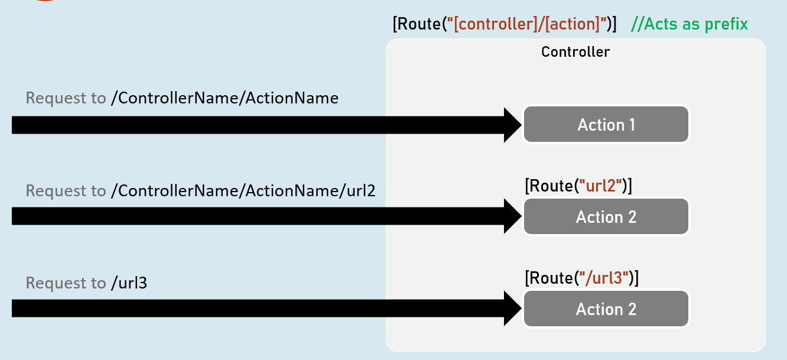
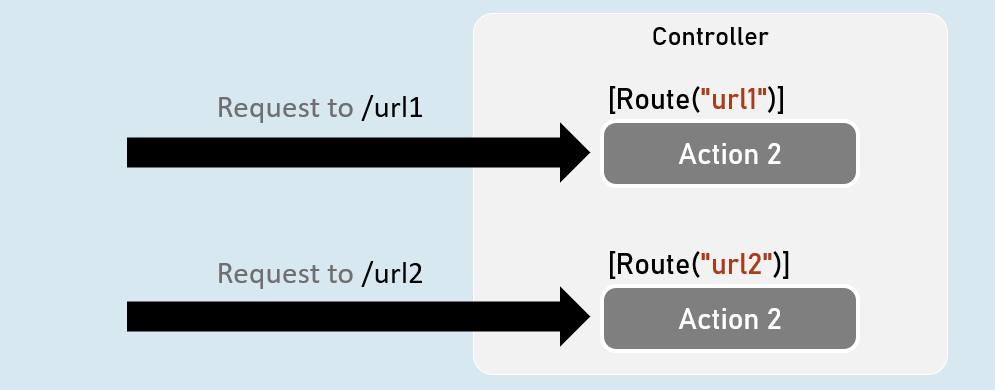
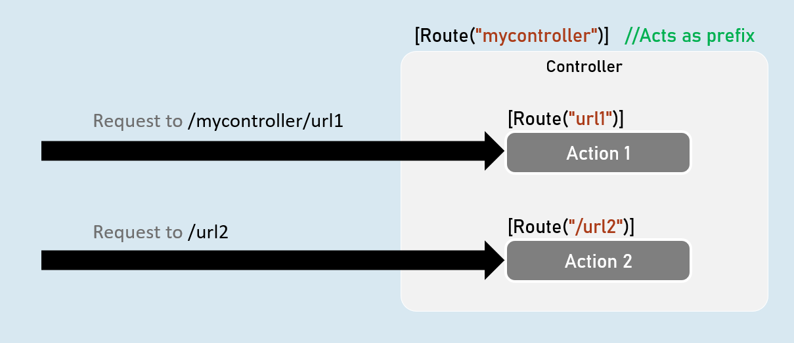

# CRUD Operations Cheat Sheet

## Route Tokens
> The route tokens [controller], [action] can be used to apply common-patterned routes for all action methods.

> The route of controller acts as a prefix for the route of actions




## Attribute Routing
> [Route] attribute specifies route for an action method or controller.

> The route of controller acts as a prefix for the route of actions.

### [Route] - Attribute Routing




# Interview Questions 

## Explain how attribute-based routing works?
Attribute routing is an alternative routing strategy for conventional routing. It can be used for both MVC controllers and Web API controllers. It uses a set of attributes to map action methods directly to route templates.

Attribute routing directly defines the routes on action methods. We can also use these attributes on the controllers. It enables us to get fine-grained control over what routes map to which actions. With attribute routing, the controller and action names play no part in determining the action method.

For example, we use attributes Blog and Home to map an incoming URL such as myapp.com/blog/post/3 to the Show method on the PostsController.
```c#
[Route("blog")]
public class PostsController : Controller
{
 [HttpGet("post/{id:int}")]
 public IActionResult Show(int id = 0)
 {
  Post post = new Post()
  {
   ID = id
  };
 return View("Show", post);
}

 [HttpGet("edit/{id:int}")]
 public IActionResult Edit(int id)
 {
  Post postToEdit = _service.Get(id);
  return View("Edit", postToEdit);
 }
}
```

In the above example, the attribute [Route(“blog”)] is placed on the controller, whereas the route [HttpGet(“post/{id:int}”)] is placed on the action method. A controller route applies to all actions in that controller. For example, the second [“edit/{id:int}”] route matches the url myapp.com/blog/edit/3.


In addition to the above route templates, ASP.NET Core provides the following HTTP verb templates.


- `[HttpGet]`

- `[HttpPost]`

- `[HttpPut]`

- `[HttpDelete]`

- `[HttpHead]`

- `[HttpPatch]`
- 
## “You can map routes to endpoints explicitly (attribute routing) or through convention (convention routing); which do you prefer and why?”
I prefer explicitly registering routes, as they are visible in the codebase and often easier to rationalize and debug. There is a potential drawback, though, as the more routes an application has, the more it can impact route resolution and performance of an application. Performance degradation can happen in applications when an extreme amount of route registrations occur, but many folks shouldn’t worry about it until they notice a drop in performance.


## “You have a page with a form, but when you submit, nothing occurs. How would you go about debugging the issue?”
I always find it’s best to start at the beginning. In my case, I clicked a submit button on a form. But, first, I would open the dev tools in my browser and make sure the client page made a network call to the backend ASP.NET Core app.

If the page didn’t make a request, I would ensure that my form has an action attribute pointing at a known endpoint in my application and that the method matches what the app expects on the endpoint.

If the client made a request, before leaving the dev tools of the client, I would read any responses sent from the server to pinpoint the exact point of failure. A “not found” response would lead me to believe the endpoint isn’t registered in my app correctly. If the endpoint does exist, I will look at any route constraints, filters, or exceptions that may stop the request from getting to my endpoint. The typical response, in this case, is a “bad request” response. An excellent place to look is the logs to see if any error messages are visible.

Methodically starting from the origin of the problem and working backward is an excellent way to fix issues and quickly move on to more work.

## How do you implement buffering and streaming file uploading files into asp.net core app?
### Buffering:

The entire file is read into a IFormFile object at-a-time

It’s good for smaller files because, the server’s disk will be utilized during this
```c#
public IActionResult ActionMethod(IFormFile file)
{
  //”file” represents the buffered file that is uploaded from the client
}
```

### Streaming
In this approach, the file is uploaded in a multipart request and directly processed or saved by the application. For uploading file streaming approach consumes less memory or disk space as compared to the buffering approach. Streaming should be the preferred approach when uploading larger files on the webserver.
```c#
public IActionResult ActionMethod()
{
 using MemoryStream stream = new MemoryStream())
 {
   await Request.Body.CopyToAsync(memoryStream);
   //the “stream” streams the file that is uploaded from the client
 }
}
```
## What is the difference between ViewModel and DTO?
The canonical definition of a DTO is the data shape of an object without any behavior.

ViewModels are the model of the view.

Basically, both serve the same purpose but DTO is a broader term - it can be used among any two layers of the app.

Eg:

between Controller to View

between HttpRequest to Controller

between Controller to Business layer (and vice versa)

between Business layer to DAL (and vice versa)