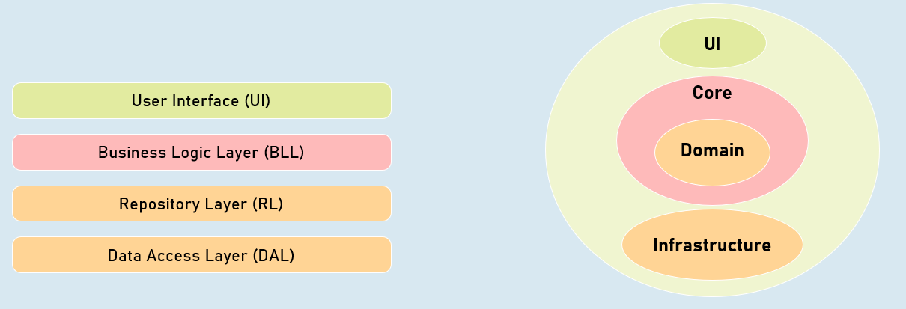
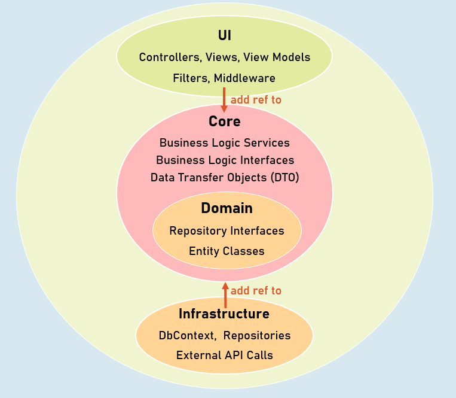

# Clean Architectire Section Cheat Sheet (PPT)

## Overview of Clean Architecture
Instead of "business logic" depend on "data access logic", this dependency is inverted; that means, the "data access logic" depend on "business logic".

**Benefit**: The business logic is highly clean-separated, independent of data storage and UI, unit-testable.

### Traditional Three-Tier / N-Tier Architecture

- User Interface (UI)

- Business Logic Layer (BLL)

- Repository Layer (RL)

- Data Access Layer (DAL)

### Clean Architecture

### UI

- Controllers, Views, View Models

- Filters, Middleware

### Core

- Business Logic Services

- Business Logic Interfaces

- Data Transfer Objects (DTO)

### Domain

- Repository Interfaces

- Entity Classes

### Infrastructure

- DbContext, Repositories

- External API Calls

## Clean Architecture
### Changing external system

Allows you to change external systems (external APIs / third party services) easily, without affecting the application core.

### Scalable

You can easily scale-up or scale-out, without really affecting overall architecture of the application.

### Database independent

The application core doesn't depend on specific databases; so you can change it any time, without affecting the application core.

### Testable

The application core doesn't depend on any other external APIs or repositories; so that you can write unit tests against business logic services easily by mocking essential repositories.

Clean architecture is earlier named as "Hexagonal architecture", "Onion architecture", "Domain-Driven Design", "Vertical Slice Architecture". Over time, it is popular as "clean architecture".

Clean Architecture

# Interview Questions

### What is Clean Architecture?
Clean Architecture is an approach to software design that separates the structure of a software system into distinct layers. Clean architecture also results in a more modular codebase. This separation of concerns makes it easier to understand, develop, upscale, maintain and test software systems.

### Can you explain the differences between clean architecture and other types of architectures?
Clean architecture is a type of software architecture that is designed to be easy to understand, easy to change, and easy to test. It is different from other types of architectures in that it is not concerned with the details of how the software will be implemented, but rather with the overall structure of the software. This makes it easier to change the software later on if necessary.
### What are some examples of good use cases for a clean architecture implementation?
A good use case for a clean architecture implementation would be an application that needs to be very modular and scalable. For example, a large e-commerce website might need to be able to handle a large number of users and a large number of transactions. In this case, a clean architecture implementation would be ideal in order to ensure that the website can handle the load and can be easily expanded as needed.
### Can you give me a general overview of how to build an application using clean architecture?
When building an application using clean architecture, you start by defining the business rules that the application must follow. From there, you build the application around those rules, keeping the different parts of the application separate and independent from each other. This makes the application more modular and easier to maintain and extend.

### Is clean architecture suitable for all kinds of applications or only specific ones? If it’s not suitable for certain types of apps, then what are the alternatives?
Clean architecture is suitable for all kinds of applications, but it is especially well-suited for applications that are expected to grow and change over time. This is because clean architecture is designed to promote modularity and flexibility, which makes it easier to make changes to the code without breaking existing functionality.

For extremely smaller applications that won’t require upscaling in future, we can use the traditional three-layer architecture (data access layer, business logic layer and presentation layer).