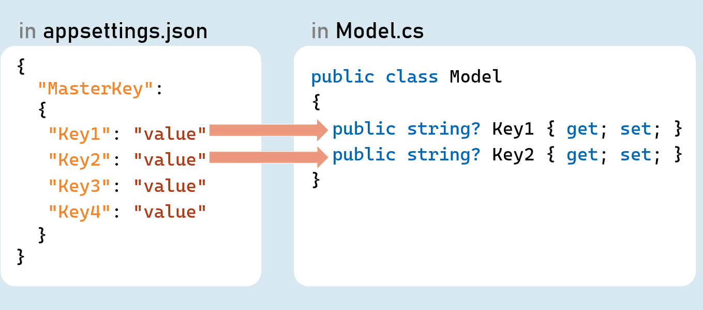
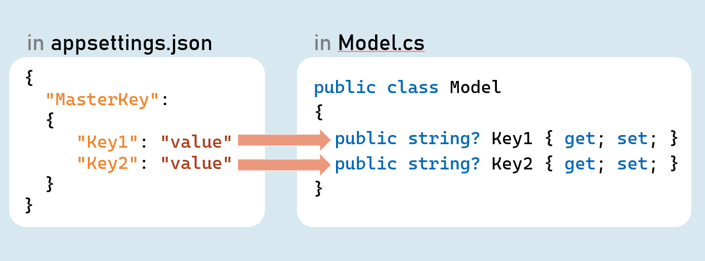
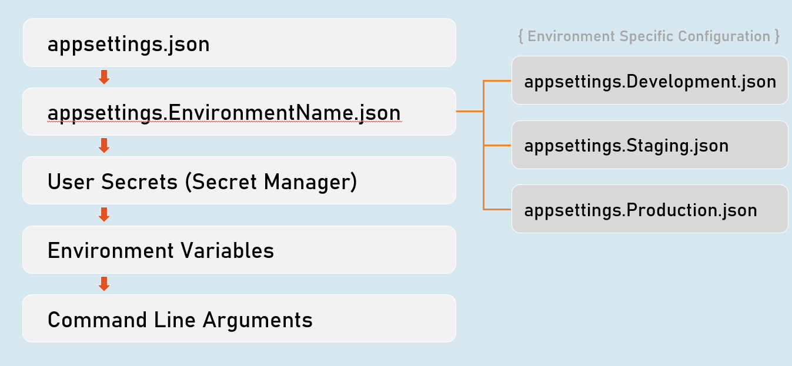
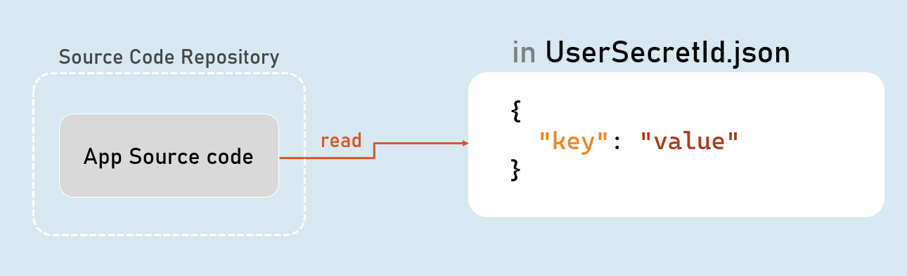
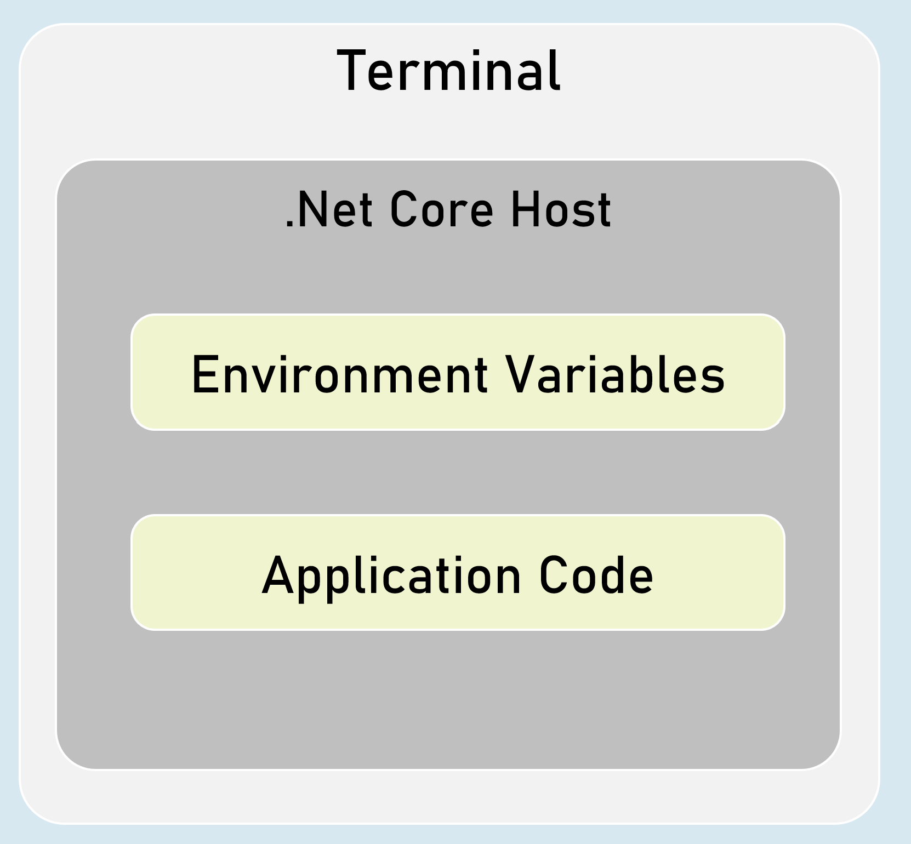
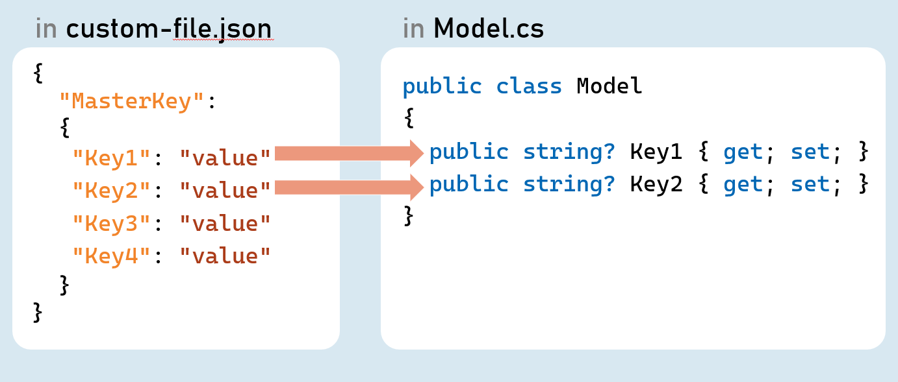
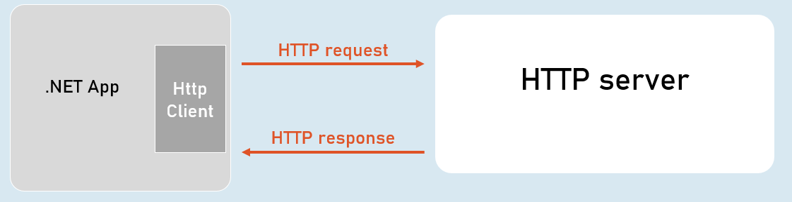
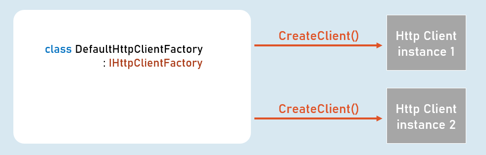

# Configuration Cheat Sheet 

## Configuration Settings
> Configuration (or configuration settings) are the constant key/value pairs that are set at a common location and can be read from anywhere in the same application.

Examples: connection strings, Client ID & API keys to make REST-API calls, Domain names, Constant email addresses etc.


## Configuration Sources
- appsettings.json

- Environment Variables

- File Configuration (JSON, INI or XML files)

- In-Memory Configuration

- Secret Manager


## Access Configuration
in Program.cs:

`app.Configuration`


## IConfiguration
### [string key]

Gets or sets configuration value at the specified key.


### GetValue<T>(string key, object defaultValue)

Gets the configuration value at the specified key; returns the default value if the key doesn't exists.


## IConfiguration in Controller
### in Controller and other classes
```c#
using Microsoft.AspNetCore.Mvc;
using Microsoft.Extensions.Configuration;
 
public class ControllerName : Controller
{
  private readonly IConfiguration _configuration;
 
  public ControllerName(IConfiguration configuration)
  {
   _configuration = configuration;
  }
}
```

## Hierarchical Configuration
### in appsettings.json
```c#
{
 "MasterKey":
 {
  "Key1": "value"
  "Key2": "value"
 }
}

```
### to read configuration

`Configuration["MasterKey:Key1"]`


### IConfiguration.GetSection(string key)

Returns an IConfigurationSection based on the specified key.

 


Options Pattern




Options pattern uses custom classes to specify what configuration settings are to be loaded into properties.


Examples: Reading the specific connections strings out of many configuration settings.

The option class should be a non-abstract class with a public parameterless constructor.

Public read-write properties are bound.

Fields are not bound.


### IConfiguration.GetSection(string key)

Returns an IConfigurationSection based on the specified key.


### IConfiguration.Bind(object instance) and IConfiguration.Get<T>()

Binds (loads) configuration key/value pairs into a new object of the specified type.


## Configuration as Service


### Inject Configuration as Service




### Add Configuration as Service

in Program.cs:
```c#
builder.Services.Configure<Model>(builder.Configuration.GetSection("MasterKey"));
```


### Inject Configuration as Service in Controller in Controller and other classes
```c#
using Microsoft.AspNetCore.Mvc;
using Microsoft.Extensions.Options;
 
public class ControllerName : Controller
{
  private readonly Model _options;
 
  public ControllerName(IOptions<Model> options)
  {
   _options = options.Value;
  }
}
```


## Environment Specific Configuration
Order of Precedence of Configuration Sources





## Secrets Manager
The 'secrets manager ' stores the user secrets (sensitive configuration data) in a separate location on the developer machine.





### Enable Secrets Manager in "Windows PowerShell" / "Developer PowerShell in VS"
```bash
dotnet user-secrets init
dotnet user-secrets set "Key" "Value"
dotnet user-secrets list
```


## Environment Variables Configuration


You can set configuration values as in-process environment variables.


### Set Configuration as Environment Variables

in "Windows PowerShell" / "Developer PowerShell in VS":
```bash
$Env:ParentKey__ChildKey="value"
dotnet run --no-launch-profile
```
It is one of the most secured way of setting-up senzsitive values in configuration.

__ (underscore and underscore) is the separator between parent key and child key.


## Custom Json Configuration




### Add Custom Json file as Configuration Source

in Program.cs:
```c# 
builder.Host.ConfigureAppConfiguration( (hostingContext, config) => {
    config.AddJsonFile("filename.json", optional: true, reloadOnChange: true);
});
```


## Http Client
HttpClient is a class for sending HTTP requests to a specific HTTP resource (using its URL) and receiving HTTP responses from the same.

Examples: Making a request to a third-party weather API, ChatGPT etc.




## IHttpClientFactory
IHttpClientFactory is an interface that provides a method called CreateClient() that creates a new instance of HttpClient class and also automatically disposes the same instance (closes the connection) immediately after usage.



## HttpClient
## Properties

- BaseAddress

- DefaultRequestHeaders


## Methods

- GetAsync()

- PostAsync()

- PutAsync()

- DeleteAsync()


# Inverview Questions
## What is the purpose of the appsettings.json file?
Appsettings.json contains all of the application's configuration settings, which allow you to configure your application behavior.

It includes with configuration settings related to logging, connection strings etc.

You can also write environment-specific configuration with “appsettings.Environment.json” file.

You can also load custom json files, custom INI files, InMemory configuration or Secrets manager to store configuration settings.

## You have configuration values needed to access your application resources. Which configuration providers do you prefer for development, and which do you prefer for production?
Many cloud providers and Docker hosting platforms support environment variables, so environment variables make much sense for production environments. However, in case of sensitive information, I prefer the user secrets configuration provider for local development as there’s no way to add sensitive secrets to source control mistakenly. Finally, for non-sensitive data, I like JSON configuration since it’s one of the default configuration options, and it’s easy to add and manage into source control.

## How do you use Options pattern in Asp.Net Core?
The configuration system in ASP.NET allows (actually, enforces) strongly typed settings using the IOptions<> pattern.
### Services:
```c#
app.Services.Configure<Model>(builder.Configuration.GetSection(“ParentKey”));
```
### Controller: 
```c#
private readonly Model _options;

public ControllerName(IOptions<Model> options)
{
  _options = options.Value; //returns an instance of Model class that has configuration values from appropriate configuration sources
}
```

## How do you enable Secrets manager and why?

- You have to call the following commands: 
```bash
dotnet user-secrets init --project projectName
```

It's the recommended way of doing it as it will create a `secrets.json` file specific to your project