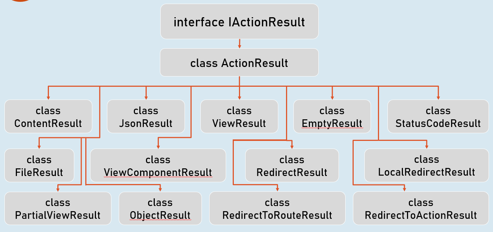

# Introduction to Controllers
Controller is a class that is used to group-up a set of actions (or action methods ).

Action methods do perform certain operation when a request is received & returns the result (response).


## Creating Controllers
Controllers should be either or both:

The class name should be suffixed with "Controller". Eg: HomeController

The controller attribute is applied to the same class or to its base class.


### Controller
```c#
controller
class ClassNameController
{
  //action methods here
}
```

### Optional:

- Is a public class.

- Inherited from Microsoft.AspNetCore.Mvc.Controller.


## Enable `routing` in controllers
### AddControllers( )

`builder.Services.AddControllers();`

Adds all controllers as services in the IServiceCollection.

So that, they can be accesed when a specific endpoint needs it.


### MapControllers()

`app.MapControllers();`

Adds all action methods as endpoints.

So that, no need of using `UseEndPoints()` method for adding action methods as end points.


## Responsibilities of Controllers
### Reading requests

Extracting data values from request such as query string parameters, request body, request cookies, request headers etc.


### Invoking models

Calling business logic methods.

Generally business operations are available as 'services'.


### Validation

Validate incoming request details (query string parameters, request body, request cookies, request headers etc.)


### Preparing Response

Choosing what kind of response has to be sent to the client & also preparing the response (action result ).


## ContentResult
ContentResult can represent any type of response, based on the specified MIME type.

MIME type represents type of the content such as text/plain, text/html, application/json, application, xml, application/pdf etc.


```c#
return new ContentResult() { Content = "content", ContentType = "content type" };
```
[or]
```c#
return Content("content", "content type");
```


## JsonResult
JsonResult can represent an object in JavaScript Object Notation (JSON) format.

Eg: 
```c#
{ "firstName": "James", "lastName": "Smith", "age": 25 }
```


```c#
return new JsonResult(your_object);
```
[or]
```c#
return Json(your_object);
```


## File Results
File result sends the content of a file as response.

Eg: pdf file, txt file, exe file, zip file etc.


## VirtualFileResult
```c#
return new VirtualFileResult("file relative path", "content type");
```
//or
```c#
return File("file relative path", "content type");
```
Represents a file within the WebRoot ('wwwroot' by default) folder.

Used when the file is present in the WebRoot folder.


## PhysicalFileResult

Represents a file that is not necessarily part of the project folder.

Used when the file is present outside the WebRoot folder.
```c#
return new PhysicalFileResult("file absolute path", "content type");
```
//or
```c#
return PhysicalFile("file absolute path", "content type");
```


## FileContentResult

Represents a file from the byte[ ].

Used when a part of the file or byte[ ] from other data source has to be sent as response.
```c#
return new FileContentResult(byte_array, "content type");
```
//or
```c#
return File(byte_array, "content type");
```


## IActionResult
It is the parent interface for all action result classes such as ContentResult, JsonResult, RedirectResult, StatusCodeResult, ViewResult etc.

By mentioning the return type as IActionResult, you can return either of the subtypes of IActionResult





## Status Code Results
Status code result sends an empty response with specified status code.

Eg: 200, 400, 401, 404, 500 etc.


### StatusCodeResult
```c#
return new StatusCodeResult(status_code);
```


### UnauthorizedResult
```c#
return new UnauthorizedResult();
```


### BadRequestResult
```c#
return new BadRequestResult();
```


### NotFoundResult
```c#
return new NotFoundResult();
```


### StatusCodeResult

Represents response with the specified status code.

Used when you would like to send a specific HTTP status code as response.
```c#
return new StatusCodeResult(status_code);
```
//or
```c#
return StatusCode(status_code);
```


### UnauthoriziedResult

Represents response with HTTP status code '401 Unauthorized'.

Used when the user is unauthorized (not signed in).
```c#
return new UnauthorizedResult();
```
//or
```c#
return Unauthorized();
```


### BadRequestResult

Represents response with HTTP status code '400 Bad Request'.

Used when the request values are invalid (validation error).
```c#
return new BadRequestResult();
```
//or
```c#
return BadRequest();
```


### NotFoundResult

Represents response with HTTP status code '404 Not Found'.

Used when the requested information is not available at server.
```c#
return new NotFoundResult();
```
//or
```c#
return NotFound();
```


## Redirect Results
Redirect result sends either HTTP 302 or 301 response to the browser, in order to redirect to a specific action or url.

Eg: redirecting from 'action1' to 'action2'.


### RedirectToActionResult
```c#
return new RedirectToActionResult("action", "controller", new { route_values }, permanent);
```


### LocalRedirectResult
```c#
return new LocalRedirectResult("local_url", permanent);
```


### RedirectResult
```c#
return new RedirectResult("url", permanent);
```


### RedirectToActionResult
Represents response for redirecting from the current action method to another action method, based on action name and controller name.


302 - Found
```c#
return new RedirectToActionResult("action", "controller", new { route_values });
```
//or
```c#
return RedirectToAction("action", "controller", new { route_values });
```


301 - Moved Permanently
```c#
return new RedirectToActionResult("action", "controller", new { route_values }, true);
```
//or
```c#
return RedirectToActionPermanent("action", "controller", new { route_values });
```


### LocalRedirectResult
•Represents response for redirecting from the current action method to another action method, based on the specified url.


302 - Found
```c#
return new LocalRedirectResult("url");
```
//or
```c#
return LocalRedirect("url);
```


301 - Moved Permanently
```c#
return new LocalRedirectResult("url", true);
```
//or
```c#
return LocalRedirectPermanent("url");
```


### RedirectResult
Represents response for redirecting from the current action method to any other url (either within the same web application or other web application).


302 - Found
```c#
return new RedirectResult("url");
```
//or
```c#
return Redirect("url);
```


301 - Moved Permanently
```c#
return new RedirectResult("url", true);
```
//or
```c#
return RedirectPermanent("url");
```

# Interview Questions
What is Controller?
- A controller is a class that is used to group-up a set of actions (or action methods)

What is an Action Method?
- Action methdods are the methods used to process the request, perform certain actions and provide a response to it

Explain different types of Action Results in asp.net core?
- `ContentResult` is used to provide any response accordingly with the appropiate MIME type
- `JsonResult` provides a response in the Javascript Object Notation
- `FileResult` sends a file as a response 
- `VirtualFileResult` represents a file within the root folder `wwwroot`
- `PhysicalFileResult` represents a file that is not necessarily within the project folder
- `FileContentResult` represents a file from the byte[]

What’s the HttpContext object? How can you access it within a Controller?
The HttpContext object in ASP.NET Core is a class that represents the context of an individual HTTP request and response. It provides access to various properties and methods that allow you to access and manipulate information about the current request and response.

You can access the HttpContext object within a controller by using the ControllerBase.HttpContext property. For example:
```c#
public class HomeController : Controller
{
    public IActionResult About()
    {
        var pathBase = HttpContext.Request.PathBase;
        // ...
        return View();
    }
}
```