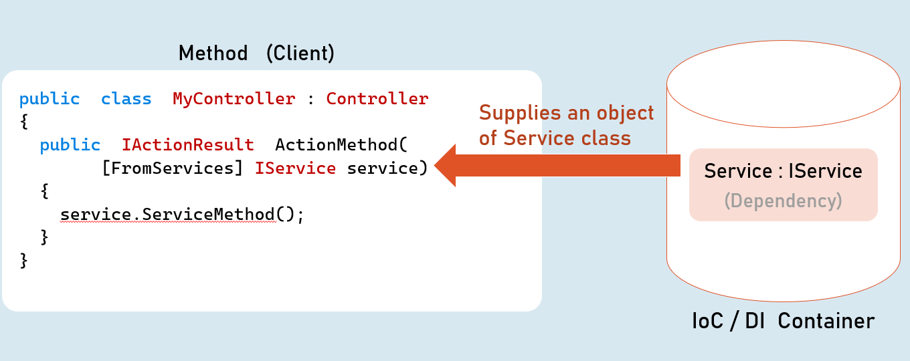

# Dependency Injection Cheat Sheet

## Services


'Service' is a class that contains business logic such as business calculations, business validations that are specific to the domain of the client's business.

Service is an abstraction layer (middle layer) between presentation layer (or application layer) and data layer.

It makes the business logic separated from presentation layer and data layer.

It makes the business logic to be unit testable easily.

Will be invoked by controller.


## Direct Dependency


Higher-level modules depend on lower-level modules.


## Dependency Problem
> Higher-level modules depend on lower-level modules.

- Means, both are tightly-coupled.

- The developer of higher-level module SHOULD WAIT until the completion of development of lower-level module.

- Requires much code changes in to interchange an alternative lower-level module.

- Any changes made in the lower-level module effects changes in the higher-level module.

- Difficult to test a single module without effecting / testing the other module.


## Dependency Inversion Principle
Dependency Inversion Principle (DIP) is a design principle (guideline), which is a solution for the dependency problem.


> "The higher-level modules (clients) SHOULD NOT depend on low-level modules (dependencies).

> Both should depend on abstractions (interfaces or abstract class)."

> "Abstractions should not depend on details (both client and dependency).

> Details (both client and dependency) should depend on abstractions."


The interface is controlled by the client.

Both client and dependency depend on abstraction.


## Inversion of Control (IoC)
- Inversion of Control (IoC) is a design pattern (reusable solution for a common problem), which suggests "IoC container" for implementation of Dependency Inversion Principle (DIP).

- It inverses the control by shifting the control to IoC container.

- "Don't call us, we will call you" pattern.

- It can be implemented by other design patterns such as events, service locator, dependency injection etc.


All dependencies should be added into the IServiceCollection (acts as IoC container).
```c#
builder.Services.Add(
  new ServiceDescriptor(
    typeof (Interface),
    typeof (Service)
    ServiceLifetime.LifeTime //Transient, Scoped, Singleton
  )
);

```


## Dependency Injection (DI)
- Dependency injection (DI) is a design pattern, which is a technique for achieving "Inversion of Control (IoC)" between clients and their dependencies.

- It allows you to inject (supply) a concrete implementation object of a low-level component into a high-level component.

- The client class receives the dependency object as a parameter either in the constructor or in a method.


## Method Injection





## Service Lifetime
(Transient, Scoped, Singleton)


A service lifetime indicates when a new object of the service has to be created by the IoC / DI container.

- Transient: Per injection

- Scoped: Per scope (browser request)

- Singleton: For entire application lifetime.


### Transient

Transient lifetime service objects are created each time when they are injected.

Service instances are disposed at the end of the scope (usually, a browser request)


### Scoped

Scoped lifetime service objects are created once per a scope (usually, a browser request).

Service instances are disposed at the end of the scope (usually, a browser request).


### Singleton

Singleton lifetime service objects are created for the first time when the are requested.

Service instances are disposed at application shutdown.


### Transient
```c#
builder.Services.AddTransient<IService, Service>(); //Transient Service
```
### Scoped
```c#
builder.Services.AddScoped<IService, Service>(); //Scoped Service
```
### Singleton
```c#
builder.Services.AddSingleton<IService, Service>(); //Singleton Service
```


## Service Scope


## View Injection


## Best Practices in DI


### Global state in services

> Avoid using static classes to store some data globally for all users / all requests.

> You may use Singleton services for simple scenarios / simple amount of data. In this case, prefer ConcurrentDictionary instead of Dictionary, which better handles concurrent access via multiple threads.

> Alternatively, prefer to use Distributed Cache / Redis for any significant amount of data or complex scenarios.


### Request state in services

> Don't use scoped services to share data among services within the same request, because they are NOT thread-safe.

> Use HttpContext.Items instead.


### Service Locator Pattern

> Avoid using service locator pattern, without creating a child scope, because it will be harder to know about dependencies of a class.

> For example, don't invoke GetService() in the default scope that is created when a new request is received.

> But you can use the IServiceScopeFactory.ServiceProvider. GetService() within a child scope.


### Calling Dispose() method

> Don't invoke the Dispose() method manually for the services injected via DI.

> The IoC container automatically invoke Dispose(), at the end of its scope.


### Captive Dependencies

> Don't inject scoped or transient services in singleton services.

> Because, in this case, transient or scoped services act as singleton services, inside of singleton service.


### Storing reference of service instance

> Don't hold the reference of a resolved service object.

> It may cause memory leaks and you may have access to a disposed service object.


## Autofac
- Autofac is another IoC container library for .Net Core.

- Means, both are tightly-coupled.

- Microsoft.Extensions.DependencyInjection [vs] Autofac

- https://autofac.readthedocs.io/en/latest/getting-started/index.html


### Microsoft.Extensions.DependencyInjection

- Built-in IoC container in asp.net core

- Lifetimes: Transient, Scoped, Singleton

- Metadata for services: Not supported

- Decorators: Not supported


### Autofac

- Alternative to the Microsoft.Extensions

- Lifetimes: InstancePerDependency, InstancePerLifetimeScope, SingleInstance, InstancePerOwned, InstancePerMatchingLifetimeScope

- Metadata for services: Supported

- Decorators: Supported


# Interview Questions

## Explain how dependency injection works in ASP.NET Core?
Dependency injection is a pattern that implements Inversion of Control (IoC) to separate the business logic from the application controllers 
Controllers and Service Classes are developed independently and finally matched through the contracts
layer, which defines the interfaces that service classes have to implement. Both contracts 
and Service Clasess are added to the IoC container through the `Services.Add()` method and they can be
recieved as parameters in the constructor of the controller class so it can be accessible for that class 
## “ASP.NET Core has dependency injection to manage services; are you aware of the different lifetimes? What are they, and what does each mean?”
- **Transient**: The service class is instantiated once per injection and its disposed once the scope is finished
- ****
- ****
## What are the benefits of Dependency Injection?

## What is IoC (DI) Container?

## What is Inversion of Control?

## How do you create your own scopes in asp.net core?

## How do you inject a service in view?

## Why you prefer Autofac over built-in Microsoft DI?

## What exception do you get when a specific service that you injected, can’t be found in the IoC container?