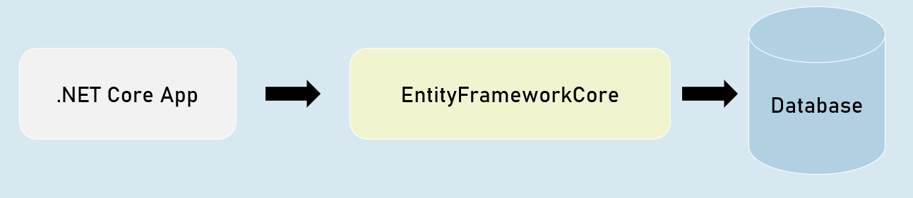
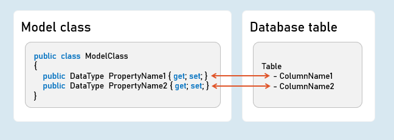
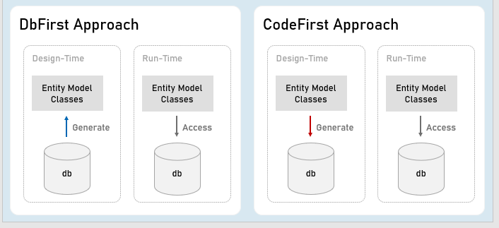
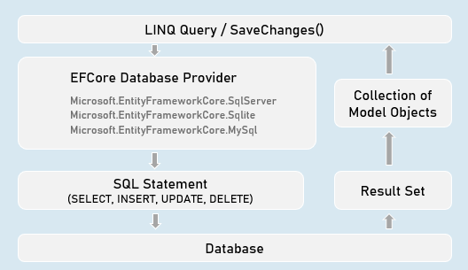
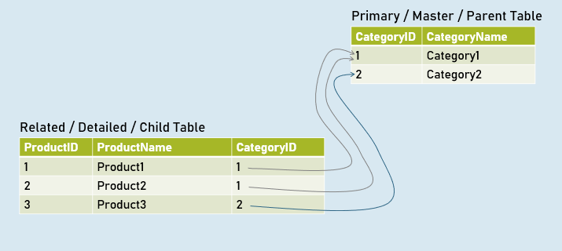
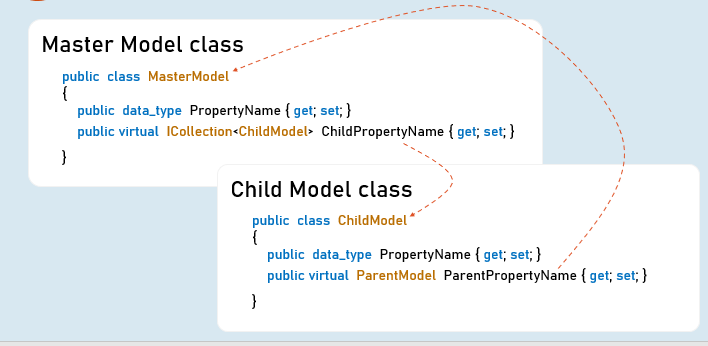
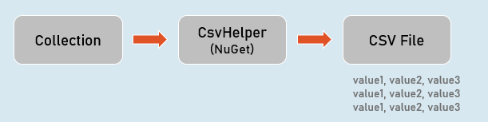

# Entity Framework - Section Cheat Sheet

## Introduction to EntityFrameworkCore
>  is light-weight, extensible and cross-platform framework for accessing databases in .NET applications.

> It is the most-used database framework for Asp.Net Core Apps.




### EFCore Models




## Pros & Cons of EntityFrameworkCore
### Shorter Code

The CRUD operations / calling stored procedures are done with shorter amount of code than ADO.NET.


### Performance

EFCore performs slower than ADO.NET.

So ADO.NET or its alternatives (such as Dapper) are recommended for larger & high-traffic applications.


### Strongly-Typed

The columns as created as properties in model class.

So the Intellisense offers columns of the table as properties, while writing the code.

Plus, the developer need not convert data types of values; it's automatically done by EFCore itself.


## Approaches in Entity Framework Core
### EFCore Approaches





## Pros and Cons of EFCore Approaches


### CodeFirst Approach

Suitable for newer databases.

Manual changes to DB will be most probably lost because your code defines the database.

Stored procedures are to be written as a part of C# code.

Suitable for smaller applications or prototype-level applications only; but not for larger or high data-intense applications.


### DbFirst Approach

Suitable if you have an existing database or DB designed by DBAs, developed separately.

Manual changes to DB can be done independently.

Stored procedures, indexes, triggers etc., can be created with T-SQL independently.

Suitable for larger applications and high data-intense applications.


## DbContext and DbSet

### DbContext

An instance of DbContext is responsible to hold a set of DbSets' and represent a connection with database.


### DbSet

Represents a single database table; each column is represented as a model property.


### Add DbContext as Service in Program.cs:
```c#
builder.Services.AddDbContext<DbContextClassName>( options => {
 options.UseSqlServer();
}
);
```


## Code-First Migrations

### Migrations

Creates or updates database based on the changes made in the model.


### in Package Manager Console (PMC):

`Add-Migration MigrationName`

//Adds a migration file that contains C# code to update the database


`Update-Database -Verbose`

//Executes the migration; the database will be created or table schema gets updated as a result.


## Seed Data
in DbContext:

`modelBuilder.Entity<ModelClass>().HasData(entityObject);`

It adds initial data (initial rows) in tables, when the database is newly created.


## EF CRUD Operations - Query


### SELECT - SQL
```sql
SELECT Column1, Column2 FROM TableName
 WHERE Column = value
 ORDER BY Column
```

### LINQ Query:
```c#
_dbContext.DbSetName
 .Where(item => item.Property == value)
 .OrderBy(item => item.Property)
 .Select(item => item);
 
//Specifies condition for where clause
//Specifies condition for 'order by' clause
//Expression to be executed for each row
```


## EF CRUD Operations - Insert
### INSERT - SQL
```sql
INSERT INTO TableName(Column1, Column2) VALUES (Value1, Value2)
```


### Add:
```c#
_dbContext.DbSetName.Add(entityObject);
//Adds the given model object (entity object) to the DbSet.
```

### SaveChanges()
```c#
_dbContext.SaveChanges();
//Generates the SQL INSERT statement based on the model object data and executes the same at database server.
```


## EF CRUD Operations - Delete
### DELETE - SQL
```sql
DELETE FROM TableName WHERE Condition
```


### Remove:
```c#
_dbContext.DbSetName.Remove(entityObject);
//Removes the specified model object (entity object) to the DbSet.
```

### SaveChanges()
```c#
_dbContext.SaveChanges();
//Generates the SQL DELETE statement based on the model object data and executes the same at database server.
```


## EF CRUD Operations - Update
### UPDATE - SQL
```sql
UPDATE TableName SET Column1 = Value1, Column2 = Value2 WHERE PrimaryKey = Value
```


### Update:
```c#
entityObject.Property = value;
//Updates the specified value in the specific property of the model object (entity object) to the DbSet.
```

### SaveChanges()
```c#
_dbContext.SaveChanges();
//Generates the SQL UPDATE statement based on the model object data and executes the same at database server.
```


## How EF Query Works?
### Workflow of Query Processing in EF




## EF - Calling Stored Procedures
### Stored Procedure for CUD (INSERT | UPDATE | DELETE):
```c#
int DbContext.Database.ExecuteSqlRaw(
 string sql,
 params object[] parameters)
 
//Eg: "EXECUTE [dbo].[StoredProcName] @Param1 @Parm2
//A list of objects of SqlParameter type
```

### Stored Procedure for Retrieving (Select):
```c#
IQueryable<Model> DbSetName.FromSqlRaw(
 string sql,
 paramsobject[] parameters)
 
//Eg: "EXECUTE [dbo].[StoredProcName] @Param1 @Parm2"
//A list of objects of SqlParameter type
```


### Creating Stored Procedure (SQL Server)
```sql
CREATE PROCEDURE [schema].[procedure_name]
(@parameter_name data_type, @parameter_name data_type)
AS BEGIN
 statements
END
```


## Advantages of Stored Procedure
### Single database call

You can execute multiple / complex SQL statements with a single database call.

As a result, you'll get:

- Better performance (as you reduce the number of database calls)

- Complex database operations such as using temporary tables / cursors becomes easier.


### Maintainability

The SQL statements can be changed easily WITHOUT modifying anything in the application source code (as long as inputs and outputs doesn't change)


## [Column] Attribute
### Model class
```c#
public class ModelClass
{
  [Column("ColumnName", TypeName = "datatype")]
  public DataType PropertyName { get; set; }
 
  [Column("ColumnName", TypeName = "datatype")]
  publicDataTypePropertyName { get; set; }
}
Specifies column name and data type of SQL Server table.
```


## EF - Fluent API
### DbContext class
```c#
public class CustomDbContext : DbContext
{
  protected override void OnModelCreating(ModelBuilder modelBuilder)
  {
    //Specify table name (and schema name optionally) to be mapped to the model class
    modelBuilder.Entity<ModelClass>( ).ToTable("table_name", schema: "schema_name");
 
    //Specify view name (and schema name optionally) to be mapped to the model class
    modelBuilder.Entity<ModelClass>( ).ToView("view_name", schema: "schema_name");
 
    //Specify default schema name applicable for all tables in the DbContext
    modelBuilder.HasDefaultSchema("schema_name");
  }
}
```
```c#
public class CustomDbContext : DbContext
{
  protected override void OnModelCreating(ModelBuilder modelBuilder)
  {
    modelBuilder.Entity<ModelClass>( ).Property(temp => temp.PropertyName)
      .HasColumnName("column_name") //Specifies column name in table
      .HasColumnType("data_type") //Specifies column data type in table
      .HasDefaultValue("default_value") //Specifies default value of the column
  }
}
```
```c#
public class CustomDbContext : DbContext
{
  protected override void OnModelCreating(ModelBuilder modelBuilder)
  {
    //Adds database index for the specified column for faster searches
    modelBuilder.Entity<ModelClass>( ).HasIndex("column_name").IsUnique();
 
    //Adds check constraint for the specified column - that executes for insert & update
    modelBuilder.Entity<ModelClass>( ).HasCheckConstraint("constraint_name", "condition");
 }
}
```

## EF - Table Relations with Fluent API
### Table Relations




### EF - Table Relations with Navigation Properties




### EF - Table Relations with Fluent API
```c#
DbContext class

public class CustomDbContext : DbContext
{
  protected override void OnModelCreating(ModelBuilder modelBuilder)
  {
    //Specifies relation between primary key and foreign key among two tables
    modelBuilder.Entity<ChildModel>( )
     .HasOne<ParentModel>(parent => parent.ParentReferencePropertyInChildModel)
     .WithMany(child => child.ChildReferencePropertyInParentModel) //optional
     .HasForeignKey(child => child.ForeignKeyPropertyInChildModel)
  }
}
```


## EF - Async Operations
### async

- The method is awaitable.

- Can execute I/O bound code or CPU-bound code

### await

- Waits for the I/O bound or CPU-bound code execution gets completed.

- After completion, it returns the return value.


## Generate PDF Files


### Rotativa.AspNetCore:
```c#
using Rotativa.AspNetCore;
using Rotativa.AspNetCore.Options;
 
return new ViewAsPdf("ViewName", ModelObject, ViewData)
{
  PageMargins = new Margins() { Top = 1, Right = 2, Bottom = 3, Left = 4 },
  PageOrientation = Orientation.Landscape
}
```


## Generate CSV Files (CSVHelper)




## CsvWriter:
### WriteRecords(records)

Writes all objects in the given collection.

Eg:
```csv
1,abc
2,def
```

### WriteHeader<ModelClass>( )

Writes all property names as headings.

Eg:

`Id, Name`


### WriteRecord(record)

Writes the given object as a row.

Eg:

`1, abc`


### WriteField( value )

Writes given value.


### NextRecord( )

Moves to the next line.


### Flush( )

Writes the current data to the stream.


## Generate Excel Files (EPPlus)


## ExcelWorksheet
`["cell_address"].Value`

Sets or gets value at the specified cell.


`["cell_address"].Style`

Sets or gets formatting style of the specific cell.

# Interview Questions 

## What is Entity Framework?
- Entity Framework (EF) is an objet-relational mapper (ORM) for . NET applications. 
- It allows developers to work with relational data using domain-specific objects.
- EF eliminates the need for writing most of the data-access code manually. 
- It supports querying, saving, concurrency, transactions, caching and migrations. 

## “What other libraries or frameworks might you use with ASP.NET Core to build your application, and for what purposes?”
- `Blazor:` A full-stack web UI framework that allows building interactive web components using C#.
- `Razor-Pages:` A page-based model for server-rendered web UI. 
- `MVC (Model-View-Controller):` Renders UI on the server and follows the MVC architectural pattern
- `Single Page Applications (SPA):` Use popluar JavaScript frameworks (Angular, React, Vue) for client-side logic

## What is SQL injection attack?
- A SQL injection attack occurs when malicious SQL code is injected into an application
- It allows attackers to read sensitive data, modify data, execute admin operations and more. 
- SQL injection is a high-impact security issue 
## How to handle SQL injection attacks in Entity Framework?
- Entity Framework migrates SQL injection by using parameterized queries
- Always use parameterized queries instead of directly injection user input into SQL commands. 
- Avoid returning `IQueryable<T>` types from ethods exposed to untrusted callers

## What are POCO classes?
- POCO classes are simple, plain C# or VB.NET classes. 
- They don't deppend on any framework-specific base class. 
- Used to represent persistent entities without ORM-specific attributes
- Implement domain business logic and support LINQ queries
## What is the proxy object?
- In EF, a proxy object is a dynamically generated subclass of an entity class. 
- It enables lazy loading, change tracking, and navigations properties. 
- Proxy objects are used for POCO proxy entities. 
## What are the various Entity States in EF?
- `Added:` Entity is new and not yet saved to the database. 
- `Modified:` Entity has been modified and needs to be updated. 
- `Deleted:` Entity is marked for deletion. 
- `Unchanged:` Entity in unchanged since it was retrieved from the database. 
## What are various approaches in Code First for model designing?
- `Data Annotations`: Use attributes to define model properties
- `Fluent API`: Configure model relationships and constraints fluently 
- `Convention Over Configuration`: Follow conventions for naming and mapping. 
## What C# Datatype is mapped with which Datatype in SQL Server?
- `int` maps to `int` or `bigint`
- `string` maps to `nvarchar(max`
- `DateTime` maps to `datetime2`
- And so on.. 
## What is Code First Migrations in Entity Framework?
- `Code First Migrations` allow you to evolve your database schema over time. 
- You create migrations to update the database schema based on changes in your model
- Migrations generate SQL scripts for schema changes
## What is Migrations History Table?
- The `__MigrationHistory` table stores information about applied migrations
- It tracks which migrations have been applied to the database
## How you apply code first migrations through code in EF Core?
- Use the `Add-Migration` command in the Package Manager Console. 
- Then apply migrations using `Update-Database`. 