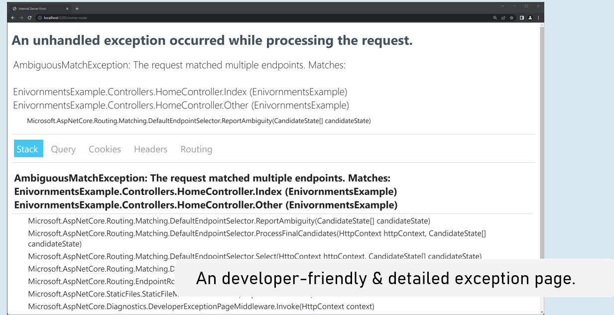
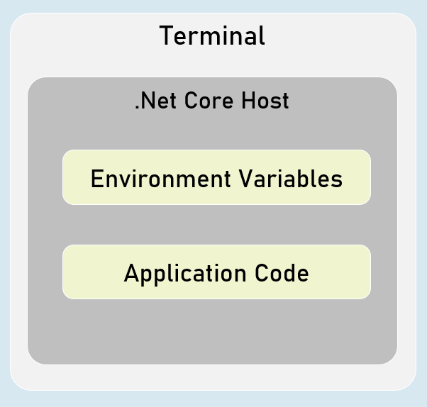

# Environments Cheat Sheet (PPT)
## Introduction to Environments
An environment represents is a system in which the application is deployed and executed.


### Development

The environment, where the developer makes changes in the code, commits code to the source control.


### Staging

The environment, where the application runs on a server, from which other developers and quality controllers access the application.


### Production

The environment, where the real end-users access the application.

Shortly, it's where the application "live" to the audience.


## Environment Setting
### Set Environment in launchSettings.json

in launchSettings.json
```c#
{
 "profiles":
 {
  "profileName":
  {
   "environmentVariables":
   {
    "DOTNET_ENVIRONMENT": "EnvironmentNameHere",
    "ASPNETCORE_ENVIRONMENT": "EnvironmentNameHere"
   }
  }
 }
}

```
### Access Environment in Program.cs

app.Environment


## IWebHostEnvironment
### EnvironmentName

Gets or sets name of the environment.

By default it reads the value from either DOTNET_ENVIRONMENT or ASPNETCORE_ENVIRONMENT.


### ContentRootPath

Gets or sets absolute path of the application folder.


### IsDevelopment()

Returns Boolean true, if the current environment name is "Development".


### IsStaging()

Returns Boolean true, if the current environment name is "Staging".


### IsProduction()

Returns Boolean true, if the current environment name is "Production".


### IsEnvironment(string environmentName)

Returns Boolean true, if the current environment name matches with the specified environment.


## Access Environment in Controller and other classes
using Microsoft.AspNetCore.Mvc;
using Microsoft.AspNetCore.Hosting;
 
public class ControllerName : Controller
{
 private readonly IWebHostEnvironment _webHost;
 
 public ControllerName(IWebHostEnvironment webHost)
 {
  _webHost = webHost;
 }
}


## Developer Exception Page



## Enable developer exception page
in Program.cs
```c#
if (app.Environment.IsDevelopment()
{
 app.UseDeveloperExceptionPage();
}
```


## Process-Level Environment




The environment variables are stored & accessible within the same process only.


## Setting Environment Variables in Process
in "Windows PowerShell" / "Developer PowerShell in VS"

$Env:Environment="EnvironmentName"

dotnet run --no-launch-profile


## <environment> tag helper
### include
```c#
<environment include="Environment1,Environment2">
  html content here
</environment>
```
It renders the content only when the current environment name matches with either of the specified environment names in the "include" property.


exclude
```c#
<environment exclude="Environment1,Environment2">
  html content here
</environment>
```

It renders the content only when the current environment name doesn't match with either of the specified environment names in the "exclude" property.


