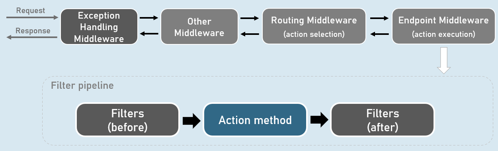
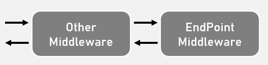
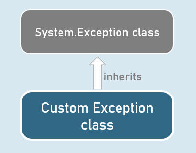
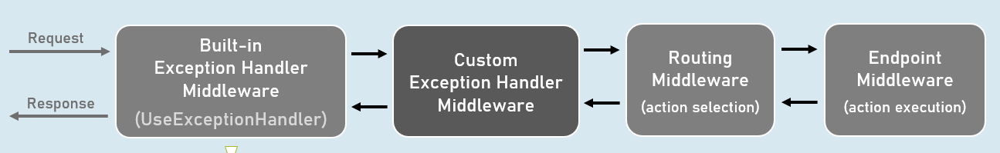

# Error Handling Section Cheat Sheet
## Exception Handling Middleware
Handles all errors occurred in filter pipeline (including model binding, controllers and filters).

Should be added to the application pipeline, before RoutingMiddleware.





### Custom Exception Handling Middleware
```c#
public class ExceptionHandlingMiddleware
{
  private readonly RequestDelegate _next; //Stores reference of subsequent middleware
 
  public ExceptionHandlingMiddleware(RequestDelegate next)
  {
    _next = next;
  }
  public async Task InvokeAsync(HttpContext context)
  {
    try
    {
      await _next(context);
    }
    catch(Exception ex)
    {
      …
    }
  }
}
```




## Custom Exceptions
A custom exception class is an exception class that inherits from System.Exception class & represents a domain-specific excpetion

Used to represent the domain-specific errors stand-out of system-related (.NET) related exceptions.



### Custom Exception class
```c#
public class CustomException : Exception
{
  public CustomException() : base()
  {
  }
 
  public CustomException(string? message) : base(message)
  {
  }
 
  public CustomException(string? message, Exception? innerException) : base(message, innerException)
  {
  }
}
```


### UseExceptionHandler()
The built-in UseExceptionHandler() middleware redirects to the specified route path, when an unhandled exception occurs during the application execution.

Can be used as an alternative to custom exception handling middleware.




Catches and logs unhandled exceptions.

Re-executes the request in an alternative pipeline using the specified route path.

# Interview Questions
## How do you handle errors in asp.net core application?
Errors arising in controller / view / result / middleware execution can be best handled with exception middleware.
```c#
public class ExceptionHandlingMiddleware : IMiddleware
{
  public async Task InvokeAsync(HttpContext context, RequestDelegate next)
  {
   try
   {
    await next(context);
   }
   catch (Exception ex)
   {
    //log errors
   }
  }
}
```
Apply the exception handling middleware before all custom middleware:
```c#
if (builder.Environment.IsDevelopment())
{
  app.UseDeveloperExceptionPage(); //enables developer exception page on exception in “Development” environment
}
else
{
  app.UseMiddleware<ExceptionHandlingMiddleware>(); //adds ExceptionHandlingMiddleware in case of other than “Development” environment
}
```

### Status code pages

To enable custom error pages on specific status codes:
```c#
app.UseStatusCodePagesWithRedirects("url”); //it redirects to the specified url when exception occurs with specific status code such as 400, 500, 404 etc.
```
## How do you choose between Exception Middleware and Exception filter?
- Though we can also create Exception filter by implementing IExceptionFilter interface, it’s not recommended unless you actually need it.

- Exception filter handles unhandled exceptions that occur in controller creation, model binding, action filters or action methods.

- Exception filter doesn't handle the unhandled exceptions that occur in authorization filters, resource filters, result filters or IActionResult execution.

- Exception filters are recommended to be used only when you want a different error handling and generate different result for specific controllers; otherwise, ErrorHandlingMiddleware is recommended over Exception Filters.