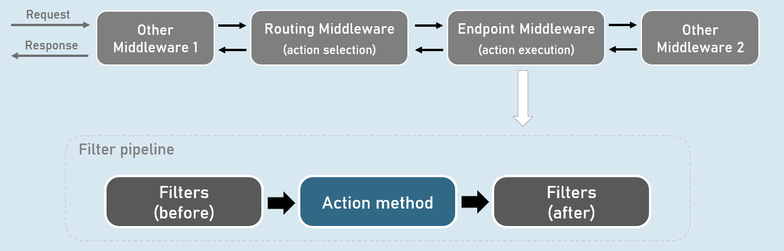
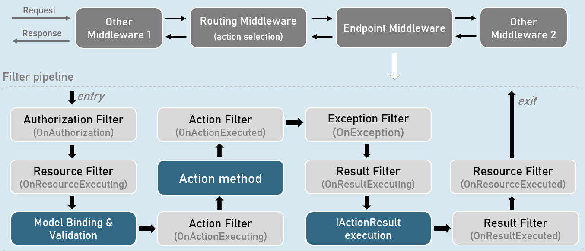
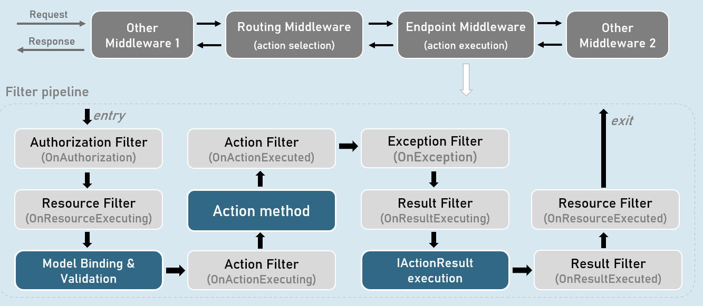
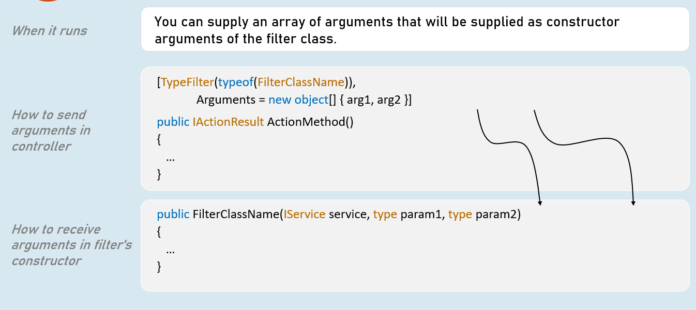
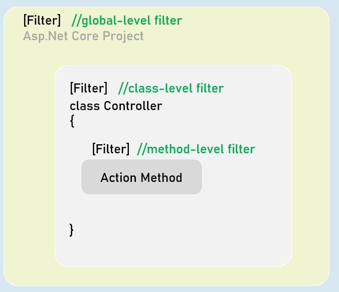
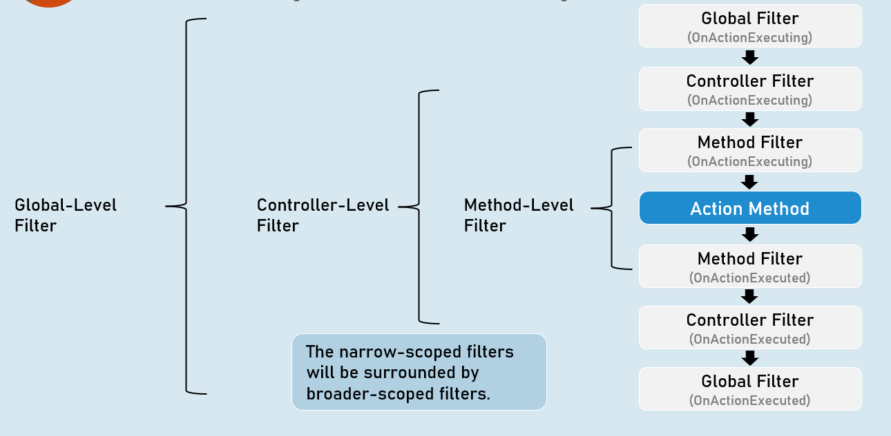

# Filters Section Cheat Sheet
## Filters
Filters are the code blocks that execute before / after specific stages in "Filter Pipeline".

Filters perform specific tasks such as authorization, caching, exeption handling etc.




### Filter Pipeline





## Overview of Types of Filters
### Authorization Filter

Determines whether the user is authorized to access the action method.


### Resource Filter

Invoking custom model binder explicitly

Caching the response.


### Action Filter

Manipulating & validating the action method parameters.

Manipulating the ViewData.

Overriding the IActionResult provided by action method.


### Exception Filter

Handling unhandled exception that occur in model binding, action filters or action methods.


### Result Filter

Preventing IActionResult from execution.

Adding last-moment changes to response (such as adding response headers).


## Action Filter


### When it runs

Runs immediately before and after an action method executes.


### 'OnActionExecuting' method

- It can access the action method parameters, read them & do necessary manipulations on them.

- It can validate action method parameters.

- It can short-circuit the action (prevent action method from execution) and return a different IActionResult.


### 'OnActionExecuted' method

- It can manipulate the ViewData.

- It can change the result returned from the action method.


## Filter Arguments



## Global Filters
### Filter Scopes




### What are global filters?

Global filters are applied to all action methods of all controllers in the project.


### How to add global filters in Program.cs?
```c#
builder.Services.AddControllersWithViews(options => {
  options.Filters.Add<FilterClassName>(); //add by type
  //or
  options.Filters.Add(new FilterClassName()); //add filter instance
});
```

## Default Order of Filter Execution





## Custom Order of Filters


IOrderedFilter
Example


IOrderedFilter
Action filter with IOrderedFilter

public class FilterClassName : IActionFilter, IOrderedFilter
{
  public int Order { get; set; } //Defines sequence of execution
 
  public FilterClassName(int order)
  {
    Order = order;
  }
 
  public void OnActionExecuting(ActionExecutingContext context)
  {
    //TO DO: before logic here
  }
 
  public void OnActionExecuted(ActionExecutedContext context)
  {
    //TO DO: after logic here
  }
}


Async Filters
Asynchronous Action Filter

public class FilterClassName : IAsyncActionFilter, IOrderedFilter
{
  public int Order { get; set; } //Defines sequence of execution
 
  public FilterClassName(int order)
  {
    Order = order;
  }
 
  public async Task OnActionExecutionAsync(ActionExecutingContext context, ActionExecutionDelegate next)
  {
    //TO DO: before logic here
    await next();
    //TO DO: after logic here
  }
}


Short-circuiting Filters
Action Filters

When it runs

Runs immediately before and after an action method executes.


'OnActionExecuting' method

It can access the action method parameters, read them & do necessary manipulations on them.

It can validate action method parameters.

It can short-circuit the action (prevent action method from execution) and return a different IActionResult.


'OnActionExecuted' method

It can manipulate the ViewData.

It can change the result returned from the action method.

It can throw exceptions to either return the exception to the exception filter (if exists); or return the error response to the browser.


Short-Circuiting Action Filter
public class FilterClassName : IAsyncActionFilter, IOrderedFilter
{
 public int Order { get; set; } //Defines sequence of execution
 
 public FilterClassName(int order)
 {
  Order = order;
 }
 
 public async Task OnActionExecutionAsync(ActionExecutingContext context, ActionExecutionDelegate next)
 {
  //TO DO: before logic here
  context.Result = some_action_result; //you can return any type of IActionResult
  //Not calling next(). So it leads remaining filters & action method short-circuited.
 }
}


Short-Circuiting (exit) the filters


Result Filter


When it runs

Runs immediately before and after an IActionResult executes.

It can access the IActionResult returned by the action method.


'OnResultExecuting' method

It can continue executing the IActionResult normally, by not assigning "Result" property of the context.

It can short-circuit the action (prevent IActionResult from execution) and return a different IActionResult.


'OnResultExecuted' method

It can manipulate the last-moment changes in the response, such as adding necessary response headers.

It should not throw exceptions because, exceptions raised in result filters would not be caught by the exception filter.


Synchronous Result Filter

public class FilterClassName : IResultFilter, IOrderedFilter
{
  public int Order { get; set; } //Defines sequence of execution
 
  public FilterClassName(int order)
  {
    Order = order;
  }
  public void OnResultExecuting(ResultExecutingContext context)
  {
    //TO DO: before logic here
  }
  public void OnResultExecuted(ResultExecutedContext context)
  {
    //TO DO: after logic here
  }
}


Asynchronous Result Filter

public class FilterClassName : IAsyncResultFilter, IOrderedFilter
{
  public int Order { get; set; } //Defines sequence of execution
 
  public FilterClassName(int order)
  {
    Order = order;
  }
 
  public async Task OnResultExecutionAsync(ResultExecutingContext context, ResultExecutionDelegate next)
  {
  //TO DO: before logic here
  await next();
  //TO DO: after logic here
  }
}


Resource Filter


When it runs

Runs immediately after Authorize Filter and after Result Filter executes.


'OnResourceExecuting' method

It can do some work before model binding. Eg: Adding metrics to an action method.

It can change the way how model binding works (invoking a custom model binder explicitly).

It can short-circuit the action (prevent IActionResult from execution) and return a different IActionResult.

Eg: Short-circuit if an unsupported content type is requested.


'OnResourceExecuted' method

It can read the response body and store it in cache.


Synchronous Resource Filter

public class FilterClassName : IResourceFilter, IOrderedFilter
{
  public int Order { get; set; } //Defines sequence of execution
 
  public FilterClassName(int order)
  {
    Order = order;
  }
 
  public void OnResourceExecuting(ResourceExecutingContext context)
  {
    //TO DO: before logic here
  }
 
  public void OnResourceExecuted(ResourceExecutedContext context)
  {
    //TO DO: after logic here
  }
}


Asynchronous Resource Filter

public class FilterClassName : IAsyncResourceFilter, IOrderedFilter
{
  public int Order { get; set; } //Defines sequence of execution
 
  public FilterClassName(int order)
  {
    Order = order;
  }
 
  public async Task OnResourceExecutionAsync(ResourceExecutingContext context, ResourceExecutionDelegate next)
  {
    //TO DO: before logic here
    await next();
    //TO DO: after logic here
  }
}


Authorization Filter


Authorization Filters

Runs before any other filters in the filter pipeline.


'OnAuthorize' method

Determines whether the user is authorized for the request.

Short-circuits the pipeline if the request is NOT authorized.

Don't throw exceptions in OnAuthorize method, as they will not be handled by exception filters.


Synchronous Authorization Filter

public class FilterClassName : IAuthorizationFilter
{
  public void OnAuthorization(AuthorizationFilterContext context)
  {
    //TO DO: authorization logic here
  }
}


Asynchronous Authorization Filter

public class FilterClassName : IAsyncAuthorizationFilter
{
  public async Task OnAuthorizationAsync(AuthorizationFilterContext context)
  {
    //TO DO: authorization logic here
  }
}


Exception Filter


When it runs

Runs when an exception is raised during the filter pipeline.


'OnException method

Handles unhandled exceptions that occur in controller creation, model binding, action filters or action methods.

Doesn't handle the unhandled exceptions that occur in authorization filters, resource filters, result filters or IActionResult execution.

Recommended to be used only when you want a different error handling and generate different result for specific controllers; otherwise, ErrorHandlingMiddleware is recommended over Exception Filters.


Synchronous Exception Filter

public class FilterClassName : IAsyncExceptionFilter
{
  public async Task OnExceptionAsync(ExceptionFilterContext context)
  {
    //TO DO: exception handling logic here, as follows
    context.Result = some_action_result;
    //or
    context.ExceptionHandled = true;
    return Task.CompletedTask;
  }
}


Asynchronous Exception Filter

public class FilterClassName : IAsyncExceptionFilter
{
  public async Task OnExceptionAsync(ExceptionFilterContext context)
  {
    //TO DO: exception handling logic here, as follows
    context.Result = some_action_result;
    //or
    context.ExceptionHandled = true;
    return Task.CompletedTask;
  }
}


Impact of Short-Circuiting
Short-circuiting Authorization Filter


Short-circuiting Resource Filter


Short-circuiting Action Filter


Short-circuiting Exception Filter


Short-circuiting Result Filter


Short-circuiting the filters


AlwaysRun Result Filter
Short-circuiting Authorization Filter


Short-circuiting Resource Filter


Short-circuiting Action Filter


Short-circuiting Exception Filter


Short-circuiting Result Filter


When AlwaysRunResultFilter runs

Runs immediately before and after result filters.


Result filters:

Doesn't execute when authorization filter, resource filter or exception filter short-circuits.


AlwaysRunResult filter:

Execute always even when authorization filter, resource filter or exception filter short-circuits.


'OnResultExecuting' method

Same as Result filter


'OnResultExecuted' method

Same as Result filter


Synchronous Always Run Result Filter

public class FilterClassName : IAlwaysRunResultFilter
{
  public void OnResultExecuting(ResultExecutingContext context)
  {
    //TO DO: before logic here
  }
  public void OnResultExecuted(ResultExecutedContext context)
  {
    //TO DO: after logic here
  }
}


Asynchronous Always Run Result Filter

public class FilterClassName : IAsyncAlwaysRunResultFilter
{
  public async Task OnResultExecutionAsync(ResultExecutingContext context, ResultExecutionDelegate next)
  {
   //TO DO: before logic here
   await next();
   //TO DO: after logic here
  }
}


Filter Overrides
[TypeFilter(typeof(FilterClassName))] //filter applied at controller level
public class ControllerName : Controller
{
  public IActionResult Action1() //requirement: The filter SHOULD execute
  {
  }
  public IActionResult Action2() //requirement: The filter SHOULD NOT execute. But how??
  {
  }
}


Attribute to be applied to desired action method

public class SkipFilterAttribute : Attribute, IFilterMetadata
{
}


Action method

[SkipFilter]
public IActionResult ActionMethod()
{
}


Filter that respects 'SkipFilterAttribute'

public class FilterClassName : IActionFilter //or any other filter interface
{
  public void OnActionExecuting(ActionExecutingContext context)
  {
    //get list of filters applied to the current working action method
    if (context.Filters.OfType<SkipResultFilter>().Any())
    {
      return;
    }
    //TO DO: before logic here
  }
 
  public void OnActionExecuted(ActionExecutedContext context)
  {
    //TO DO: after logic here
  }
}
It skips execution of code of a filter, for specific action methods.


[ServiceFilter]
Common purpose

Both are used to apply a filter a controller or action method.


Type Filter Attribute

//can supply arguments to filter
[TypeFilter(typeof(FilterClassName), Arguments = new object[] { arg1, arg2 })]
public IActionResult ActionMethod()
{
  …
}


Service Filter Attribute

//can't supply arguments to filter
[ServiceFilter(typeof(FilterClassName))]
public IActionResult ActionMethod()
{
  …
}


Type Filter

Can supply arguments to the filter.

Filter instances are created by using Microsoft.Extensions.DependencyInjection. ObjectFactory.

They're NOT created using DI (Dependency Injection).

The lifetime of filter instances is by default transient (a new filter instance gets created every time when it is invoked).

But optionally, you can re-use the same instance of filter class across multiple requests, by setting a property called TypeFilterAttribute.IsReusable to 'true'.

Filter classes NEED NOT be registered (added) to the IoC container.

Filter classes CAN inject services using both constructor injection or method injection.


Service Filter

Can't supply arguments to the filter.

Filter instances are created by using ServiceProvider (using DI).

The lifetime of filter instances is the actual lifetime of the filter class added in the IoC container.

Eg: If the filter class is added to the IoC container with AddScoped() method, then its instances are scoped.

Filter class SHOULD be registered (added) to the IoC container, much like any other service.

Filter classes CAN inject services using both constructor injection or method injection.


Filter attribtute classes
IActionFilter [vs] ActionFilterAttribute

[versus]

Action filter that implements 'IActionFilter'

public class FilterClassName : IActionFilter, IOrderedFilter
{
  //supports constructor DI
}


Action filter that inherits 'ActionFilterAttribute'

public class FilterClassName : ActionFilterAttribute
{
  //doesn't support constructor DI
}


Filter interfaces:

IAuthorizationFilter

IResourceFilter

IActionFilter

IExceptionFilter

IResultFilter

IAsyncAuthorizationFilter

IAsyncResourceFilter

IAsyncActionFilter

IAsyncExceptionFilter

IAsyncResultFilter


Filter attributes:

ActionFilterAttribute

ExceptionFilterAttribute

ResultFilterAttribute


Action filter that implements 'IActionFilter'

public class FilterClassName : IActionFilter, IOrderedFilter
{
  public int Order { get; set; }
 
  public FilterClassName(IService service, type arg)
  {
  }
 
  public void OnActionExecuting(ActionExecutingContext context)
  {
  }
 
  public void OnActionExecuted(ActionExecutedContext context)
  {
  }
}


[TypeFilter(typeof(FilterClassName),
Arguments = new object[] { arg1, … })]


Action filter that inherits 'ActionFilterAttribute'

public class FilterClassName : ActionFilterAttribute
{
  public FilterClassName(type arg)
  {
  }
 
  public override void OnActionExecuting(ActionExecutingContext context)
  {
  }
 
  public override void OnActionExecuted(ActionExecutedContext context)
  {
  }
}
[FilterClassName(arg1, … )]


Internal definitions of IActionFilter and ActionFilterAttribute
IActionFilter

namespace Microsoft.AspNetCore.Mvc.Filters
{
  public interface IActionFilter : IFilterMetadata
  {
    void OnActionExecuting(ActionExecutingContext context);
    void OnActionExecuted(ActionExecutedContext context);
  }
}


ActionFilterAttribute

namespace Microsoft.AspNetCore.Mvc.Filters
{
  public class ActionFilterAttribute : Attribute, IActionFilter, IAsyncActionFilter, IOrderedFilter, IResultFilter, IAsyncResultFilter
  {
    public virtual void OnActionExecuting(ActionExecutingContext context) { }
    public virtual void OnActionExecuted(ActionExecutedContext context) { }
    public virtual void OnResultExecuting(ActionExecutingContext context) { }
    public virtual void OnResultExecuted(ActionExecutedContext context) { }
    public virtual Task OnActionExecutionAsync(ActionExecutingContext context, ActionExecutionDelegate next) { }
    public virtual Task OnResultExecutionAsync(ResultExecutingContext context, ResultExecutionDelegate next) { }
    public int Order { get; set; }
  }
}


Filter interface [vs] FilterAttribute class
Filter interface [such as IActionFilter, IResultFilter etc.]

Filter class MUST implement all methods - both "Executing" and "Executed" methods.

Filter class CAN have DI with either constructor injection or method injection.

Doesn't implement "Attribute" class.

Filter should be applied to controller or action methods by using [ServiceFilter] or [TypeFilter] attributes; otherwise can be applied as global filter in the Program.cs.

Eg: [TypeFilter(typeof(FilterClassName))] //lengthy

Filter class can receive arguments only through constructor parameters; but only with [TypeFilter] attribute; not with [ServiceFilter] attribute.


FilterAttribute class [such as ActionFilterAttribute etc.]

Filter class MAY override desired (either or both methods - "Executing" and "Executed") methods.

Filter class CAN'T have DI with neither constructor injection nor method injection.

FilterAttribute class [such as ActionFilterAttribute etc.]

Filter can be applied to controller or action methods by directly using the filter class name itself (without using [ServiceFilter] or [TypeFilter] attributes); otherwise can be applied as global filter in the Program.cs.

Eg: [FilterClassName] //simple

Filter class can receive arguments either through constructor parameters or filter class's properties.


IFilterFactory
Filter factory that inherits 'IFilterFactory'

public class FilterClassNameAttribute : Attribute,
IFilterFactory
{
  public type Prop1 { get; set; }
 
  public FilterClassName(type arg1, type arg2)
  {
    this.Prop1 = arg1; this.Prop2 = arg2;
  }
 
  public IFilterMetadata CreateInstance(IServiceProvider serviceProvider)
  {
    FilterClassName filter = serviceProvider.GetRequiredService<FilterClassName>(); //instantiate the filter
    filter.Property1 = Prop1;
    …
    return filter;
  }
}
[FilterClassName(arg1, arg2, … )]


Action filter that inherits 'ActionFilterAttribute'

public class FilterClassName : ActionFilterAttribute
{
  public FilterClassName(type arg1, type arg2)
  {
  }
 
  public override void OnActionExecuting(ActionExecutingContext context)
  {
  }
 
  public override void OnActionExecuted(ActionExecutedContext context)
  {
  }
}
[FilterClassName(arg1, arg2, … )]


IFilterFactory

namespace Microsoft.AspNetCore.Mvc.Filters
{
  public interface IFilterFactory : IFilterMetadata
  {
     IFilterMetadata CreateInstance(IServiceProvider serviceProvider);
     bool IsReusable { get; }
  }
}


FilterAttribute class [such as ActionFilterAttribute etc.]

Filter CAN be applied as an attribute to the controller or action method. Eg: [FilterClassName]

Filter class CAN'T have DI with neither constructor injection nor method injection.

Filter class CAN receive arguments either through constructor parameters or filter class's properties.


IFilterFactory

Filter CAN be applied as an attribute to the controller or action method. Eg: [FilterClassName]

Filter class CAN have DI with either constructor injection or method injection.

Filter class CAN receive arguments only through filter class's properties, if it is instantiated through ServiceProvider (using DI).


Alternatively, if you don't need to inject services using DI in the filter class; you can instantiate the filter class with 'new' keyword, in the CreateInstance() method of IFilterFactory; then the filter class can receive arguments either as constructor parameters or properties.


Filters [vs] Middleware

Middleware

Middleware pipeline is a superset of Filter pipeline, which contains the full-set of all middlewares added to the ApplicationBuilder in the application's startup code (Program.cs).

Middleware pipeline execute for all requests.

Middleware handles application-level functionality such as Logging, HTTPS redirection, Performance profiling, Exception handling, Static files, Authentication etc., by accessing low-level abstractions such as HttpContext.


Filter

Filter pipeline is a subset of Middleware pipeline which executes under "EndPoint Middleware".

In addition, filter pipeline executes for requests that reach "EndPoint Middleware".

Filters handle MVC-specific functionality such as manipulating or accessing ViewData, ViewBag, ModleState, Action result, Action parameters etc.

Middleware Pipeline


