# Identity, Authorization and Security Section Cheat Sheet (PPT)
## Introduction to Identity
It is an API that manages users, passwords, profile data, roles, tokens, email confirmation, external logins etc.

It is by default built on top of EntityFrameworkCore; you can also create custom data stores.

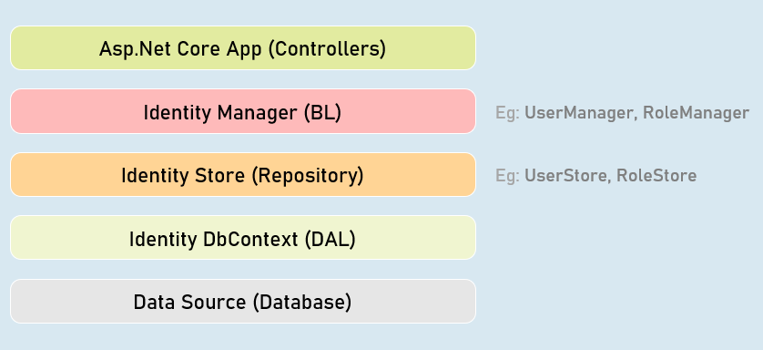


## IdentityUser<T>
Acts as a base class for ApplicationUser class that acts as model class to store user details.

You can add additional properties to the ApplicationUser class.

### sBuilt-in Properties:

- Id

- UserName

- PasswordHash

- Email

- PhoneNumber


## IdentityRole<T>
Acts as a base class for ApplicationRole class that acts as model class to store role details. Eg: "admin"

You can add additional properties to the ApplicationRole class.

### Built-in Properties:

- Id

- Name


## Register View

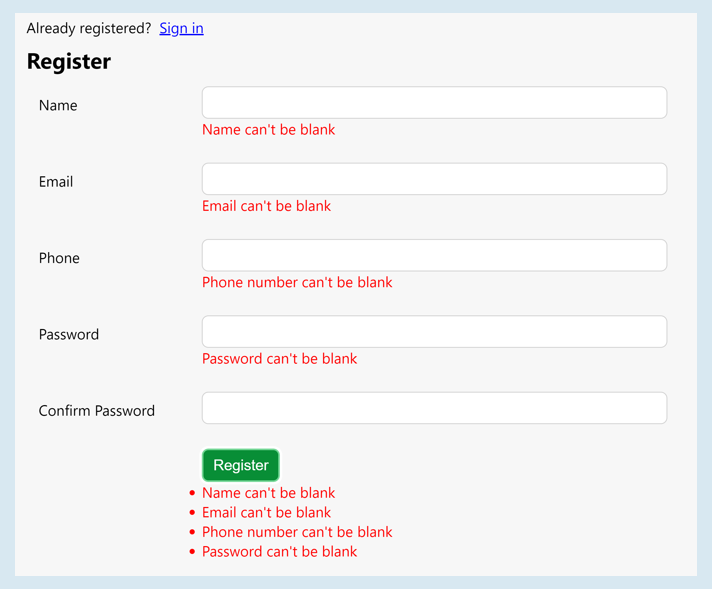


## Managers

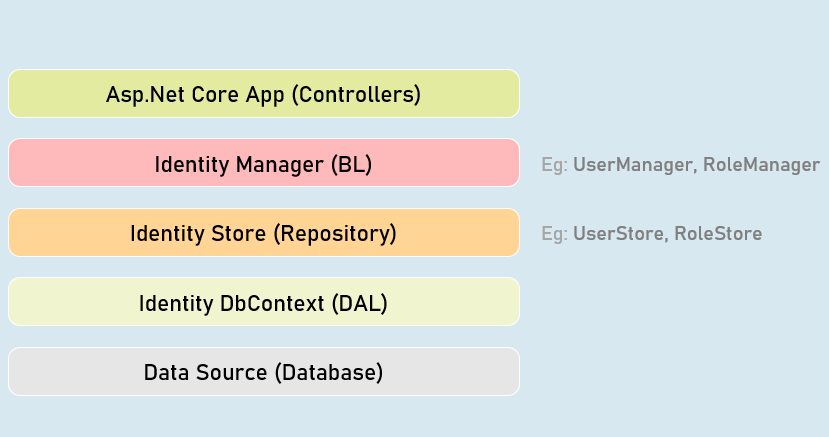


## UserManager
Provides business logic methods for managing users.

It provides methods for creating, searching, updating and deleting users.

### Methods:

- CreateAsync()

- DeleteAsync()

- UpdateAsync()

- IsInRoleAsync()FindByEmailAsync()

- FindByIdAsync()

- FindByNameAsync()


### SignInManager
Provides business logic methods for sign-in and sign-in functionality of the users.

It provides methods for creating, searching, updating and deleting users.

### Methods:

- SignInAsync()

- PasswordSignInAsync()

- SignOutAsync()

- IsSignedIn()


## Password Complexity Configuration
```c#
services.AddIdentity<ApplicationUser, ApplicationRole>(options => {
  options.Password.RequiredLength = 6; //number of characters required in password
  options.Password.RequireNonAlphanumeric = true; //is non-alphanumeric characters (symbols)
required in password
  options.Password.RequireUppercase = true; //is at least one upper case character required in password
  options.Password.RequireLowercase = true; //is at least one lower case character required in password
  options.Password.RequireDigit = true; //is at least one digit required in password
  options.Password.RequiredUniqueChars = 1; //number of distinct characters required in password
})
.AddEntityFrameworkStores<ApplicationDbContext>()
.AddDefaultTokenProviders()
.AddUserStore<UserStore<ApplicationUser, ApplicationRole, ApplicationDbContext, Guid>>()
.AddRoleStore<RoleStore<ApplicationRole, ApplicationDbContext, Guid>>();
```


## Login/Logout Buttons

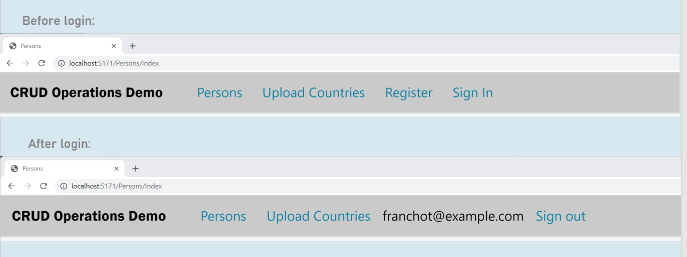


## Login View

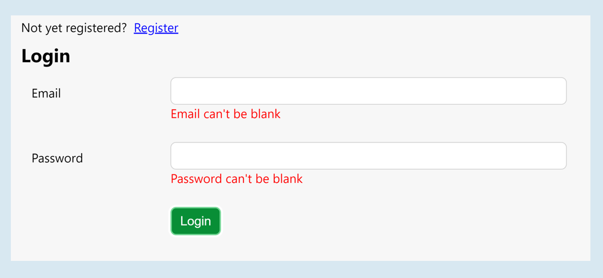


## Authorization Policy
```c#
services.AddAuthorization(options =>
{
  var policy = new AuthorizationPolicyBuilder().RequireAuthenticatedUser().Build();
  options.FallbackPolicy = policy;
});
```
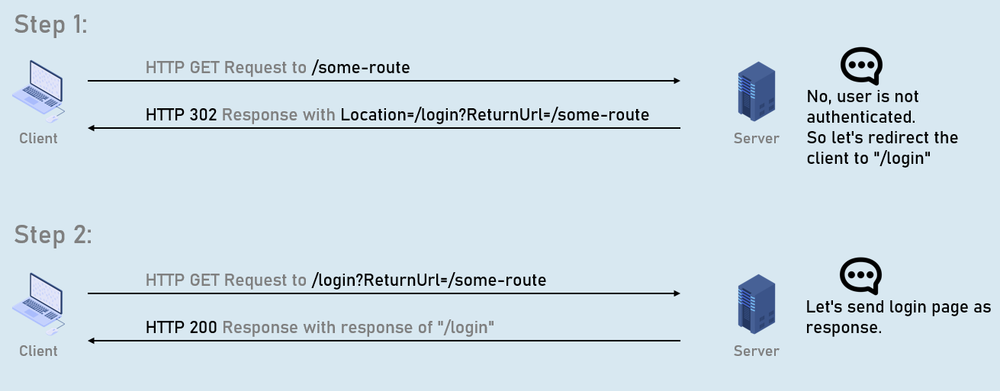
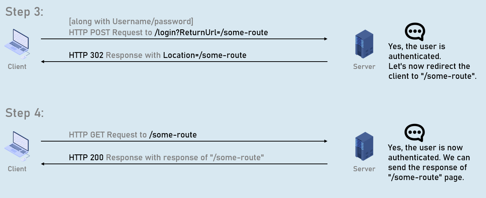


## ReturnUrl


## Remote Validation

### Model class
```c#
public class ModelClassName
{
  [Remote(action: "action name", controller: "controller name", ErrorMessage = "error message")]
  public type PropertyName { get; set; }
}
```


## Conventional Routing
Conventional routing is a type of routing system in asp.net core that defines route templates applied on all controllers in the entire application.


You can override this using attribute routing on a specific action method.
```c#
endpoints.MapControllerRoute(
  name: "default",
  pattern: "{controller=Persons}/{action=Index}/{id?}"
);
```


## Areas
Area is a group of related controllers, views and models that are related to specific module or specific user.

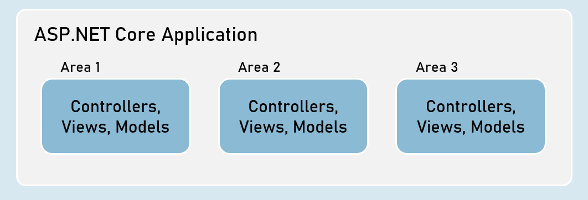


## User Roles
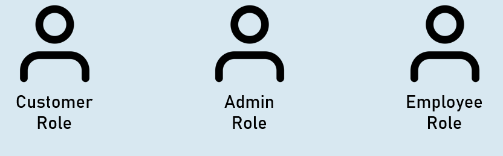


## Role Based Authentication
User-role defines type of the user that has access to specific resources of the application.

Examples: Administrator role, Customer role etc.


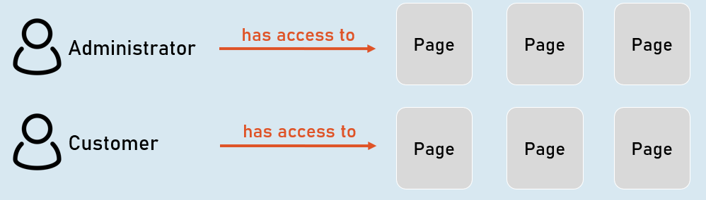


## HTTPS
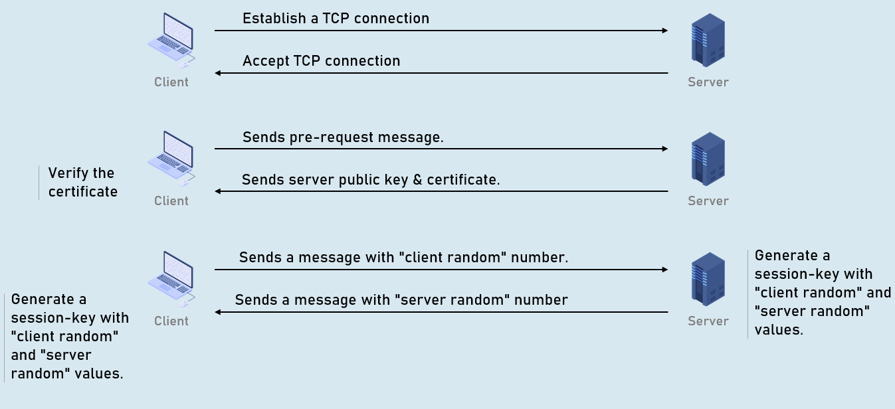
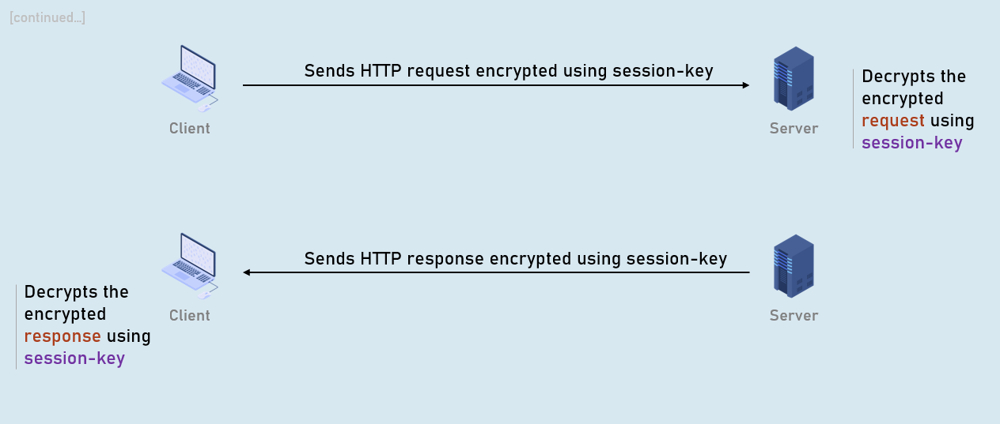


## XSRF
XSRF (Cross Site Request Forgery - CSRF) is a process of making a request to a web server from another domain, using an existing authentication of the same web server.

Eg: attacker.com creates a form that sends malicious request to original.com.


### Attacker's request without AntiForgeryToken


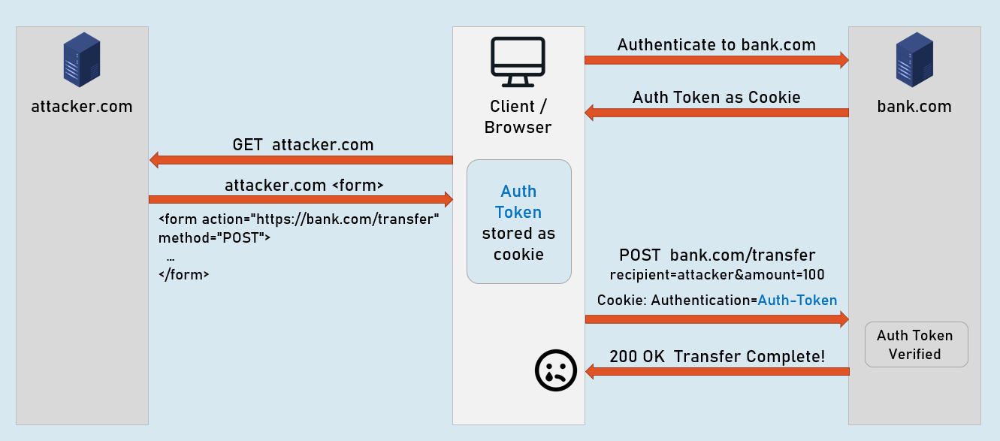


### Attacker's request


### Legit request [No attacker.com]


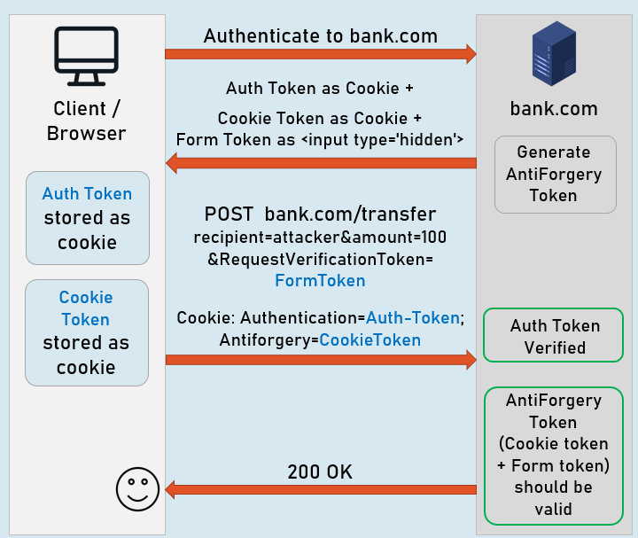


# Interview Questinos 

## Can you explain the concept of ASP.NET Core Identity and its role in building secure web applications?
- `ASP.NET Core Identity` is an API used to manage users, roles, passwords, profile data, tokens, email confimation, etc.
- It's built on top of EntityFramework, so it's possible to use custom data stores easily
## What are the key components of ASP.NET Core Identity and how do they work together?
### Identity User
This is the base class fort the `ApplicationUser` class. It's resposible for storing user details.I.e.
- Id
- UserName
- PasswordHash
- Emaill
- PhoneNumber

These properties can be overriden by the `ApplicationUser` class, which inherits from `IdentityUser<T>`
### Identity Role
It acts as a base class for the `ApplicationRole` and acts as a model class to store Role details:
- Id
- Name

### User Manager
This class provides business logic methods for creating, searching updating and deleting users.
### SignIn Manager
Provides business logic methods for sign-in and sign-out functionality of the users. 
### Role Manager
Provides business loging for creating, searching, updating and deleting user roles. 

## How can you customize ASP.NET Core Identity to meet specific application requirements?
By providing the `options` in a lambda expression by the time the Identity is added into the `Services` collection

```c#
builder.Services.AddIdentity<ApplicationUser, ApplicationRole>(options => 
{
	...	
	options.Password.RequiredLength = 6;//Custom password length
	...
})
```

By using this method, you can easily customize ASP.NET Core Identity to meet specific requirements. 
## How does ASP.NET Core Identity handle authentication and authorization in a web application?
- The `authentication` is handled by the `SignInManager` class, which is responsible for the users' sign-in and sign-out functionality
- The `authorization` is handled by the `Authorization Policies`. They can be either built-in or user-defined in order to define the permissions for a specific part of the application
## How can you handle user registration and password management in ASP.NET Core Identity?
`user registration` and `password management` are both handled by the `UserManager` class  
## How can you implement role-based authorization in ASP.NET Core Identity?

## What are some common security considerations when using ASP.NET Core Identity?

## What are different managers in ASP.NET Core?

## What architecture is used in ASP.NET Core Identity (with store and managers)?

## What is Cross-Site Request Forgery (XSRF) and how does it impact web applications?

## How does ASP.NET Core protect against XSRF attacks?

## How can you implement XSRF protection in ASP.NET Core manually?