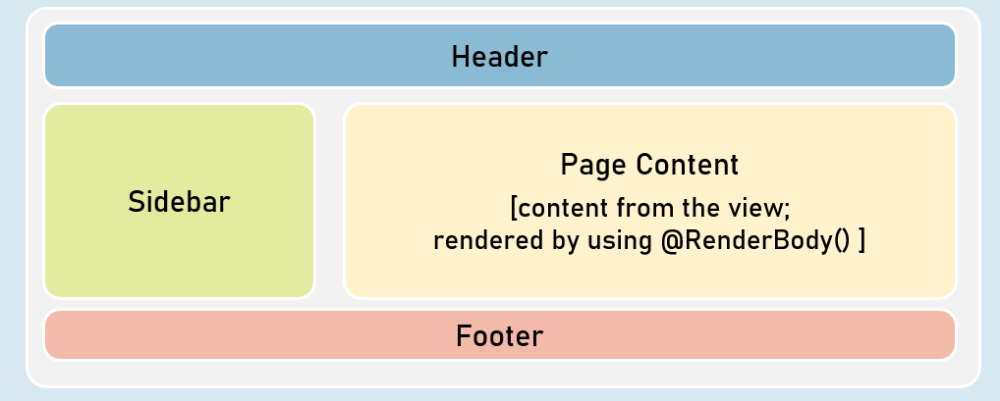
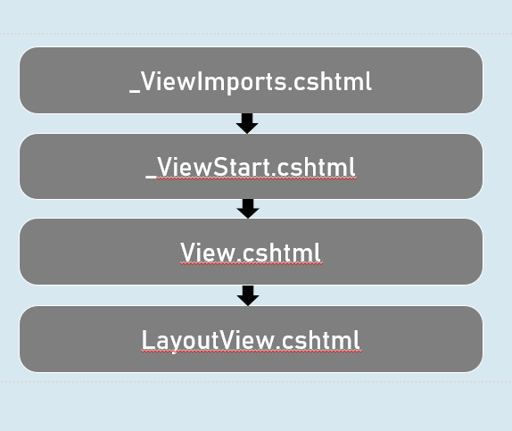
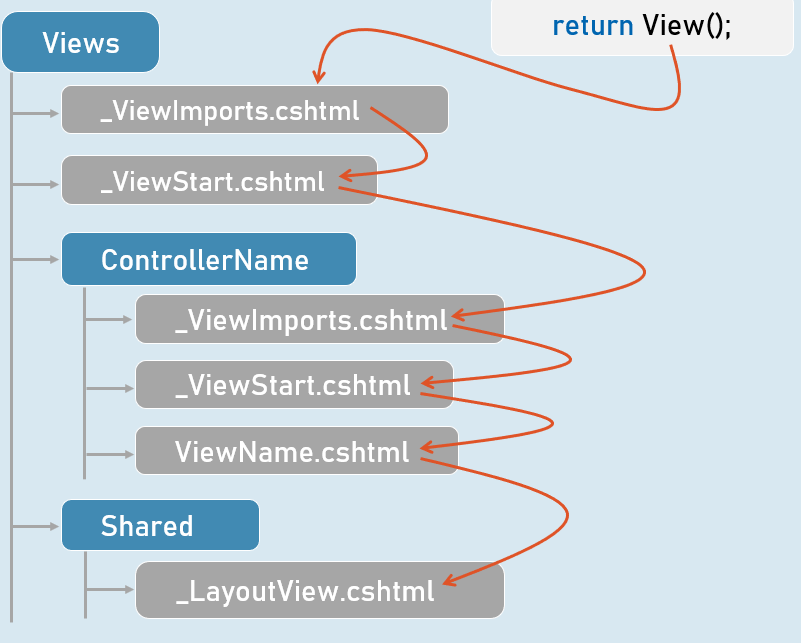

# Layout Views Section CheatSheet 
## Layout Views
Layout View is a web page (.cshtml) that is responsible for containing presentation logic template (commonly the html template with header, sidebar, footer etc.)

## Order of Views Execution

## Layout Views
- The @RenderBody() method presents only in layout view to represent the place where exactly the content from the view has to be rendered.

- The "Layout" property of the view specifies path of the layout view.

- It can be dynamically set in the view.

- Both View and Layout View shares the same ViewData object.

- So it is possible to send data from view to layout, since the view executes first.

- The css files / js files imported in layout view will be applicable to view also, because the content of view will be merged into the layout view at run time.

# Interview Questions
Explain the purpose and usage of layout views in asp.net core?
- Layout views help to maintain consistent UI across all pages of the web application.

- Layout views contain common HTML structures such as scripts and stylesheets are also frequently used by many pages within an app. All of these shared elements may be defined in a layout file, which can then be referenced by any view used within the app. Layouts reduce duplicate code in views.

- Generally, layout views are presented with in the “Views/Shared” folder.

- Their name is recommended to be prefixed with “_” (underscore).

- Layout views contains @RenderBody() to represent the position to render the content of a view.

- You can reference a layout view from a view by using view’s “Layout” property.

- Common layout view path can be applied by using _ViewStart.csthml file either in the “Views” folder or in the “Views\ControllerName” folder. The inner-most takes precedence, because it can override the outer setting.

- Nested layout views are possible.

