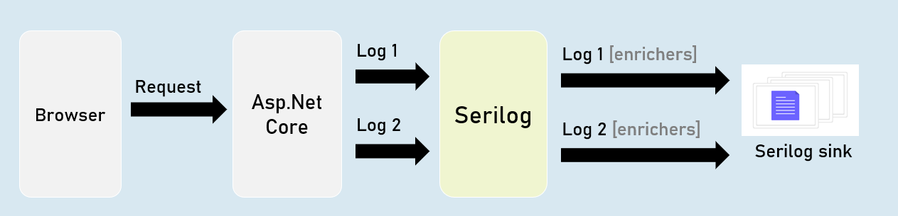

# Logging And Serilog Cheat Sheet
## Logging


> Logging is the process of recording run-time actions as they happen in real-time.

> Helps us to understand the failures and performance bottlenecks of the application.


## ILogger


### Debug
`
ILogger.LogDebug("log_message");
`
Logs that provide details & values of variables for debugging purpose.


### Information
`
ILogger.LogInformation("log_message");
`
Logs that track the general flow of the application execution.


### Warning
`
ILogger.LogWarning("log_message");
`
Logs that highlight an abnormal or unexpected event.


### Error
`
ILogger.LogError("log_message");
`
Logs to indicate that flow of execution is stopped due to a failure.


### Critical
`
ILogger.LogCritical("log_message");
`
Logs to indicate an unrecoverable application crash.


## Logging Configuration
### appsettings.json
```json
{
 "Logging": {
  "LogLevel": {
   "Default": "Debug | Information | Warning | Error| Critical"
   "Microsoft.AspNetCore": "Debug | Information | Warning | Error | Critical"
  }
 }
}
```

### Controller and other classes
```c#
using Microsoft.AspNetCore.Mvc;
using Microsoft.Extensions.Logging;
 
public class ControllerName : Controller
{
 private readonly ILogger<ClassName> _logger;
 
 public ControllerName(ILogger<ClassName> logger)
 {
  _logger = logger;
 }
}
```


## Logging Providers
Logging provider specifies where to store / display logs.

The built-in logging providers in asp.net core doesn't support file / database logging providers.


in **Program.cs**:
```c#
builder.Host.ConfigureLogging(logging =>
{
  logging.ClearProviders();
  logging.AddConsole();
  logging.AddDebug();
  logging.AddEventLog();
});
```


## HTTP Logging
Logs details all HTTP requests and responses.

You need to set a value of "HttpLoggingFields" enum to set specify desired details.


## HTTP Logging Options


### "HttpLoggingFields" enum:

### RequestMethod

Method of request. Eg: GET

### RequestPath

Path of request. Eg: /home/index

### RequestProtocol

Protocol of request. Eg: HTTP/1.1

### RequestScheme

Protocol Scheme of request. Eg: http

### RequestQuery

Query string Scheme of request. Eg: ?id=1

### RequestHeaders

Headers of request. Eg: Connection: keep-alive

### RequestPropertiesAndHeaders

Includes all of above (default)

### RequestBody

Entire request body. [has performance drawbacks; not recommended]

### Request

Includes all of above


### "HttpLoggingFields" enum

### ResponseStatusCode

Status code of response. Eg: 200

### ResponseHeaders

Headers of response. Eg: Content-Length: 20

### ResponsePropertiesAndHeaders

Includes all of above (default)

### ResponseBody

Entire response body. [has performance drawbacks; not recommended]

### Response

Includes all of above
### All

Includes all from request and respon### se


### HTTP Logging Options

Program.cs:
```c#
builder.Serices.AddHttpLogging(options =>
{
  options.LoggingFields = Microsoft.AspNetCore.HttpLogging.HttpLoggingFields.YourOption;
});

```


## Serilog
> Serilog is a structured logging library for Asp.Net Core.

> Supports variety of logging destinations, referred as "Sinks" - starts with Console, Azure, DataDog, ElasticSearch, Amazon CloudWatch, Email and Seq.


### Serilog - Configuration
```json
appsettings.json

{
 "Serilog": {
  "Using": [
    "Serilog.Sinks.YourSinkHere"
  ],
  "MinimumLevel": "Debug | Information | Warning | Error | Critical",
  "WriteTo": [
  {
    "Name": "YourSinkHere",
    "Args": "YourArguments"
  }
  ]
 }
}
```

## Serilog - Options
### Program.cs:
```c#
builder.Host.UseSerilog(HostBuilderContext context,
IServiceProvider services, LoggerConfiguration configuration) =>
{
  configuration
  .ReadFrom.Configuration(context.Configuration) //read configuration settings from built-in IConfiguration
  .ReadFrom.Services(services); //read services from built-in IServiceProvider
});
```


## Serilog - File Sink
### The "Serilog.Sinks.File" logs into a specified file.
You can configure the filename, rolling interval, file size limit etc., using configuration settings.


### Serilog - "File Sink" Configuration

### appsettings.json
```json
{ 
 "Serilog": {
    "Using": [ "Serilog.Sinks.File" ],
    "MinimumLevel": "Debug | Information | Warning | Error | Critical",
    "WriteTo": [
    {
     "Name": "File",
     "Args": [
       "path": "folder/filename.ext",
       "rollingInterval": "Minute | Hour | Day | Month | Year | Infinite",
     ]
    }
   ]
  }
}
```


## Serilog - Database Sink
The "Serilog.Sinks.MSSqlServer" logs into a specified SQL Server database.

You can configure the connection string using configuration settings.


### Serilog - 'MSSqlServer' Sink Configuration


### appsettings.json
```c#
{ 
  "Serilog": {
    "Using": [ "Serilog.Sinks.MSSqlServer" ],
    "MinimumLevel": "Debug | Information | Warning | Error | Critical",
    "WriteTo": [
    {
      "Name": "MSSqlServer",
      "Args": [
        "connectionString": "your_connection_string_here",
        "tableName": "table_name",
      ]
    }
   ]
  }
}
```


## Serilog - Seq Sink
The "Serilog.Sinks.Seq" is a real-time search and analysis server for structured application log data.

Seq server can run on Windows, Linux or Docker.


### Serilog - 'Seq' Sink - Configuration

### appsettings.json
```json
{ 
  "Serilog": {
    "Using": [ "Serilog.Sinks.Seq" ],
    "MinimumLevel": "Debug | Information | Warning | Error | Critical",
    "WriteTo": [
     {
       "Name": "Seq",
       "Args": [
          "serverUrl": "http://localhost:5341"
       ]
     }
    ]
  }
}
```


## Serilog - RequestId
"RequestId" is the unique number (guid) of each individual requests, used to identify to which request the log belongs to.

RequestId is "TraceIdentifier" internally, that is generated by Asp.Net Core.


## Serilog - Enrichers
Enrichers are additional details that are added to LogContext; so they're stored in logs.

Eg: MachineName[or]Custom Properties.





## Serilog - IDiagnosticContext
Diagnostic context allows you to add additional enrichment properties to the context; and all those properties are logged at once in the final "log completion event" of the request.


## Serilog Timings
"SerilogTimings" package records timing of a piece of your soure code, indicating how much time taken for executing it.


# Serilog Interview Questions
## Explain how logging works in Asp.Net Core?
Logging is the process of recording events in software as they happen in real-time, along with other information such as the infrastructure details, time taken to execute, etc.
Logging is an essential part of any software application. Having logs is crucial, especially when things go wrong. 
Logs help you understand the failures of performance bottlenecks and fix the problems
## What is Serilog and why to use it?
Serilog is a logging library for .NET and C# that allows for more detailed and structured logging than the default .NET logging library 
- It is designed to handle large volumes of data efficiently
- Serilog provides diagnostic logging to files, to the console, and elsewhere. 
- It is easy to set up, has a clean API, and is portable between recent .NET platforms
## What is IDiagnosticContext in Serilog and how to use it?
The `DiagnosticContext` provides additional enrichment properties that can be used later in the context