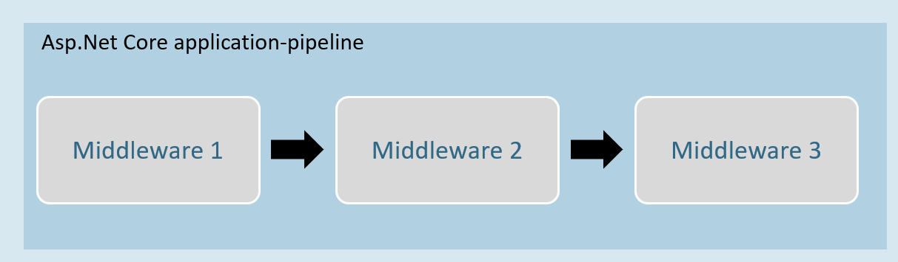
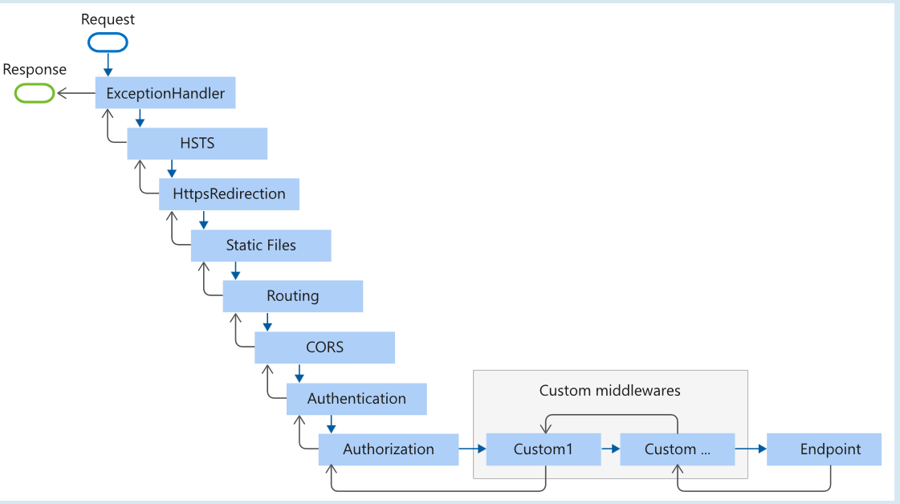
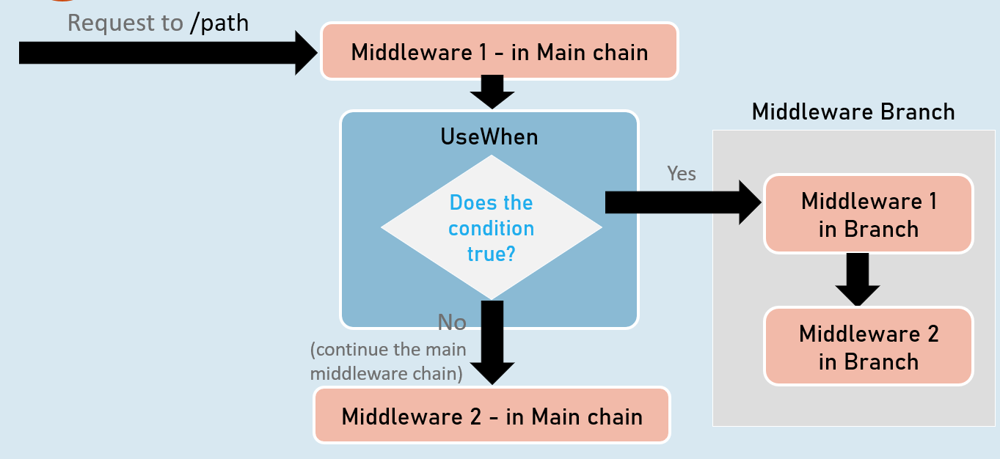

# Middleware 
## Introduction to Middleware
Middleware is a component that is assembled into the application pipeline to handle requests and responses.

Middlewares are chained one-after-other and execute in the same sequence how they're added.


Middleware can be a request delegate (anonymous method or lambda expression) [or] a class.

## Middleware - Run
### app.Run( )
 ```c#
 app.Run(async (HttpContext context) =>
{
//code
});

 ```
The extension method called “Run” is used to execute a terminating / short-circuiting middleware that doesn’t forward the request to the next middleware.


## Middleware Chain


### app.Use( )
```c#
app.Use(async (HttpContext context, RequestDelegate next) =>
{
  //before logic
  await next(context);
  //after logic
});
```
The extension method called “Use” is used to execute a non-terminating / short-circuiting middleware that may / may not forward the request to the next middleware.

## Middleware Class
Middleware class is used to separate the middleware logic from a lambda expression to a separate / reusable class.
```c#
class MiddlewareClassName : IMiddleware
{
  public async Task InvokeAsync(HttpContext context, RequestDelegate next)
  {
    //before logic
    await next(context);
    //after logic
  }
}
app.UseMiddleware<MiddlewareClassName>();
```


## Middleware Extensions
```c#
class MiddlewareClassName : IMiddleware
{
  public async Task InvokeAsync(HttpContext context,RequestDelegate next)
  {
    //before logic
    await next(context);
    //after logic
  }
});
```

Middleware extension method is used to invoke the middleware with a single method call.
```c#
static class ClassName
{
  public static IApplicationBuilder ExtensionMethodName(this IApplicationBuilder app)
  {
    return app.UseMiddleware<MiddlewareClassName>();
  }
}
app.ExtensionMethodName();
```


## Conventional Middleware
```c#
class MiddlewareClassName
{
  private readonly RequestDelegate _next;
 
  public MiddlewareClassName(RequestDelegate next)
  {
    _next = next;
  }
 
  public async Task InvokeAsync(HttpContext context)
  {
   //before logic
   await _next(context);
   //after logic
  }
});


static class ClassName
{
  public static IApplicationBuilder ExtensionMethodName(this IApplicationBuilder app)
  {
   return app.UseMiddleware<MiddlewareClassName>();
  }
}
app.ExtensionMethodName();

```

## The Right Order of Middleware


```c#
app.UseExceptionHandler("/Error");
app.UseHsts();
app.UseHttpsRedirection();
app.UseStaticFiles();
app.UseRouting();
app.UseCors();
app.UseAuthentication();
app.UseAuthorization();
app.UseSession();
app.MapControllers();
//add your custom middlewares
app.Run();
```

## Middleware - UseWhen




### app.UseWhen( )

```c#
app.UseWhen(
  context => { return boolean; },
  app =>
  {
    //add your middlewares
  }
);
```
The extension method called “UseWhen” is used to execute a branch of middleware only when the specified condition is true


# Interview Questions
- What is middleware?
Is a component which is assembled in the application's pipeline and performs a certain action after the request has been recieved and before the response is sent
- What is the difference between IApplicationBuilder.Use() and IApplicationBuilder.Run()?
Whereas `IApplicationBuilder.Run()` is used to execute a terminating middleware, `IApplicationBuilder.Use()` lets the developer choice whether the following middleware should be executed or not 
- What is the use of the "Map" extension while adding middleware to the ASP.NET Core pipeline?

- How do you create a custom middleware?
By using a CustomMiddleware class which can be accomplished by:
    - Implementing the `IMiddleware` Interface
    - Using the `Middleware` blueprint given by visual studio

- What is the right order of middleware used in production-level applications?
```c#
app.UseExceptionHandler();
app.UseHsts();
app.UseHttpsRedirection();
app.UseStaticFiles();
app.UseRouting();
app.UseCors();
app.UseAuthentication();
app.UseAuthorization();
app.UseSession();
app.MapControllers();
// Custom middlewares
app.Run();
```