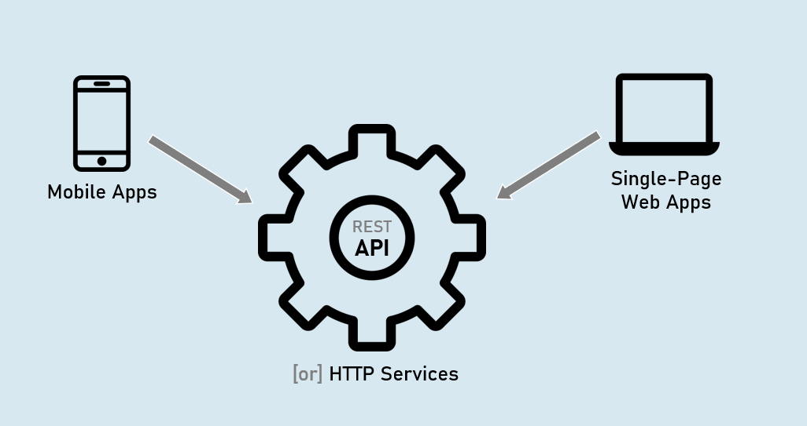
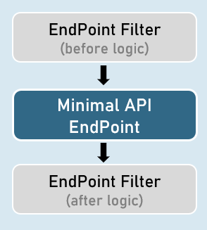

# Minimal API Section Cheat Sheet (PPT)
## Overview of Minimal API
- It is a Microsoft's API that is used to create HTTP services (or HTTP APIs) with minimal dependencies on packages.

- Alternative to Web API Controllers. Mainly used to create HTTP services or Microservices.


### REST API (Representational State Transfer)




### MVC Controller (Microsoft.AspNetCore.Mvc.Controller)

- Full support for model binding and model validation.

- Full support for views.

- Full support for filters & filter pipeline.


### API Controller (Microsoft.AspNetCore.Mvc.ApiControllerAttribute)

- Full support for model binding and model validation.

- No support for views.

- Full support for filters & filter pipeline.


### Minimal API (IApplicationBuilder.Map* Methods)

- Limited support for custom model binding and custom model validation (needs to improve).

- No support for views.

- No support for filters & filter pipeline; but supports "Endpoint Filters" alternatively.


## Routing in Minimal API
### 1. MapGet()

Creates an endpoint that receives HTTP GET request.
```csharp

app.MapGet("/route", async (HttpContext context) => {
await context.Response.WriteAsync("your response");
});
```


### 2. MapPost()

Creates an endpoint that receives HTTP POST request.
```csharp

app.MapDelete("/route", async (HttpContext context) => {
await context.Response.WriteAsync("your response");
});
```


### 3. MapPut()

Creates an endpoint that receives HTTP PUT request.
```csharp

app.MapPut("/route", async (HttpContext context) => {
await context.Response.WriteAsync("your response");
});
```


### 4. MapDelete()

Creates an endpoint that receives HTTP DELETE request.

```csharp
app.MapDelete("/route", async (HttpContext context) => {
await context.Response.WriteAsync("your response");
});
```


## Route Parameters in Minimal API
Route parameters can be created as you were creating them in UseEndpoints() or in MVC controllers.
```csharp

app.MapGet("/route/{parameter}", async (HttpContext context) => {
await context.Response.WriteAsync("your response");
});
```


## Route Constraints in Minimal API
Route constraints can be used as you were using them in UseEndpoints() or in MVC controllers.
```csharp

app.MapGet("/route/{parameter:constraint}", async (HttpContext context) => {
await context.Response.WriteAsync("your response");
});
```
Eg: int, bool, datetime, decimal, double, float, guid, long, Minlength, maxlength, length, min, max, range, alpha, regex, required


## Map Groups in Minimal API
A map group (or route group) is a set of endpoints with a common prefix.

A map group is a collection of endpoints created with Map* methods such as MapGet(), MapPost() etc.


### MapGet()

Creates an endpoint that receives HTTP GET request.
```csharp

var mapGroup = app.MapGroup("/route-prefix");

mapGroup.MapGet(…);
mapGroup.MapPost(..);
```


## IResult
The Microsoft.AspNetCore.Http.IResult is the base interface that is implemented by different result types such as Ok, Json, BadRequest etc., which can be returned by endpoints in minimal API.

- Results.Ok( )

- Results.Json( )

- Results.Text( )

- Results.File( )

- Results.BadRequest( )

- Results.NotFound( )

- Results.Unauthorized( )

- Results.ValidationProblem( )


## IResult Implementations
### 1. Results.Ok

Response Content-type: application/json [or] text/plain

Response Status Code: 200

`return Results.Ok(response_object); //can be a string or model`


2. Results.Json

Response Content-type: application/json

Response Status Code: 200

`return Results.Json(response_object); //should be a model`


3. Results.Text

Response Content-type: text/plain

Response Status Code: 200

`return Results.Text(response_string); //should be a string`


4. Results.File

Response Content-type: application/octet-stream

Response Status Code: 200

`return Results.File(stream_object); //should be 'System.IO.Stream' type`


5. Results.BadRequest

Response Content-type: N/A

Response Status Code: 400

`return Results.BadRequest(response_object); //can be a string or model`


6. Results.NotFound

Response Content-type: N/A

Response Status Code: 404

`return Results.NotFound(response_object); //can be a string or model`


7. Results.Unauthorized

Response Content-type: N/A

Response Status Code: 401

`return Results.Unauthorized(response_object); //can be a string or model`


8. Results.ValidationProblem

Response Content-type: application/json

Response Status Code: 400

`return Results.ValidationProblem(response_object); //automatically creates JSON with validation errors`


## Endpoint Filter
EndPoint Filters execute much like 'action filters' i.e., 'before' and 'after' the execution of minimal API endpoint.

They are mainly used to validate parameters of the endpoint.




### Creating an Endpoint Filter

Endpoint filters can be registered by providing a Delegate that takes a EndpointFilterInvocationContext and returns a EndpointFilterDelegate.
```csharp
app.MapGet("/route", () => {
//your endpoint code here
})
.AddEndpointFilter(async (context, next) => {
//before logic
var result = await next(context); //calls subsequent filter or endpoint

//after logic
return result;
});
```


## IEndpointFilter
Creating an Endpoint Filter by implementing IEndpointFilter interface

The InvokeAsync() method takes a EndpointFilterInvocationContext and returns a EndpointFilterDelegate.

```csharp

class CustomEndpointFilter : IEndpointFilter
{
public async ValueTask<object?> InvokeAsync(EndpointFilterInvocationContext context, EndpointFilterDelegate next)
{
//before logic
var result = await next(context); //calls subsequent filter or endpoint

      //after logic
      return result;
}
}
```

# Interview Questions

- What is ASP.NET Core Minimal API, and how does it differ from traditional Web API?
ASP.NET Core Minimal API is a lightweight and simplified approach to building web APIs in ASP.NET Core. It aims to reduce the amount of boilerplate code required to create APIs by leveraging the new minimalistic programming model. Unlike traditional Web API, which typically involves multiple files and configurations, Minimal API allows developers to define the API routes and handlers in a single file, making it easier to understand and maintain.


- How to implement CRUD operations using Asp.Net Core Minimal API? Explain with sample code.
  To create minimal API CRUD operations in ASP.NET Core 6, follow these steps:


1. Create a new ASP.NET Core 6 project in Visual Studio:

- Open Visual Studio.

- Click on "Create a new project."

- Select "ASP.NET Core Empty" template.

- Configure other project details and click on "Create."


2. Define your data model:

Create a class that represents the entity you want to perform CRUD operations on. For example, a "Product" class with properties like Id, Name, Price, etc.


3. Implement the API endpoints:

Open the project's `Program.cs` file.

Add the necessary services for your application. For example, you'll typically need to add a database context using builder.Services.AddDbContext.


Here's an example of creating minimal API CRUD operations for a "Product" entity:
```csharp

using Microsoft.EntityFrameworkCore;
using Microsoft.OpenApi.Models;

var builder = WebApplication.CreateBuilder(args);

// Add services
builder.Services.AddDbContext<ApplicationDbContext>(options =>
{
options.UseSqlServer(builder.Configuration.GetConnectionString("DefaultConnection"));
});

builder.Services.AddEndpointsApiExplorer();
builder.Services.AddSwaggerGen(c =>
{
c.SwaggerDoc("v1", new OpenApiInfo { Title = "My API", Version = "v1" });
});

// Create database and migrate
using (var app = builder.Build())
{
using (var scope = builder.Services.CreateScope())
{
var services = scope.ServiceProvider;
var dbContext = services.GetRequiredService<ApplicationDbContext>();
dbContext.Database.Migrate();
}

// Enable middleware to serve generated Swagger as a JSON endpoint.
app.UseSwagger();

// Specify the Swagger JSON endpoint.
app.UseSwaggerUI(c =>
{
c.SwaggerEndpoint("/swagger/v1/swagger.json", "My API V1");
c.RoutePrefix = string.Empty;
});
```


4. Define API endpoints for GET, POST, PUT and DELETE operations
```csharp

app.MapGet("/api/products", async (ApplicationDbContext dbContext) =>
{
var products = await dbContext.Products.ToListAsync();
return Results.Ok(products);
});

app.MapGet("/api/products/{id}", async (int id, ApplicationDbContext dbContext) =>
{
var product = await dbContext.Products.FindAsync(id);
if (product != null)
{
return Results.Ok(product);
}
else
{
return Results.NotFound();
}
});

app.MapPost("/api/products", async (Product product, ApplicationDbContext  dbContext) =>
{
dbContext.Products.Add(product);
await dbContext.SaveChangesAsync();
return Results.Created($"/api/products/{product.Id}", product);
});

app.MapPut("/api/products/{id}", async (int id, Product updatedProduct, ApplicationDbContext dbContext) =>
{
var product = await dbContext.Products.FindAsync(id);
if (product != null)
{
product.Name = updatedProduct.Name;
product.Price = updatedProduct.Price;
// Update other properties as needed

    await dbContext.SaveChangesAsync();
    return Results.Ok(product);
}
else
{
return Results.NotFound();
}
});

app.MapDelete("/api/products/{id}", async (int id, ApplicationDbContext  dbContext) =>
{
var product = await dbContext.Products.FindAsync(id);
if (product != null)
{
dbContext.Products.Remove(product);
await dbContext.SaveChangesAsync();
return Results.NoContent();
}
else
{
return Results.NotFound();
}
});

app.Run();
}

```

In this example, the endpoints for listing products, retrieving a product by id, creating a product, updating a product, and deleting a product are defined using app.MapGet, app.MapPost, app.MapPut, and app.MapDelete respectively. The endpoints use the ApplicationDbContext to access the database and perform CRUD operations. Additionally, Swagger is configured to generate documentation for the API.
- How do you handle request routing and parameter binding in ASP.NET Core Minimal API?
  In ASP.NET Core Minimal API, request routing and parameter binding can be handled using the MapMethods extension method within the Configure method. The MapMethods method allows you to specify the HTTP verb, route pattern, and handler function for each API endpoint.

The MapMethod can be MapGet, MapPost, MapPut and MapDelete.


For example, to handle a GET request with a route parameter, you can define a route pattern with a placeholder for the parameter and bind it to the handler function using lambda syntax:
```csharp

app.MapGet("/api/users/{id}", new[] { "GET" }, (int id) =>
{
// Handle the GET request with the specified route parameter
// Access the 'id' parameter in the handler function
// Perform necessary operations and return a response
});
```
ASP.NET Core Minimal API uses a built-in route parameter binding feature that automatically maps the route parameter to the corresponding parameter in the handler function. You can use various parameter types (such as int, string, DateTime, etc.) depending on the type of data expected.


- How do you perform model validation in ASP.NET Core Minimal API?
  To perform model validation in ASP.NET Core Minimal API, you can utilize the model binding and validation features provided by the framework. Follow these steps:


Define a request model class with the desired properties and validation attributes. For example:
```csharp

public class UserRequest
{
[Required]
public string Name { get; set; }

[Range(18, 99)]
public int Age { get; set; }
}
```
In the handler function for the API endpoint, add a parameter of the defined request model type. ASP.NET Core will automatically bind and validate the request data against the model.


Check the ModelState.IsValid property to determine if the model validation passed or not. If the model is invalid, you can return a BadRequest response with the validation errors.


Here's an example of a POST endpoint with model validation:
```csharp

app.MapPost("/api/users", new[] { "POST" }, (UserRequest user) =>
{
if (!ModelState.IsValid)
{
return Results.BadRequest(ModelState);
}

// Process the valid user request and return a response
});
```
ASP.NET Core will automatically perform validation based on the defined attributes, such as Required or Range, and populate the ModelState with any validation errors. Returning a BadRequest result with the ModelState will include the validation errors in the response.


- How can you implement authentication and authorization in ASP.NET Core Minimal API?
  To implement authentication and authorization in ASP.NET Core Minimal API, you can leverage the authentication and authorization middleware provided by the framework. Here's a high-level overview of the steps involved:


Install the required NuGet packages for the authentication and authorization middleware. For example, Microsoft.AspNetCore.Authentication and Microsoft.AspNetCore.Authorization.


Configure the desired authentication scheme(s) in the services collection. This typically involves setting up authentication options, such as JwtBearer or cookies, and specifying the authentication provider details.


Use the UseAuthentication and UseAuthorization middleware in the request pipeline. Ensure that the UseAuthentication middleware is placed before the routing middleware to authenticate incoming requests.


Apply the necessary authorization attributes to the API endpoints or handler functions to restrict access. For example, [Authorize] attribute can be used to specify that only authenticated users are allowed to access an endpoint.


Here's an example of configuring JWT authentication and applying authorization to an endpoint:
```csharp

// Services
builder.Services.AddAuthentication(JwtBearerDefaults.AuthenticationScheme)
.AddJwtBearer(options =>
{
// Configure JWT authentication options
});

builder.Services.AddAuthorization();

// Request pipeline
var app = builder.Build();

app.UseAuthentication();
app.UseAuthorization();

app.MapMethods("/api/protected", new[] { "GET" }, () =>
{
// This endpoint requires authorization
}).RequireAuthorization();

app.Run();
```


In this example, the JWT authentication scheme is configured in ConfigureServices, and the UseAuthentication and UseAuthorization middleware are applied in Configure. The /api/protected endpoint requires authorization, and the [Authorize] attribute can also be applied to the handler function for the same effect.
