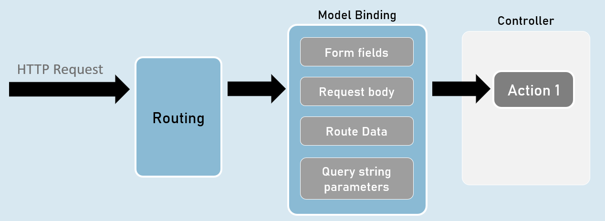
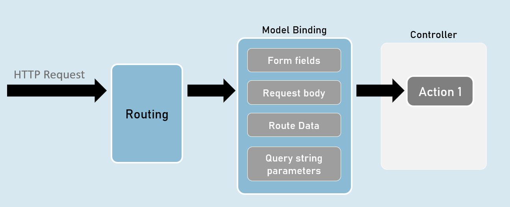
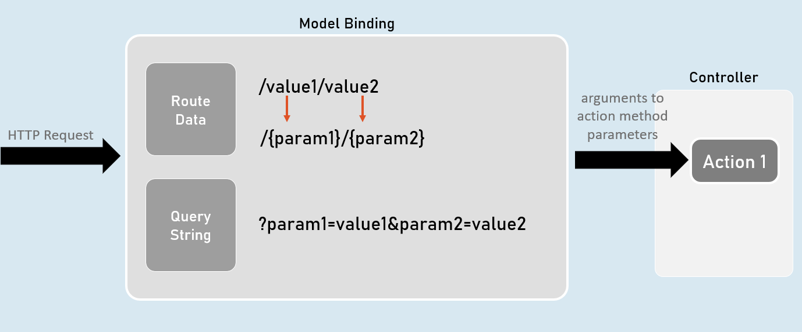
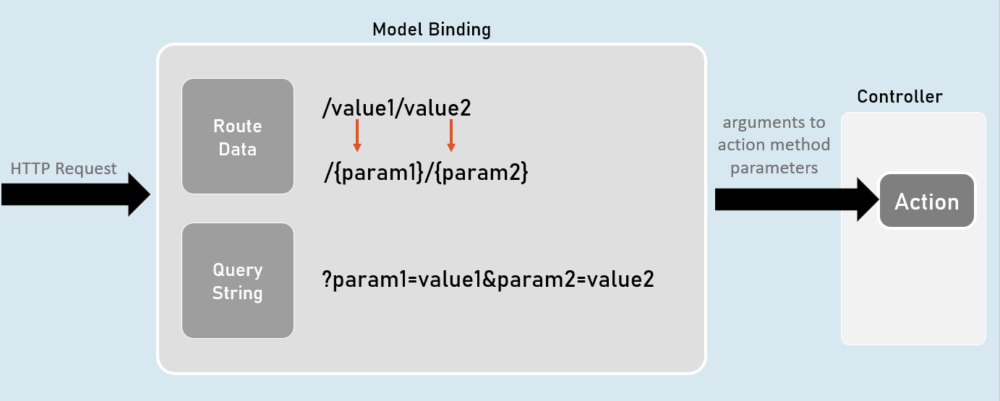
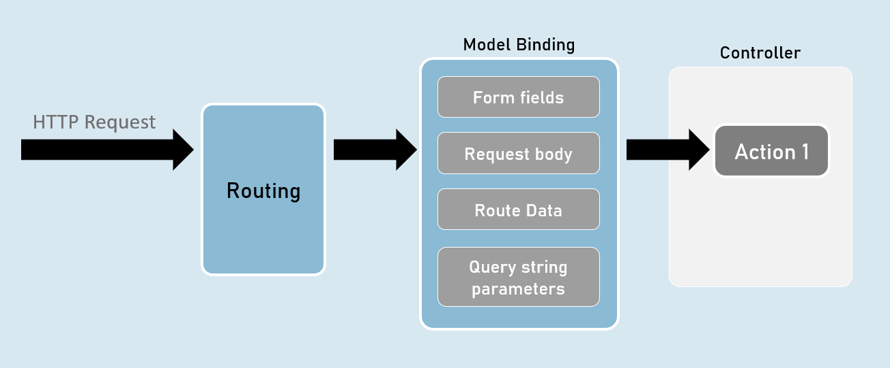
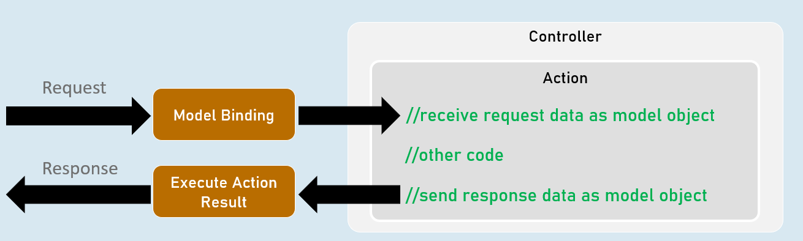
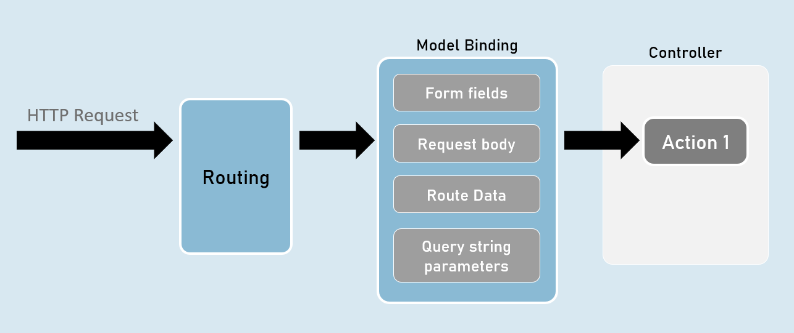
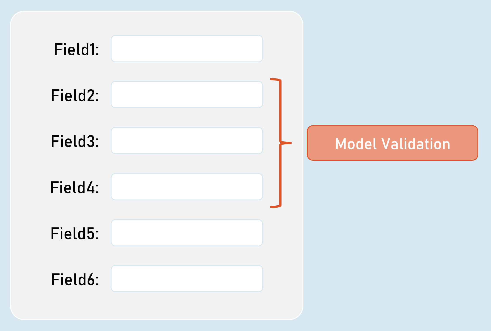
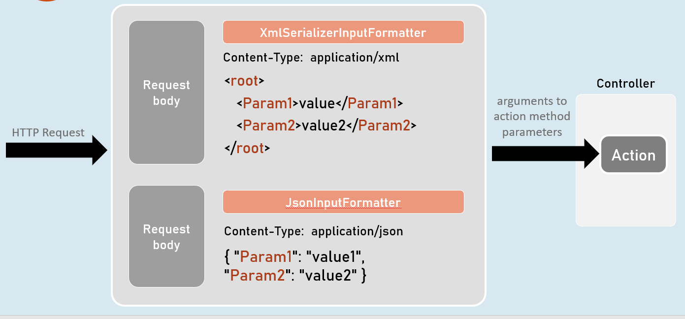

# Model Binding and Validations Cheat Sheet
## Model Binding
Model Binding is a feature of asp.net core that reads values from http requests and pass them as arguments to the action method.




## QueryString vs RouteData





## [FromQuery] and [FromRoute]



### [FromQuery]
```c#
//gets the value from query string only
public IActionResult ActionMethodName( [FromQuery] type parameter)
{
}
```

### [FromRoute]
```c#
//gets the value from route parameters only
public IActionResult ActionMethodName( [FromRoute] type parameter)
{
}
```





## Models
Model is a class that represents structure of data (as properties) that you would like to receive from the request and/or send to the response.

Also known as POCO (Plain Old CLR Objects).




### Model
```c#
class ClassName
{
  public type PropertyName { get; set; }
}
```


## form-urlencoded and form-data




## form-urlencoded (default)
### Request Headers

Content-Type: application/x-www-form-urlencoded


### Request Body

param1=value1&param2=value2


## form-data
### Request Headers

Content-Type: multipart/form-data


### Request Body

--------------------------d74496d66958873e

Content-Disposition: form-data; name="param1"

value1

--------------------------d74496d66958873e

Content-Disposition: form-data; name="param2"

value2


## Model Validation
```c#
class ClassName
{
  [Attribute] //applies validation rule on this property
  public type PropertyName { get; set; }
}
```


## ModelState
### IsValid

Specifies whether there is at least one validation error or not (true or false).

### Values

Contains each model property value with corresponding "Errors" property that contains list of validation errors of that model property.

### ErrorCount

Returns number of errors.


## Model Validation
### [Required(ErrorMessage = "value")]

Specifies that the property value is required (can't be blank or empty).


### [StringLength(int maximumLength, MinimumLength = value, ErrorMessage = "value")]

Specifies minimum and maximum length (number of characters) allowed in the string.


### [Range(int minimum, int maximum, ErrorMessage = "value")]

Specifies minimum and maximum numerical value allowed.


### [RegularExpression(string pattern, ErrorMessage = "value")]

Specifies the valid pattern (regular expression).


### [EmailAddress(ErrorMessage = "value")]

Specifies that the value should be a valid email address.


### [Phone(ErrorMessage = "value")]

Specifies that the value should be a valid phone number).

Eg: (999)-999-9999 or 9876543210


### [Compare(string otherProperty, ErrorMessage = "value")]

Specifies that the values of current property and other property should be same.


### [Url(ErrorMessage = "value")]

Specifies that the value should be a valid url (website address).

Eg: http://www.example.com


### [ValidateNever]

Specifies that the property should not be validated (excludes the property from model validation).


## Custom Validations
```c# 
class ClassName : ValidationAttribute
{
  public override ValidationResult? IsValid(object? value, ValidationContext validationContext)
  {
    //return ValidationResult.Success;
    //[or] return new ValidationResult("error message");
  }
}
```

### ValidationAttribute

Base class for all validation attributes such as RequiredAttribute, RegularExpressionAttribute, RangeAttribute, StringLengthAttribute, CompareAttribute etc.

Provides properties such as ErrorMessage & methods such as Validate(), IsValid() etc.


### ValidationContext

Acts as a parameter for "IsValid()" method of custom validation attribute classes.

Provides properties such as ObjectType, ObjectInstance.


## Custom Validations with Multiple Properties




## IValidatableObject
```c#
class ClassName : IValidatableObject
{
  //model properties here
 
  public IEnumerable<ValidationResult> Validate(ValidationContext validationContext)
  {
    if (condition)
    {
      yield return new ValidationResult("error message");
    }
  }
}
```

- Base class for model classes with validation.

- Provides a method called Validate() to define class level validation logic.

- The Validate() method executes after validating all property-level validations are executed; but doesn't execute if at least one property-level validations result error.


### ValidationContext

- Acts as a parameter for "Validate()" method of model classes with IValidatableObject.

- Provides properties such as ObjectType, ObjectInstance.


## [Bind] and [BindNever]
### [Bind]
```c#
class ClassNameController
{
  public IActionResult ActionMethodName( [Bind(nameof(ClassName.PropertyName), nameof(ClassName.PropertyName) )]  ClassName parameterName)
  {
  }
}
```
- [Bind] attribute specifies that only the specified properties should be included in model binding.

- Prevents over-posting (post values into unexpected properties) especially in 'Create' scenarios.


### [BindNever]
```c# 
class ModelClassName
{
  [BindNever]
  public type PropertyName { get; set; }
}
```
- [BindNever] attribute specifies that the specified property should NOT be included in model binding.

- Useful when you have fewer properties to eliminate from model binding.


## [FromBody]
```c#
//enables the input formatters to read data from request body (as JSON or XML or custom) only
public IActionResult ActionMethodName( [FromBody] type parameter)
{
}
```


## Input Formatters




## Custom Model Binders
### Custom Model Binder
```c#
class ClassName : IModelBinder
{
  public Task BindModelAsync(ModelBindingContext bindingContext)
  {
    //gets value from request
    bindingContext.ValueProvider.GetValue("FirstName");
 
    //returns model object after reading data from the request
    bindingContext.Result = ModelBindingResult.Success(your_object);
  }
}
```

### IModelBinder

- Base interface for all custom model binders.

- Provides a method called BindModelAsync, to define logic for binding (reading) data from the request and creating a model object that has be received as parameter in the action method.


### ModelBindingContext

- Acts as a parameter for "BindModelAsync()" method of custom model binder classes.

- Provides properties such as HttpContext, ModelState, ValueProvider, Result etc..


## Custom Model Binder Providers
```c#
class ClassName : IModelBinderProvider
{
  public IModelBinder GetBinder(ModelBinderProviderContext providerContext)
  {
    //returns type of custom model binder class to be invoked
    return new BinderTypeModelBinder(typeof(YourModelBinderClassName));
  }
}
```

### IModelBinderProvider

- Base interface for all custom model binder providers.

- Provides a method called GetBinder, to return the type of custom model binder class.


### ModelBinderProviderContext

- Acts as a parameter for "GetBinder()" method of custom model binder provider classes.

- Provides properties such as BindingInfo, Services etc.

# Interview Questions


## What is model binding in ASP.NET CORE?
Controllers and views need to work with data that comes from HTTP requests. For example, routes may provide a key that identifies a record, and posted form fields may provide model properties. The process of converting these string values to .NET objects could be complicated and something that you have to do with each request. Model binding automates and simplifies this process.


The model binding system fetches the data from multiple sources such as form fields, route data, and query strings. It also provides the data to controllers and views in method parameters and properties, converting plain string data to .NET objects and types in the process.


Example:

Let’s say you have the following action method on the PostsController class:

[HttpGet("posts/{id}")]
public ActionResult<Post> GetById(int id, bool archivedOnly)


And the app receives a request with this URL:

http://yourapp.com/api/Posts/5?ArchivedOnly=true

After the routing selects the action method, model binding executes the following steps.


Locate the first parameter of GetByID, an integer named id, look through the available sources in the HTTP request and find id = "5" in route data.

Convert the string "5" into an integer 5.

Find the next parameter of GetByID, a boolean named archivedOnly.

Look through the sources and find "ArchivedOnly=true" in the query string. It ignores the case when matching the parameters to the strings.

Convert the string "true" into boolean true.


Some other examples of attributes include:

 - `[FromQuery]` - Gets values from the query string.

 - `[FromRoute]` - Gets values from route data.

 - `[FromForm]` - Gets values from posted form fields.

 - `[FromBody]` - Gets values from the request body.

[FromHeader] - Gets values from HTTP headers.
## How validation works in ASP.NET CORE MVC and how they follow DRY principle?
Validation takes place after model binding is completed and it each validation rule can be declared on each property of the model class so redundancy problems are avoided