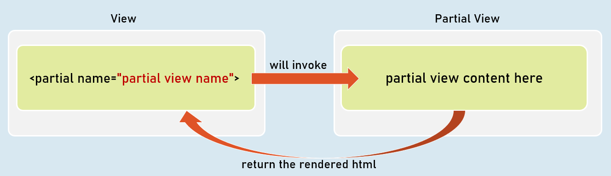
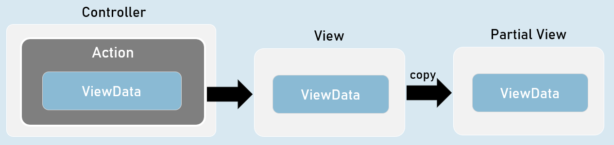
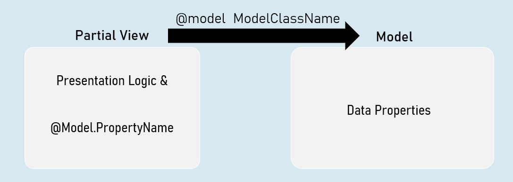
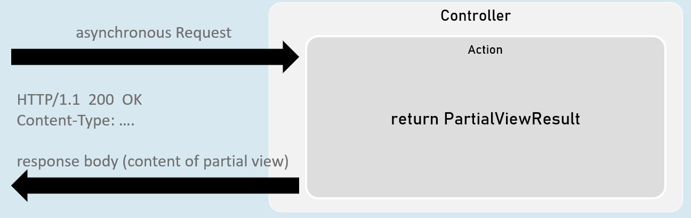

# Partial Views CheatS Sheet

## Partial Views
Partial view is a razor markup file (.cshtml) that can't be invoked individually from the controller; but can be invoked from any view within the same web application.

## Invoking Partial Views
`<partial name="partial view name" />`

Returns the content to the parent view.

`@await Html.PartialAsync("partial view name")`

Returns the content to the parent view.

`@{ await Html.RenderPartialAsync("partial view name"); }`

Streams the content to the browser.

## Partial Views with ViewData
When partial view is invoked, it receives a copy of the parent view's ViewData object.

So, any changes made in the ViewData in the partial view, do NOT effect the ViewData of the parent view.

Optionally, you can supply a custom ViewData object to the partial view, if you don't want the partial view to access the entire ViewData of the parent view.

### Invoking Partial Views with View Data

`@{ await Html.RenderPartialAsync("partial view name", ViewData); }`

-- or --

`<partial name="partial view name" view-data="ViewData" />`

## Strongly Typed Partial Views
Strongly Typed Partial View is a partial view that is bound to a specified model class.

So, it gets all the benefits of a strongly typed view.

### Invoking Strongly-Typed Partial View

`@{ await Html.RenderPartialAsync("partial view name", Model); }`

-- or --

`<partial name="partial view name" model="Model" />`

## PartialViewResult
PartialViewResult can represent the content of a partial .

Generally useful to fetch partial view's content into the browser, by making an asynchronous request (XMLHttpRequest / fetch request) from the browser.

`return new PartialViewResult() { ViewName = "partial view name", Model = model };`

[or]

`return PartialView("partial view name", model);`