# Razor Views 
## Model-View-Controller (MVC) Pattern
"Model-View-Controller" (MVC) is an architectural pattern that separates application code into three main components: Models, Views and Controllers.

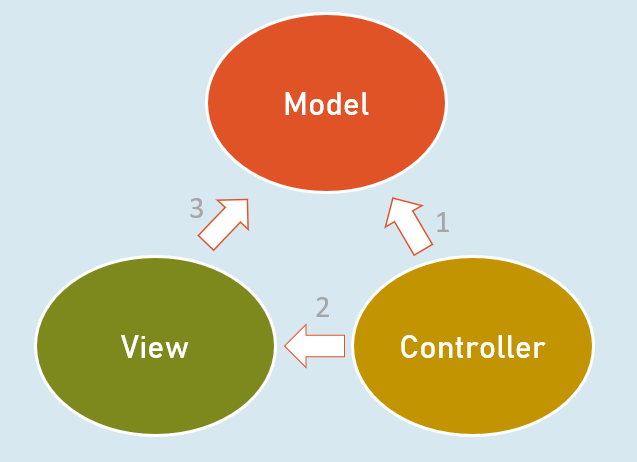
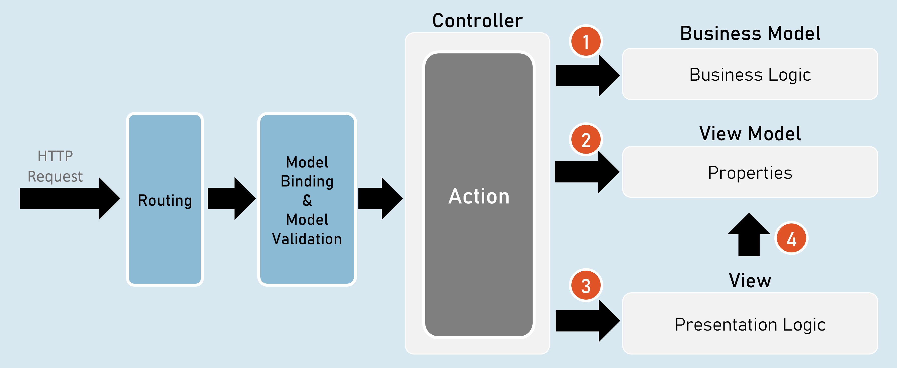


- Controller invokes Business Model.

- Controller creates object of View Model.

- Controller invokes View.

- View accesses View Model.


## Responsibilities of Model-View-Controller
### Controller

- Receives HTTP request data.

- Invoke business model to execute business logic.


### Business Model

- Receives input data from the controller.

- Performs business operations such as retrieving / inserting data from database.

- Sends data of the database back to the controller.


### Controller

- Creates object of ViewModel and files data into its properties.

- Selects a view & invokes it & also passes the object of ViewModel to the view.


### View

- Receives the object of ViewModel from the controller.

- Accesses properties of ViewModel to render data in html code.

- After the view renders, the rendered view result will be sent as response.


## Benefits / Goals of MVC architectural pattern
- Clean separation of concerns

- Each component (model, view and controller) performs single responsibility.

- Identifying and fixing errors will be easy.

- Each component (model, view and controller) can be developed independently.

- In practical, both view and controller depend on the model.

- Model doesn't depend on neither view nor the controller.

- This is one of the key benefits of the 'clean separation'.

- This separation allows the model to be built and tested independently.

- Unit testing each individual component is easier.


## Views
View is a web page (.cshtml) that is responsible for containing presentation logic that merges data along with static design code (HTML).


- Controller creates an object of ViewModel and fills data in its properties.

- Controller selects an appropriate view and invokes the same view & supplies object of ViewModel to the View.

- View access the ViewModel.


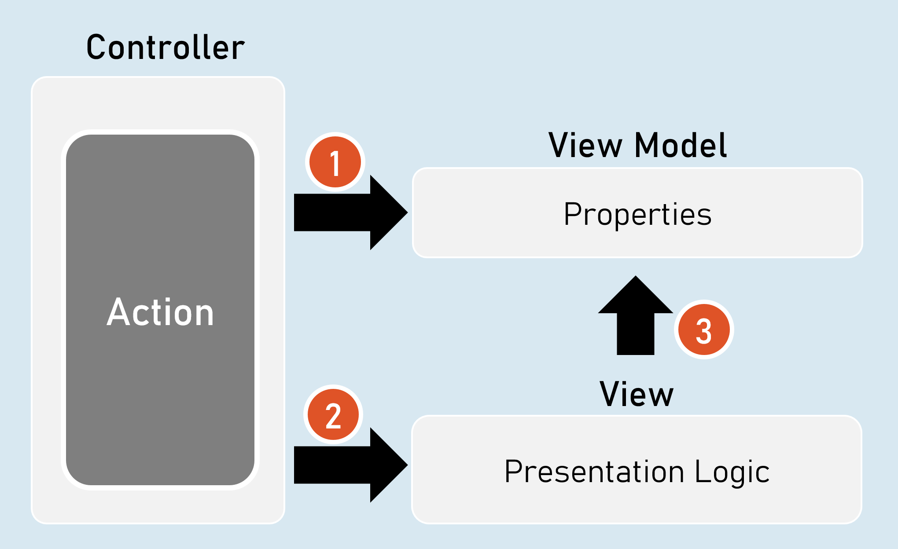


- View contains HTML markup with Razor markup (C# code in view to render dynamic content).

- Razor is the view engine that defines syntax to write C# code in the view. @ is the syntax of Razor syntax.

- View is NOT supposed to have lots of C# code. Any code written in the view should relate to presenting the content (presentation logic).

- View should neither directly call the business model, nor call the controller's action methods. But it can send requests to controllers.


## Razor View Engine
### Razor Code Block
```c#
@{
 
  C# / html code here
 
}
Razor code block is a C# code block that contains one or more lines of C# code that can contain any statements and local functions.
```


### Razor Expressions
```c#
@Expression
--or--
@(Expression)
Razor expression is a C# expression (accessing a field, property or method call) that returns a value.
```


### Razor - If
```c#
@if (condition) {
  C# / html code here
}
```

### Razor - if…else
```c#
@if (condition) {
  C# / html code here
}
else {
  C# / html code here
}
Else…if and nested-if also supported.
```


### Razor - Switch
```c#
@switch (variable) {
  case value1: C# / html code here; break;
  case value2: C# / html code here; break;
  default: C# / html code here; break;
}
```

### Razor - foreach
```c#
@foreach (var variable in collection ) {
  C# / html code here
}
```

### Razor - for
```c#
@for (initialization; condition; iteration) {
  C# / html code here
}
```

### Razor - Literal
```c#
@{
 @: static text
}
```

### Razor - Literal
```c#
<text>static text</text>
```


### Razor - Local Functions
```c#
@{
return_type method_name(arguments) {
  C# / html code here
 }
}
```

The local functions are callable within the same view.

Razor - Members

### Razor - Methods, Properties, Fields
```c#
@functions {
 return_type method_name(arguments) {
   C# / html code here
 }
 
 data_type field_name;
 
 data_type property_name
 {
   set { … }
   get { … }
 }
}

The members of razor view can be accessible within the same view.
```


### Html.Raw( )
```c#
@{
 string variable = "html code";
}
 
@Html.Raw(variable) //prints the html markup without encoding (converting html tags into plain text)
```


## ViewData
ViewData is a dictionary object that is automatically created up on receiving a request and will be automatically deleted before sending response to the client.

It is mainly used to send data from controller to view.
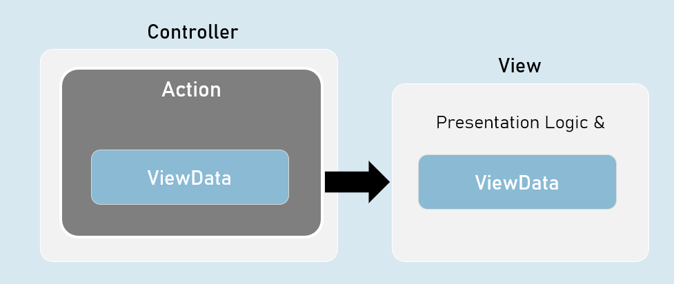


ViewData is a property of Microsoft.AspNetCore.Mvc.Controller class and Microsoft.AspNetCore.Mvc.Razor.RazorPage class.

It is of Microsoft.AspNet.Mvc.ViewFeatures.ViewDataDictionary type.
```c#
namespace Microsoft.AspNetCore.Mvc
{
 public abstract class Controller : ControllerBase
 {
   public ViewDataDictionary ViewData { get; set; }
 }
}
```

- It is derived from IDictionary<KeyValuePair<string, object>> type.

- That means, it acts as a dictionary of key/value pairs.

- Key is of string type.

- Value is of object type.


## ViewData - Properties and Methods
- int Count { get; set; } //gets the number of elements.

- [string Key] //Gets or sets an element.

- Add(string key, object value) //Adds a new element.

- ContainsKey(string key) //Determines whether the specified key exists or not.

- Clear() //Clears (removes) all elements.


## ViewBag
ViewBag is a property of Controller and View, that is used to access the ViewData easily.

ViewBag is 'dynamic' type.


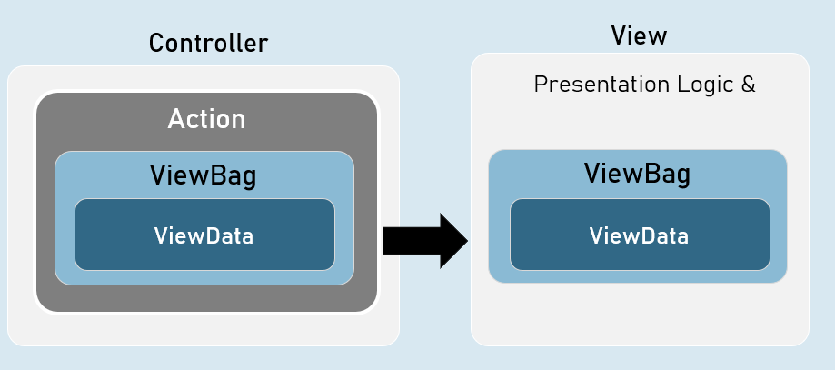


ViewBag is a property of Microsoft.AspNetCore.Mvc.Controller class and Microsoft.AspNetCore.Mvc.Razor.RazorPageBase class.

It is of dynamic type.
```c#
namespace Microsoft.AspNetCore.Mvc
{
 public abstract class Controller : ControllerBase
 {
   public dynamic ViewBag { get; set; }
 }
}
```

The 'dynamic' type similar to 'var' keyword.

But, it checks the data type and at run time, rather than at compilation time.

If you try to access a non-existing property in the ViewBag, it returns null.
```c#
[string Key] //Gets or sets an element.
```


## Benefits of 'ViewBag' over ViewData
ViewBag's syntax is easier to access its properties than ViewData.

Eg: ViewBag.property [vs] ViewData["key"]

You need NOT type-cast the values while reading it.

Eg: ViewBag.object_name.property

[vs]

(ViewData["key"] as ClassName).Property


## Strongly Typed Views
Strongly Typed View is a view that is bound to a specified model class.

It is mainly used to access the model object / model collection easily in the view.

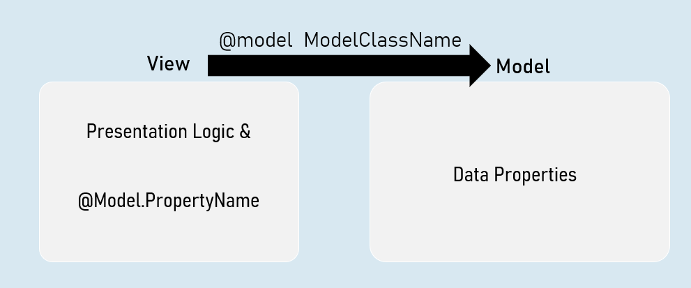


## Benefits of Strongly Typed Views
- You will get Intellisense while accessing model properties in strongly typed views, since the type of model class was mentioned at @model directive.

- Property names are compile-time checked; and shown as errors in case of misspelled / non-existing properties in strongly typed views.

-  will have only one model per one view in strongly typed views.

- Easy to identify which model is being accessed in the view.


## Helper methods in Controller to invoke a View
- return View( ); //View name is the same name as the current action method.

- return View(object Model ); //View name is the same name as the current action method & the view can be a strongly-typed view to receive the supplied model object.

- return View(string ViewName); //View name is explicitly specified.

- return View(string ViewName, object Model ); //View name is explicitly specified & the view can be a strongly-typed view to receive the supplied model object.


## Strongly Typed Views
Strongly Typed View can be bound to a single model directly.

But that model class can have reference to objects of other model classes.


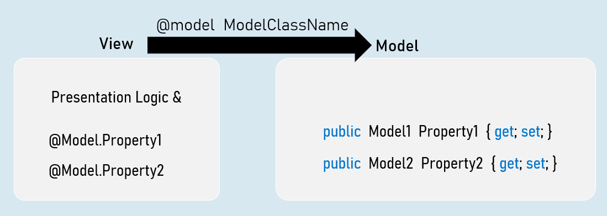


## ViewImports.cshtml
ViewImports.cshtml is a special file in the "Views" folder or its subfolder, which executes automatically before execution of a view.

It is mainly used to import common namespaces that are to imported in a view.


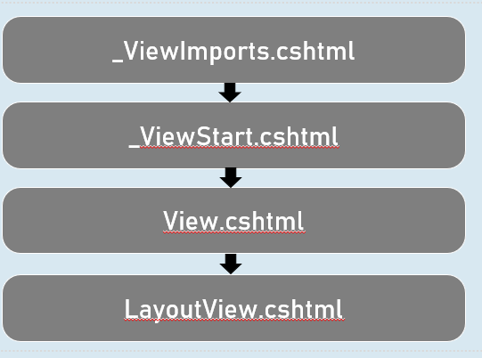

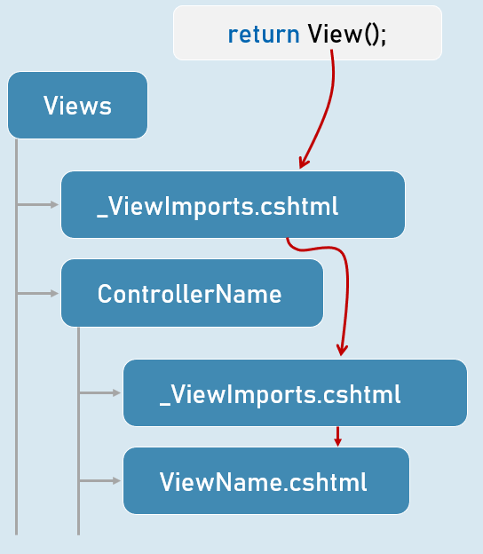
 


## Shared Views
Shared views are placed in "Shared" folder in "Views" folder.

They are accessible from any controller, if the view is NOT present in the "Views\ControllerName" folder.

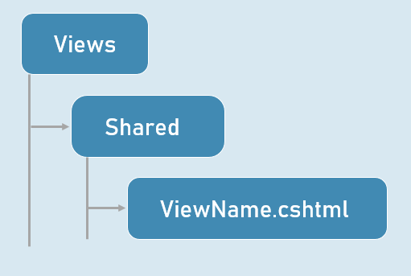


## View Resolution
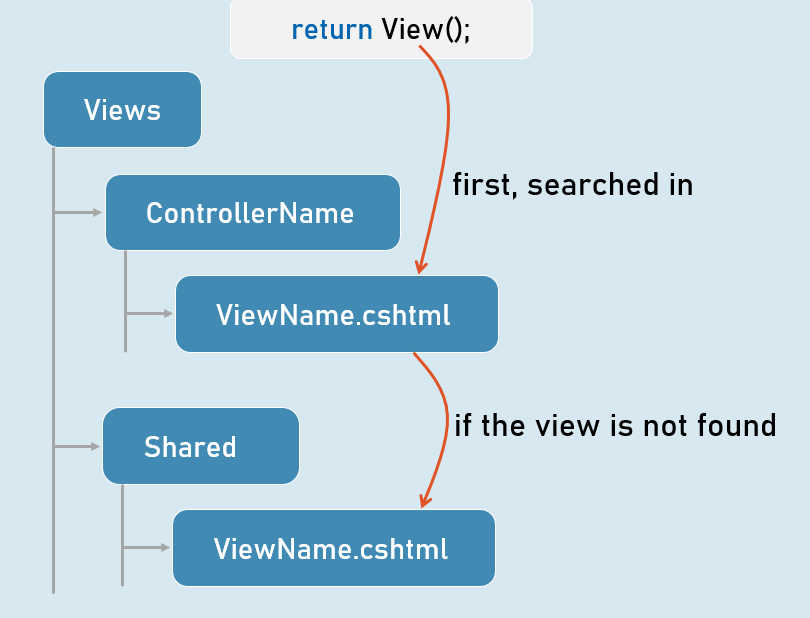


# Interview Questions 
## What is the MVC pattern?
It is a pattern that allows us to separate code into three categories: Models, Views and Controlllers

In an application that follows the MVC pattern, each component has its role well specified. For example, model classes only hold the data and the business logic. They don't deal with HTTP requests. Views only display information. The controllers handle and respond to user input and decide which model to pass to which view. This is known as the separation of responsibility or separation of concerns. It makes an application easy to develop and maintain over time as it grows in complexity.


Though Model-View-Controller is one of the oldest and most prominent patterns, alternate patterns have emerged over the years. Some popular patterns include MVVM (Model-View-ViewModel), MVP (Model-View-Presenter) and MVA (Model-View-Adapter).
## Explain the role of the various components of the MVC pattern?
Model: Represents all the data and business logic that the user works within a web application. In ASP.NET core, the model is represented by C# classes that hold the data and the related logic that operates on that data. The 'Models' directory stores the model classes. You can also write POCO (Plain-Old-CLR-Object) classes only for storing the data and write business logic in a separate model class (a.k.a ‘Services’).


View: Represents all the UI logic of the application. In a web application, it represents the HTML that's sent to the user and displayed in the browser.


One important thing to remember is that all HTML code is not static or hard-coded. The HTML code in view can be generated dynamically using a model's data.


Controller: Acts as an interface between Model and View. It processes the business logic and incoming requests, manipulates data using the Model, and interacts with the Views to render the final output.


In ASP.NET, these are C# classes that form the glue between a model and a view. Controllers have action methods that act as middleware that execute upon receiving a HTTP request from the browser, then retrieve the data from model and pass it to the view to dynamically render a response. The controllers can be present in any folder – the common name of the folder is “Controllers”.
## Explain the differences between ViewData and ViewBag
ViewData is Key-Value paired Dictionary collection.

ViewBag is internally “object” type.


2:

ViewData is a property of “Microsoft.AspNetCore.Mvc.Controller” class.

ViewBag is “dynamic” property of “Microsoft.AspNetCore.Mvc.Controller” class.
3:

ViewBag internally uses ViewData. So you can set / get data of ViewData using ViewBag.

ViewBag is the syntactic sugar to easily access the ViewData.


4:

Type Conversion code is required while reading values from ViewData.

Type conversion is not required while reading values from ViewBag.


5:

The lifetime of both ViewData and ViewBag is per-request. They will be deleted automatically at the end of the request processing. When a new request is received, a new ViewData will be created.
## Explain strongly-typed views.
Strongly-typed views are tightly bound to a model.

The strongly-typed view can receive model object (of specific model class) from the controller.

The controller can supply model object by using the return View(model) method, at the end of action method.

You can use the strongly-typed tag helpers (such as asp-for) in strongly-typed views.


You will create a strongly typed view by mentioning the model class by using @model directive at the top of the view.

@model ModelClassName
