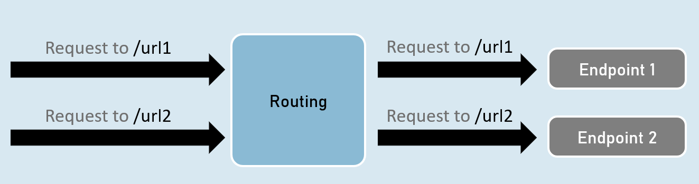
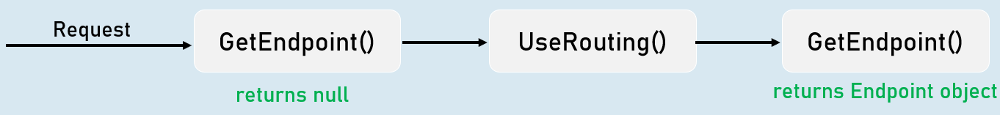
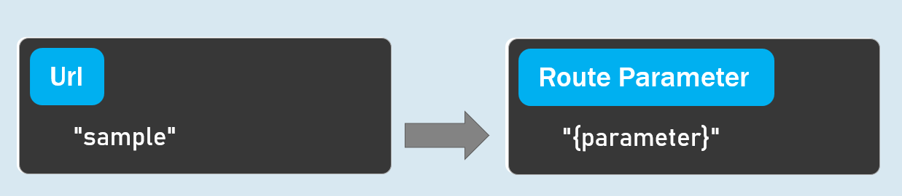
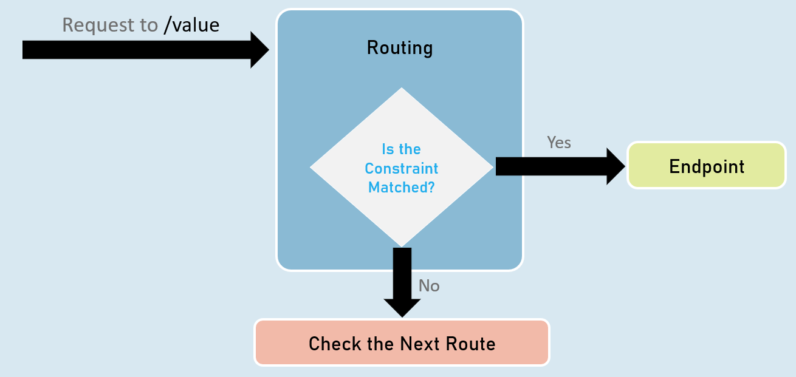
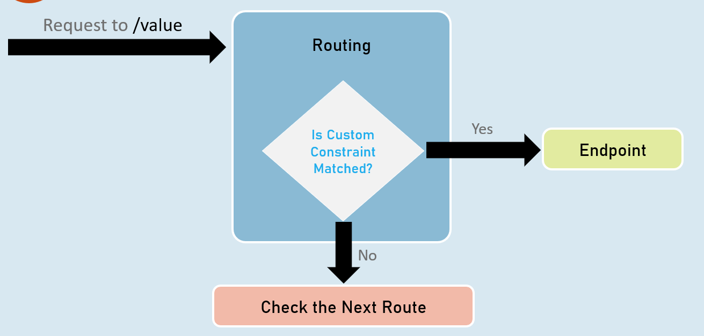
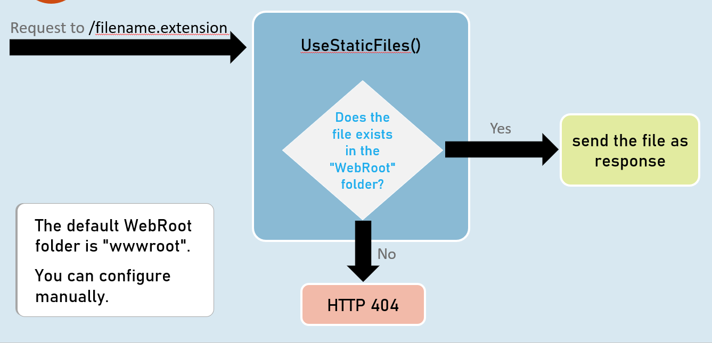

# Routing Cheat Sheet

# Introduction to Routing

Routing is a process of matching incoming HTTP requests by checking the HTTP method and url; and then invoking corresponding endpoints.



## Routing - UseRouting and UseEndPoints
### UseRouting( )

`app.UseRouting();`

Enables routing and selects an appropriate end point based on the url path and HTTP method.


### UseEndPoints( )

```c#
app.UseEndPoints(endpoints =>
{
 endpoints.Map(…);
 endpoints.MapGet(…);
 endpoints.MapPost(…);
);
```
Executes the appropriate endpoint based on the endpoint selected by the above UseRouting() method.


## Map, MapGet, MapPost
### endpoints.Map( )
```c#
endpoints.Map("path", async (HttpContext context) =>
{
 //code
});
```
Executes the endpoint when a HTTP request's url path begins with the specified path.


### endpoints.MapGet( )
```c#
endpoints.MapGet("path", async (HttpContext context) =>
{
 //code
});
```
Executes the endpoint when a HTTP GET request's url path begins with the specified path.


### endpoints.MapPost( )
```c# 
endpoints.MapPost("path", async (HttpContext context) =>
{
 //code
});
```
Executes the endpoint when a HTTP POST request's url path begins with the specified path.


### GetEndpoint( )

`context.GetEndpoint();`

Returns an instance of `Microsoft.AspNetCore.Http.Endpoint` type, which represents an endpoint.

That instance contains two important properties: `DisplayName`, `RequestDelegate`.


### Route Parameters
"{parameter}"

A route parameter can match with any value.



### Default Route Parameters

"{parameter=default_value}"

A route parameter with default value matches with any value.

It also matches with empty value. In this case, the default value will be considered into the parameter.


### Optional Route Parameters

"{parameter?}"

"?" indicates an optional parameter.

That means, it matches with a value or empty value also.


## Route Constraints



### Route Parameter with Constraint:

"{parameter:constraint}"

A route parameter that has a constraint can match with a value that satisfies the given constraint.


### Multiple Constraints

"{parameter:constraint1:constraint2}"

A route parameter can have more than one constraint, separated with colon ( : ).

### int

Matches with any integer.

Eg: {id:int} matches with 123456789, -123456789


### bool

Matches with true or false. Case-insensitive.

Eg: {active:bool} matches with true, false, TRUE, FALSE


### datetime

Matches a valid DateTime value with formats "yyyy-MM-dd hh:mm:ss tt" and "MM/dd/yyyy hh:mm:ss tt".

Eg: {id:datetime} matches with 2030-01-01%2011:59%20pm

Note: '%20' is equal to space.


### decimal

Matches with a valid decimal value.

Eg: {price:decimal} matches with 49.99, -1, 0.01


### long

Matches a valid long value.

Eg: {id:long} matches with 123456789, -123456789


### guid

Matches with a valid Guid value (Globally Unique Identifier - A hexadecimal number that is universally unique).

Eg: {id:guid} matches with 123E4567-E89B-12D3-A456-426652340000


### minlength(value)

Matches with a string that has at least specified number of characters.

Eg: {username:minlength(4)} matches with John, Allen, William


### maxlength(value)

Matches with a string that has less than or equal to the specified number of characters.

Eg: {username:maxlength(7)} matches with John, Allen, William


### length(min,max)

Matches with a string that has number of characters between given minimum and maximum length (both numbers including).

Eg: {username:length(4, 7)} matches with John, Allen, William


### length(value)

Matches with a string that has exactly specified number of characters.

Eg: {tin:length(9)} matches with 987654321


### min(value)

Matches with an integer value greater than or equal to the specified value.

Eg: {age:min(18)} matches with 18, 19, 100


### max(value)

Matches with an integer value less than or equal to the specified value.

Eg: {age:max(100)} matches with -1, 1, 18, 100


### range(min,max)

Matches with an integer value between the specified minimum and maximum values (both numbers including).

Eg: {age:range(18,100)} matches with 18, 19, 99, 100


### alpha

Matches with a string that contains only alphabets (A-Z) and (a-z).

Eg: {username:alpha} matches with rick, william


### regex(expression)

Matches with a string that matches with the specified regular expression.

Eg 1: {age:regex(^[0-9]{2}$)} matches with any two-digit number, such as 10, 11, 98, 99

Eg 2: {age:regex(^\d{3}-\d{3}$)} matches with any three-digit number, then hyphen, and then three-digit number, such as 123-456

## Custom Route Constraint Classes
### Custom Route Constraint Class
```c# 
public class ClassName : IRouteConstraint
{
  public bool Match(HttpContext? HttpContext, IRouter? route, string routeKey, RouteValueDictionary values, RouteDirection routeDirection)
  {
    //return true or false
  }
}


builder.Services.AddRouting(options =>
{
  options.ConstraintMap.Add("name", typeof(ClassName));
}); //adding the custom constraint to routing
```



## Endpoint Selection Order
Top is highest precedence (will be evaluated first)


1: URL template with more segments.

Eg: "a/b/c/d" is higher than "a/b/c".


2: URL template with literal text has more precedence than a parameter segment.

Eg: "a/b" is higher than "a/{parameter}".


3: URL template that has a parameter segment with constraints has more precedence than a parameter segment without constraints.

Eg: "a/b:int" is higher than "a/b".


4: Catch-all parameters (**).

Eg: "a/{b}" is higher than "a/**".

## WebRoot


# Routing Interview Questions

## What is Routing?
Routing is the process of matching incoming HTTP requests to controller actions and determining which action should handle the request. 

## How Routing works in ASP.NET Core?
Routing works in ASP.NET Core by using a pair of middleware, registered by UseRouting and UseEndpoints. UseRouting adds route matching to the middleware pipeline, and UseEndpoints adds endpoint execution to the middleware pipeline. Endpoints are the app’s units of executable request-handling code, and they can be defined using conventional routing or attribute routing
## When will you prefer attribute routing over conventional routing?
Attribute routing is preferred over conventional routing when you want more control over the URL patterns for your actions, or when you want to create RESTful APIs with descriptive and hierarchical URLs. Attribute routing also allows you to use tokens, constraints, and order parameters to customize the routing behavior
## What are the important route constraints?
Route constraints are used to restrict the values of route parameters, such as limiting them to a specific range, format, or length. Some important route constraints are: int, bool, datetime, decimal, double, float, guid, length, long, max, min, range, regex, and required
## What is the purpose of the wwwroot folder?
The purpose of the wwwroot folder is to store the static files, such as HTML, CSS, images, and JavaScript, that are served directly to clients by default. The wwwroot folder is treated as the web root folder, and the files in it are accessible via a path relative to the web root
## How do you change the path of wwwroot folder?
You can change the path of the wwwroot folder by using the UseWebRoot method on the WebApplicationBuilder object. For example, if you want to use a folder named “public” as the web root folder, you can write: 
`builder.UseWebRoot("public");`
