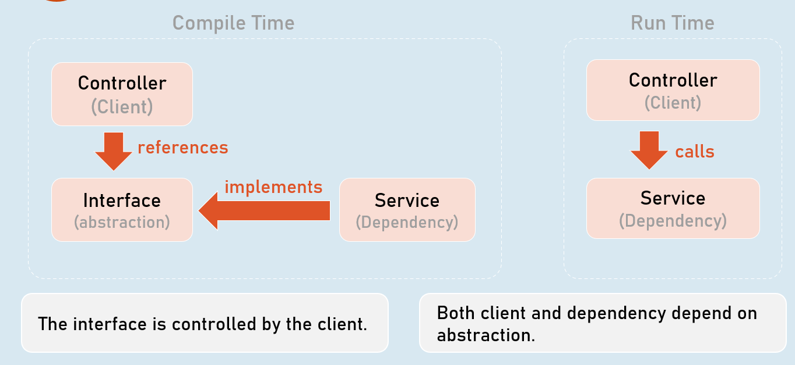
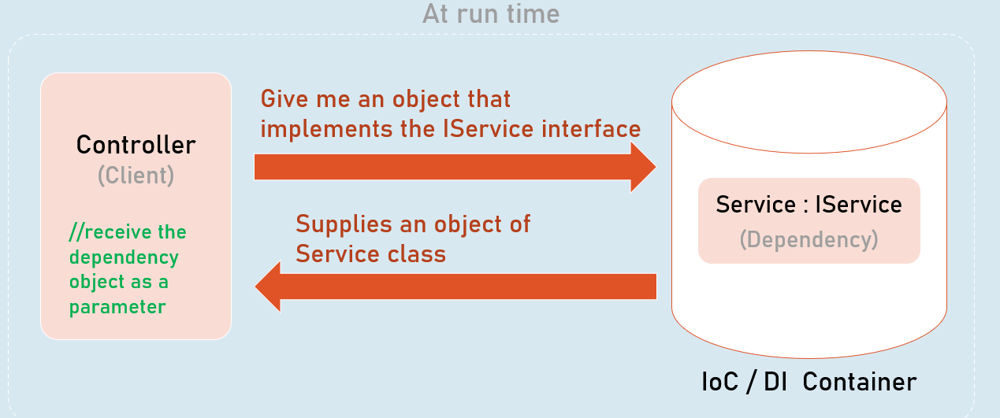
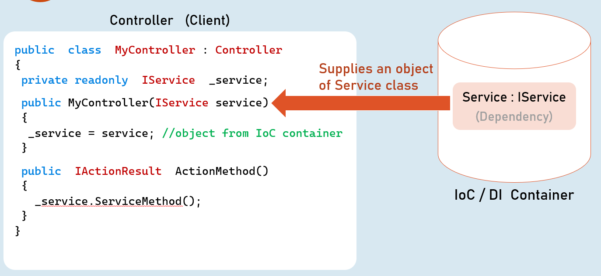
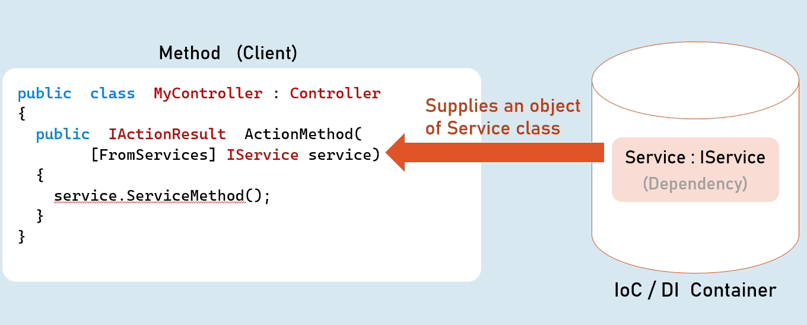
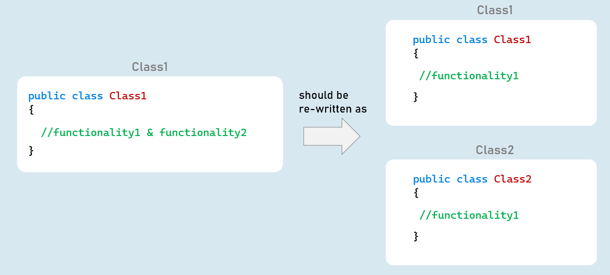
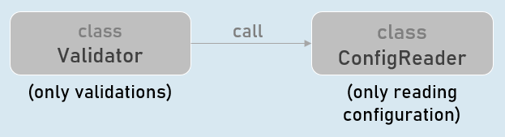
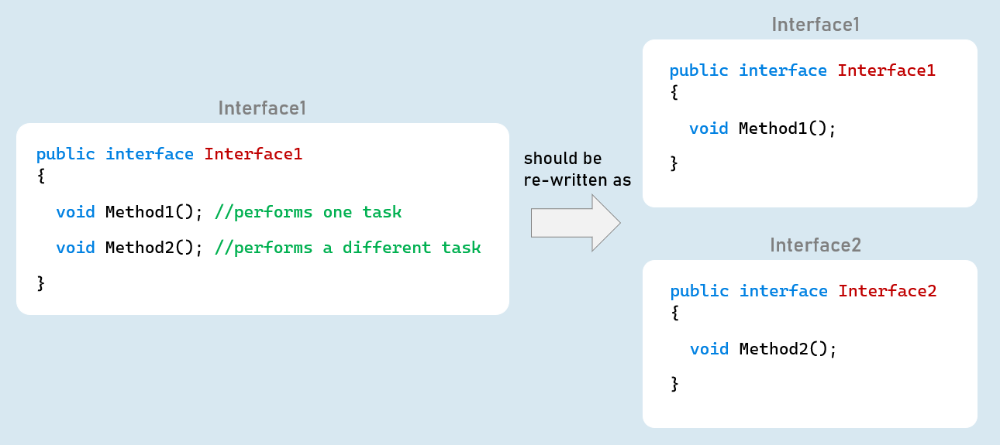
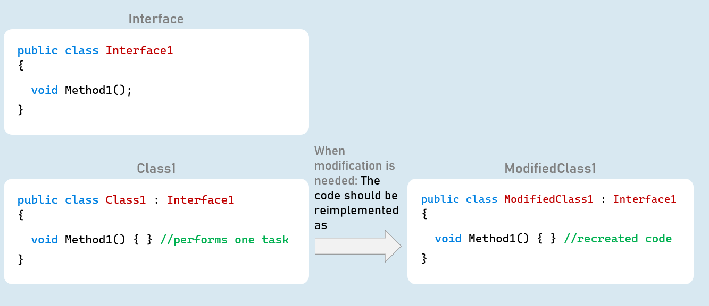

# SOLID Principles Section Cheat Sheet (PPT)
## Overview of SOLID Principles
"SOLID" is a set of five design patterns, whose main focus is to create loosely coupled, flexible, maintainabile code.

Broad goal of SOLID Principles:Reduce dependencies of various classes / modules of the application.


## Single Responsibility Principle (SRP)

A software module or class should have one-and-only reason to change.


### Liskov Subsitution Principle (LSP)

Subtypes must be substitutable for their base types.


### Open-Closed Principle (OCP)

A class is closed for modifications; but open for extension.

### Interface Segregation Principle (ISP)

No client class should be forced to depend on methods it does not use.


### Dependency Inversion Principle (DIP)

High-level modules should not depend on low-level modules. Both should depend upon abstractions.


## Dependency Inversion Principle (DIP)
### Direct Dependency

### Controller (Client)
```c#
public class MyController : Controller
{
  private readonly MyService _service;
  public MyController()
  {
    _service = new MyService(); //direct
  }
  public IActionResult ActionMethod()
  {
    _service.ServiceMethod();
  }
}
```

### Service (Dependency)
```c#
public class MyService
{
  public void ServiceMethod()
  {
    …
  }
}
```

### Dependency Problem

- Higher-level modules depend on lower-level modules.

- Means, both are tightly-coupled.

- The developer of higher-level module SHOULD WAIT until the completion of development of lower-level module.

- Requires much code changes in to interchange an alternative lower-level module.

- Any changes made in the lower-level module effects changes in the higher-level module.

- Difficult to test a single module without effecting / testing the other module.


### Dependency Inversion Principle

- Dependency Inversion Principle (DIP) is a design principle (guideline), which is a solution for the dependency problem.

- "The higher-level modules (clients) SHOULD NOT depend on low-level modules (dependencies).

- Both should depend on abstractions (interfaces or abstract class)."

- "Abstractions should not depend on details (both client and dependency).

- Details (both client and dependency) should depend on abstractions."





### Dependency Injection




### Constructor Injection




### Method Injection




## Single Responsibility Principle (SRP)




- A class should have one-and-only reason to change.

- A class should implement only one functionality.

- Avoid multiple / tightly coupled functionalities in a single class.

- Eg: A class that performs validation should only involve in validation.

- But it should not read configuration settings from a configuration file.

- But instead, it call a method of another class that reads configuration settings.


### Interfaces

- Create alternative implementation of the class by implementing the same interface.

- Benefit: Makes the class independent of other classes, in terms of its purpose / functionality.

- So that, the classes become easier to design, write, debug, maintain and test.


Eg:





## Interface Segregation Principle (ISP)


- No client class should be forced to depend on methods it doesn't use.

- We should prefer to make many smaller interfaces rather than one single big interface.

- The client classes may choose one or more interfaces to implement.

- Benefit: Makes it easy to create alternative implementation for a specific functionality, rather than recreating entire class.


Eg:

Assume, a class has two methods: GetPersons() and AddPerson().

Instead of creating both methods in a single interface, create them as two different interfaces: IPersonGetter, IPersonAdder

- interface IPersonsGetter (methods to get persons data)

- interface IPersonsAdder(methods to create person)


## Open/Closed Principle (OCP)




A class is closed for modifications; but open for extension.

You should treat each class as readonly for development means; unless for bug-fixing.

If you want to extend / modify the functionality of an existing class; you need to recreate it as a separate & alternative implementation; rather than modifying existing code of the class.


Eg:

Assume, a class has a method: GetPersons().

The new requirement is to get list of sorted persons.

Instead of modifying existing GetPersons() method, you need to create an alternative class that gets sorted persons list.

Benefit: Not modifying existing code of a class doesn't introduce new bugs; and keeps the existing unit tests stay relavant and needs no changes.


```c#
class PersonGetter : IPersonGetter (GetPersons() method retrieves list of persons)
class SortedPersonGetter : IPersonGetter (GetPersons() method retrieves sorted list of persons)
```

### Interfaces

Create alternative implementation of the class by implementing the same interface.


### Inheritance

Create a child class of the existing class and override the required methods that needs changes.


## Liskov Substitution Principle (LSP)
### Parent Class
```c#
public class ParentClass
{
  public virtual int Calculate(int? a, int? b)
  {
    //if 'a' or 'b' is null, throw ArgumentNullException
    //return sum of 'a' and 'b'
  }
}
```

### Child Class
```c#
public class ChildClass : ParentClass
{
  public override int Calculate(int? a, int b)
  {
    //if 'a' or 'b' is null, throw ArgumentNullException
    //if 'a' or 'b' is negative, throw ArgumentException
    //return product of 'a' and 'b'
  }
}
```

[Violates LSP]


Functions that use references of base classes must be able to use objects of derived classes without breaking / changing its functionality.

The child classes that override methods of base class, should provide same behavior.


### Using object of parent class

ParentClass variable = new ParentClass();

variable.Method(); //executes ParentClass.Method


### Using object of child class

ParentClass variable = new ChildClass();

variable.Method(); //executes ChildClass.Method

[Both methods should offer same functionality]


Functions that use references of base classes must be able to use objects of derived classes without breaking / changing its functionality.

The child classes that override methods of base class, should provide same behavior.

If a derived class overrides a method of base class; then the method of derived class should provide same behavior:

With same input, it should provide same output (return value).

The child class's method should not introduce (throw) any new exceptions than what were thrown in the base implementation.

The child class's method should not implement stricter rules than base class's implementation.


Benefit: Prevents code to break - if by mistake or wantedly, someone has replaced the derived class with its base class (or even vice versa), as its behavior doesn't change.

# Interview Questions

## What does SOLID stand for? What are its principles?
S.O.L.I.D is an acronym for the first five object-oriented design (OOD) principles by Robert C. Martin.


- **S - Single-responsibility principle**. A class should have one and only one reason to change, meaning that a class should have only one job.

- **O - Open-closed principle**. Objects or entities should be open for extension, but closed for modification.

- **L - Liskov substitution principle. ** Instance of a child class must replace an instance of the parent class without affecting the results. That means both child class’s instance and parent class’s instance should offer same functionality of common methods.

- **I - Interface segregation principle. ** A client should never be forced to implement an interface that it doesn't use or clients shouldn't be forced to depend on methods they do not use.

- **D - Dependency Inversion Principle. ** Entities must depend on abstractions not on concretions. It states that the high level module must not depend on the low level module, but they should depend on abstractions.


### Benefits of SOLID principles
- **Accessibility:** The SOLID Principle assures uncomplicated to control and access to object entities. The integrity of stable object-oriented applications gives easy access to objects, reducing the chances of unintended inheritance.


- **Ease of refactoring:** Software changes with time. Thus, programmers are required to develop applications, considering the possibility of future changes. Software applications which are poorly constructed make it challenging to refactor, but it is quite easy to refactor your codebase with the SOLID principle.


- **Extensibility:** The software goes through stages of improvement, including extra features. If the features of an application are not extended tactfully, this could affect prevailing functionalities and lead to unexpected problems. The process of extensibility could be a tiring process since you require to design existing functionalities in the codebase, and if the existing functionalities are not rightly designed, this can make it even more challenging to include extra features. But the application of SOLID principles causes the extensibility procedure to be smoother.


- **Debugging:** Debugging is an important aspect of the software development process. When software applications are not rightly devised, and the codebase gets clustered like spaghetti, it becomes difficult to debug applications. The SOLID principle embodies the feature of assuring that the software’s debugging process is much more comfortable.


- **Readability:** A well-designed codebase can be simple to comprehend and easy to read. Readability is also a crucial element in the software development process as it makes the refactoring and debugging operations easier, specifically in open-source projects. The SOLID principle method assures that your code is comparatively easier to read and interpret.


## What is Bad Design?
If a system exhibits any or all of the following three traits then we have identified bad design:


- **The system is rigid:** It’s hard to change a part of the system without affecting too many other parts of the system

- **The system is fragile:** When making a change, unexpected parts of the system break

- **The system or component is immobile:** It is hard to reuse it in another application because it cannot be disentangled from the current application.


## Describe the Single Responsibility Principle (SRP).

In Object Oriented Programming, Single Responsibility (SRP) ensures that every module or class should be responsible for single functionality supported by the software system. In other words, every class should have one and only reason to change it.

For example, In ASP.NET MVC HomeController class should be responsible related to Home Page functionality of software system. It should not involve in other aspects such as error handling or logging. Each of these functionalities should be accomplished by independent classes (say middleware, filters etc.).

### Advantages of the Single Responsibility Principle

- You should modify your class more often, and every modification is more complex, has more side effects, and needs a lot more effort than it should have. Thus, it’s good to ward off these problems by ensuring that each class has just one responsibility.

- The class is simpler to comprehend. When the class just does “one thing”, usually its interface has a few methods that are reasonably self-explanatory. It should also have a few member variables (less than seven).

- The class is effortless to manage. Changes are isolated, cutting down the probability of splitting other unrelated areas of the software. As programming flaws are inversely proportional to complexity, being simpler to figure out makes the code less inclined to bugs.

- The class is more reusable. If a class has different responsibilities, and just one of those is required in another area of the software, then the additional irrelevant responsibilities deter reusability. Owning a single responsibility implies the class should be reusable without modification.


## Describe the Open Close Principle (OCP).
- The simplest approach to carry out the Open-Closed Principle in C# is to include the new functionalities by building new derived classes that need to be inherited from the original base class.

- Another step is to let the client access the original class with the help of an abstract interface.

- So, when there is a difference in need or any additional need comes, then rather than touching the prevailing functionality, it’s always better proposed to design new derived classes and let the original class implementation be as it is.

The simplest approach to carry out the Open-Closed Principle in C# is to include the new functionalities by building new derived classes that need to be inherited from the original base class.

Another step is to let the client access the original class with the help of an abstract interface.

So, when there is a difference in need or any additional need comes, then rather than touching the prevailing functionality, it’s always better proposed to design new derived classes and let the original class implementation be as it is.


### Problems you’ll get if you are not following the OCP in C#:

If you are not adhering to the OCP during the process of the application development process, then your application development may result in the following problems:

- If you let a function or class include new logic, then as a programmer you have to test the entire functionalities, including the old functionalities and the latest functionalities of the application.

- As a programmer, the onus is on you to inform the QA (Quality Assurance) team about the modifications beforehand so that they can, in advance, prepare themselves for regression testing along with testing the new features.

- If you are not adhering to the Open-Closed Principle, then it also splits the Single Responsibility Principle, since the module or class is going to achieve several responsibilities.

- If in a single class you are incorporating all the functionalities, then the maintenance of the class becomes challenging.

## Explain Liskov Substitution Principle (LSP).
Liskov Substitution Principle (LSP) states that Objects in a program can be replaced by the instances of their subtypes without modifying the correctness of a program.

In other words, if A is subtype of B then instances of B may be replaced by the instances of A without altering the program correctness.


### The LSP rules are:

- Subclass should incorporate all classes of the base class. This implies there should be no techniques that throw “NotImplementedException” or overriding existing methods of base class. Instead, you can create another method (with another name) with new / altered functionality.

- Overridden method of the parent class has to accept the exact parameters in the child class. For instance, you possess a method “CalculateSquare” in the parent class that accepts an int as a parameter. This implies you can’t point out the exact method in the child class, override it with the keyword new, and design an extra rule that will confirm that the number is not negative. If you attempt to pass -3 in the client code but utilize the child class rather than the superclass, the client code will have the exception. And that’s not the behavior that was proposed by the base class.

### Advantages

Stops code to break if someone by mistake has altered the base class with the derived class since its behaviour does not change

Derived classes can readily throw exceptions for the method which are not managed by them.


## Explain DIP (Dependency Inversion Principle)
Dependency Inversion Principle (DIP) is a design principle (guideline), which is a solution for the dependency problem.

- "The higher-level modules (clients) SHOULD NOT depend on low-level modules (dependencies). Both should depend on abstractions (interfaces or abstract class)."

- "Abstractions should not depend on details (both client and dependency). Details (both client and dependency) should depend on abstractions."

### Advantage:

Low-level and high-level classes are loosely coupled


### Problems if DIP is not implemented

- If DIP is not implemented, it indicates the high-level modules (classes that invoke services) and low-level modules (services) are tightly coupled.

- The developer of higher-level module SHOULD WAIT until the completion of development of lower-level module.

- Requires much code changes in to interchange an alternative lower-level module.

- Any changes made in the lower-level module effects changes in the higher-level module.

- Difficult to test a single module without effecting / testing the other module.

## Explain Interface Segregation Principle
> “Many client-specific interfaces are better than one general-purpose interface”.

ISP (interface segregation principle) demands that classes will only be capable of performing behaviors that are helpful in achieving their end functionality. Classes do not consist of behaviors they do not use.


### Advantage:

The benefit of ISP is that it breaks large methods into minor, more precise methods. This makes the program simpler to debug for the below-mentioned reasons:

- There is limited code transferred between classes. Less code implies fewer bugs.

- A single method handles a smaller range of behaviors. If there is an issue with a behavior, you are only required to look over the minor methods.