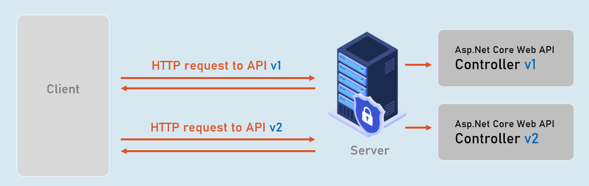
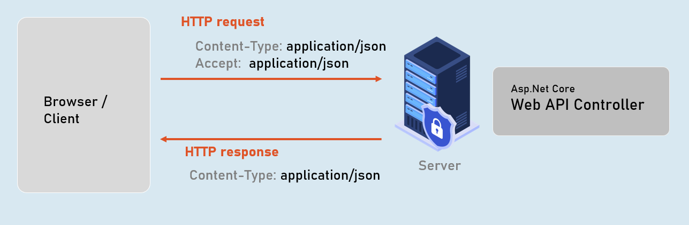

# Swagger Section Cheat Sheet (PPT)
## Introduction to Swagger
Swagger is a set of open-source tools that help developers to generate interactive UI to document, test RESTful services.

Swagger is a set of tools to implement Open API.


### 1. Swasbuckle.AspNetCore

Framework that makes it easy to use swagger in asp.net core.


### 2. Swagger

Set of tools to generate UI to document & test RESTful services.


### 3. Open API

Specification that defines how to write API specifications in JSON).


## API Versions
API Versioning is the practice of transparently managing changes to your API, where the client requests a specific version of API; and the server executes the same version of the API code.





## Content Negotiation
Content negotiation is the process of selecting the appropriate format or language of the content to be exchanged between the client (browser) and Web API.





## What is Swagger/OpenAPI?
Swagger is a set of open-source tools to generate UI to document and test RESTful services
## What is the purpose of Swagger/OpenAPI?
To make it easy for developers to document, test and visualize the useness of the RESTful services
## How can you enable Swagger in ASP.NET Core?
Install Swagger-related NuGet Packages:
	- Microsoft.AspNetCore.Mvc.Versioning
	- Swashbuckle.AspNetCore

Add and configure Swagger middleware 
```c#
builder.Services.AddControllers();
...
builder.Services.AddEndpointsApiExplorer();

builder.Services.AddSwaggerGen();
```

Enable the middleware for serving the generated JSON document and the Swagger Ui, also in Program.cs
```c#
if (app.Environment.IsDevelopment())
{
    app.UseSwagger();
    app.UseSwaggerUI();
}
```
## How can you version your API using Swagger in ASP.NET Core?
Using the `OpenInfo` class, you can modify the author and version-related information displayed in the UI
```c#
builder.Services.AddSwaggerGen(options =>
{
    options.SwaggerDoc("v1", new OpenApiInfo
    {
        Version = "v1",
        Title = "ToDo API",
        Description = "An ASP.NET Core Web API for managing ToDo items",
        TermsOfService = new Uri("https://example.com/terms"),
        Contact = new OpenApiContact
        {
            Name = "Example Contact",
            Url = new Uri("https://example.com/contact")
        },
        License = new OpenApiLicense
        {
            Name = "Example License",
            Url = new Uri("https://example.com/license")
        }
    });
});
```
## What is content negotiation in the context of ASP.NET Core Web APIs?
`content negotiation` is the process of specifying the content-type of the request and the type of content the request expects to recieve from the server
Similarly, the server must inform the client the content-type of the response

## How can you implement content negotiation in ASP.NET Core Web APIs?
 By using the `ProducesAttribute` and `ConsumesAttribute` classes:
 ```c#
 builder.Services.AddControllers(options => {
     //Expected content-type for responses
     options.Filters.Add(new ProducesAttribute("application/json"));
     //Expected content-type for requests
     options.Filters.Add(new ConsumesAttribute("application/json"));
})
 ```