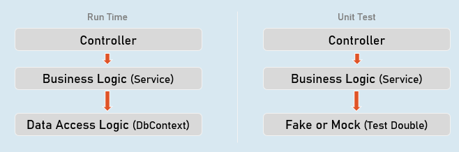
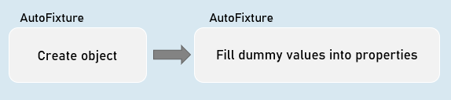
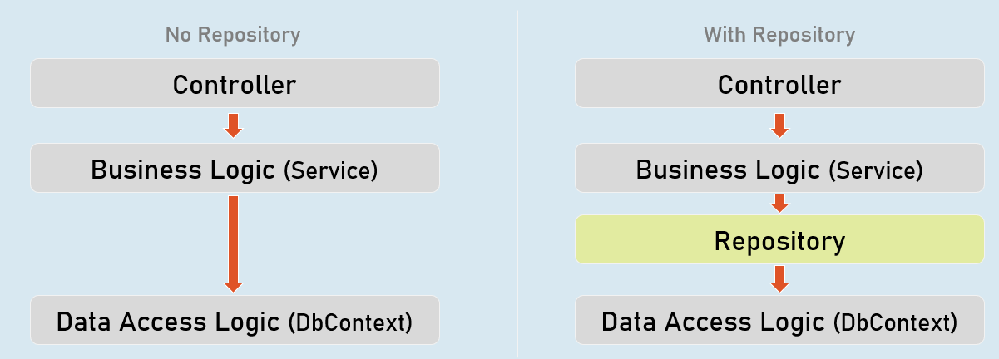
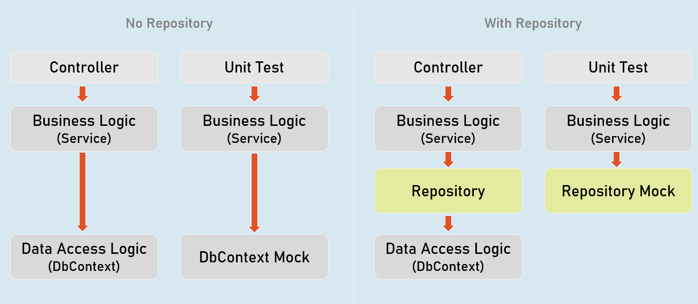
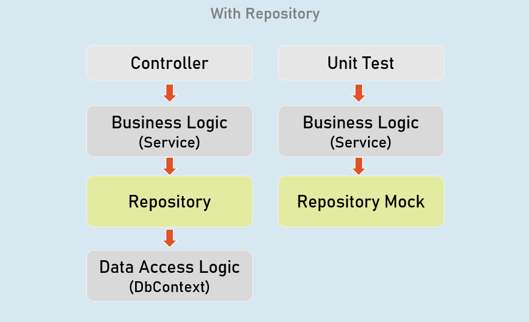
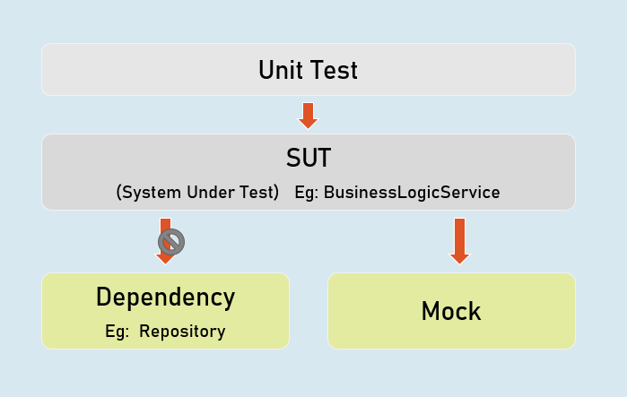
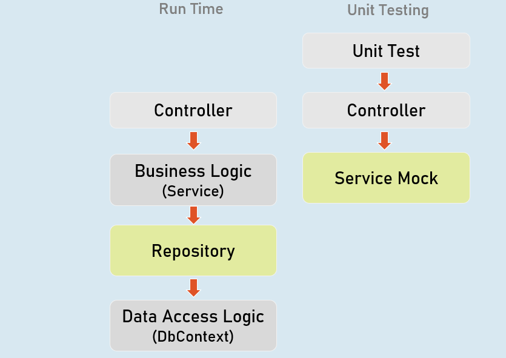
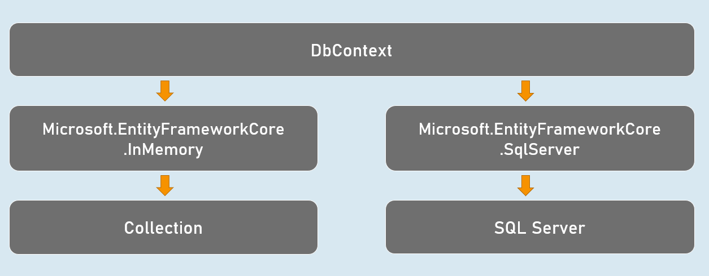
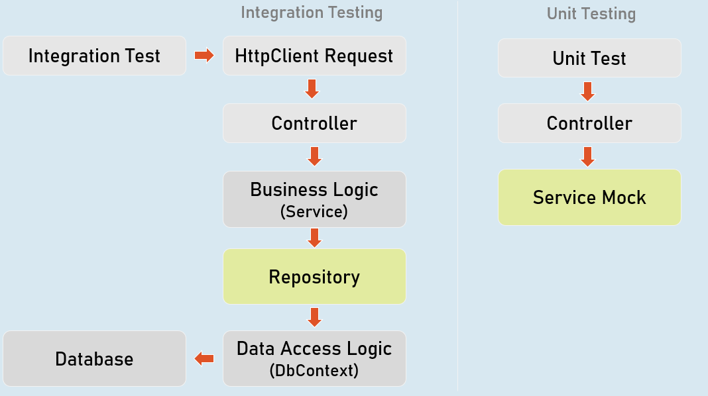

# Unit Testing [Advanced, Moq & Repository Pattern] - Section Cheatsheet 
## Best Practices of Unit Tests
### Isolated / Stand-alone

(separated from any other dependencies such as file system or database)


### Test single method at-a-time

(should not test more than one method in a single test case)


### Unordered

(can be executed in any order)


### Fast

(Tests should take little time to run (about few milliseconds))


### Repeatable

(Tests can run repeatedly but should give same result, if no changes in the actual source code)


### Timely

(Time taken for writing a test case should not take longer time, than then time taken for writing the code that is being tested)


## Mocking the DbContext
### Test Double

A "test double" is an object that look and behave like their production equivalent objects.



A "test double" is an object that look and behave like their production equivalent objects.


### Fake

An object that providers an alternative (dummy) implementation of an interface


### Mock

An object on which you fix specific return value for each individual method or property, without actual / full implementation of it.


### Mocking the DbContext
```c#
Install-Package Moq
Install-Package EntityFrameworkCoreMock.Moq
```

### Mocking the DbContext:
```c#
var dbContextOptions = new DbContextOptionsBuilder<DbContextClassName>().Options;
 
//mock the DbContext
DbContextMock<DbContextClass> dbContextMock = new DbContextMock<DbContextClass>(dbContextOptions);
var initialData = new List<ModelClass>() { … };
 
//mock the DbSet
var dbSetMock = dbContextMock.CreateDbSetMock(temp => temp.DbSetName, initialData);
 
//create service instance with mocked DbContext
var service = newServiceClass(dbContextMock.Object);
```


## AutoFixture
AutoFixture generates objects of the specified classes and their properties with some fake values based their data types.



### Normal object creation
```c#
new ModelClass() {
 Property1 = value,
 Property2 = value 
}
```

### With AutoFixture

`Fixture.Create<ModelClass>(); //initializes all properties of the specified model class with dummy values`


### AutoFixture

`Install-Package AutoFixture`


### Working with AutoFixture:
```c#
var fixture = new Fixture();
 
//Simple AutoFixture
var obj1 = fixture.Create<ModelClass>();
 
//Customization with AutoFixture
var obj2 = fixture.Build<ModelClass>()
 .With(temp => temp.Property1, value)
 .With(temp => temp.Property2, value)
 .Create();
 
```


## Fluent Assertions
Fluent Assertions are a set of extension methods to make the assertions in unit testing more readable and human-friendly.

`Install-Package FluentAssertions`


### Assert
```c#
//Equal
Assert.Equal(expected, actual);
 
//Not Equal
Assert.NotEqual(expected, actual);
 
//Null
Assert.Null(actual);
 
//Not Null
Assert.NotNull(actual);
 
//True
Assert.True(actual);
 
//False
Assert.False(actual);
 
//Empty
Assert.Empty(actual);
 
//Not Empty
Assert.NotEmpty(actual);
 
//Null or empty
Assert.True(string.IsNullOrEmpty(actual)); //string
Assert.True(actual == null || actual.Length == 0); //collection
 
//Should not be null or empty
Assert.False (string.IsNullOrEmpty(actual)); //string
Assert.False(actual == null || actual.Length == 0); //collection
 
//number should be positive
Assert.True(actual > 0);
 
//number should be negative
Assert.True(actual < 0);
 
//number should be >= expected
Assert.True(actual >= expected);
 
//number should be <= expected
Assert.True(actual <= expected);
 
//number should be in given range
Assert.True(actual >= minimum && actual <= maximum);
 
//number should not be in given range
Assert.True(actual < minimum || actual > maximum);
 
//check data type
Assert.IsType<ExpectedType>(actual);
 
//Compare properties of two objects (Equals method SHOULD BE overridden)
Assert.Equal(expected, actual);
 
//Compare properties (should not be equal) of two objects (Equals method SHOULD BE overridden)
Assert.NotEqual(expected, actual);
```


### Fluent Assertion
```c#
//Equal
actual.Should().Be(expected);
 
//Not Equal
actual.Should().NotBe(expected);
 
//Null
actual.Should().BeNull();
 
//Not Null
actual.Should().NotBeNull();
 
//True
actual.Should().BeTrue();
 
//False
actual.Should().BeFalse();
 
//Empty
actual.Should().BeEmpty();
 
//Not Empty
actual.Should().NotBeEmpty();
 
//Null or empty
actual.Should().BeNullOrEmpty();
 
//Should not be null or empty
actual.Should().NotBeNullOrEmpty();
 
//number should be positive
actual.Should().BePositive();
 
//number should be negative
actual.Should().BeNegative();
 
//number should be >= expected
actual.Should().BeGreaterThanOrEqualTo(expected);
 
//number should be <= expected
actual.Should().BeLessThanOrEqualTo(expected);
 
//number should be in given range
actual.Should().BeInRange(minimum, maximum);
 
//number should not be in given range
actual.Should().NotBeInRange(minimum, maximum);
 
//number should be in given range
actual.Should().BeInRange(minimum, maximum);
 
//number should not be in given range
actual.Should().NotBeInRange(minimum, maximum);
 
//check data type (same type)
actual.Should().BeOfType<ExpectedType>();
 
//check data type (same type or derived type)
actual.Should().BeAssignableTo<ExpectedType>();
 
//Compare properties of two objects (Equals method NEED NOT be overridden)
actual.Should().BeEquivalentTo(expected);
 
//Compare properties (should not equal) of two objects (Equals method NEED NOT be overridden)
actual.Should().BeNotEquivalentTo(expected);
```


### Fluent Assertions - Collections:
```c#
actualCollection.Should().BeEmpty();
actualCollection.Should().NotBeEmpty();
 
actualCollection.Should().HaveCount(expectedCount);
actualCollection.Should().NotHaveCount(expectedCount);
 
actualCollection.Should().HaveCountGreaterThanOrEqualTo(expectedCount);
actualCollection.Should().HaveCountLessThanOrEqualTo(expectedCount);
 
actualCollection.Should().HaveSameCount(expectedCollection);
actualCollection.Should().NotHaveSameCount(expectedCollection);
 
actualCollection.Should().BeEquivalentTo(expectedCollection);
actualCollection.Should().NotBeEquivalentTo(expectedCollection);
 
actualCollection.Should().ContainInOrder(expectedCollection);
actualCollection.Should().NotContainInOrder(expectedCollection);
 
actualCollection.Should().OnlyHaveUniqueItems(expectedCount);
actualCollection.Should().OnlyContain(temp => condition);
 
actualCollection.Should().BeInAscendingOrder(temp => temp.Property);
actualCollection.Should().BeInDescendingOrder(temp => temp.Property);
 
actualCollection.Should().NotBeInAscendingOrder(temp => temp.Property);
actualCollection.Should().NotBeInDescendingOrder(temp => temp.Property);
 
delegateObj.Should().Throw<ExceptionType>();
delegateObj.Should().NotThrow<ExceptionType>();
 
await delegateObj.Should().ThrowAsync<ExceptionType>();
await delegateObj.Should().NotThrowAsync<ExceptionType>();

```


## Repository
Repository (or Repository Pattern) is an abstraction between Data Access Layer (EF DbContext) and business logic layer (Service) of the application.




### Unit Testing




## Benefits of Repository Pattern
### Loosely-coupled business logic (service) & data access.

(You can independently develop them).


### Changing data store

(You can create alternative repository implementation for another data store, when needed).


### Unit Testing

(Mocking the repository is much easier (and preferred) than mocking DbContext).


## Mocking the Repository


`Install-Package Moq`


### Mocking the Repository:
```c#
//mock the repository
Mock<IRepository> repositoryMock = new Mock<IRepository>();
 
//mock a method repository method
repositoryMock.Setup(temp => temp.MethodName(It.Any<ParameterType>()))
 .Returns(return_value);
 
//create service instance with mocked repository
var service = newServiceClass(repositoryMock.Object);


```



### Mock<IPersonsRepository>

Used to mock the methods of IPersonsRepository.


### IPersonsRepository

Represents the mocked object that was created by Mock<T>.


## Unit Testing the Controller




### Unit Testing the Controller:
```c# 
//Arrange
ControllerName controller = new ControllerName();
 
//Act
IActionResult result = controller.ActionMethod();
 
//Assert
result.Should().BeAssignableTo<ActionResultType>(); //checking type of action result
result.ViewData.Model.Should().BeAssignableTo<ExpectedType>(); //checking type of model
result.ViewData.Model.Should().Be(expectedValue); //you can also use any other assertion


```


## EFCore In-Memory Provider


`Install-Package Microsoft.EntityFrameworkCore.InMemory`


### Using In-memory provider:
```c#
var dbContextOptions =
 new DbContextOptionsBuilder<DbContextClassName>()
 .UseInMemoryDatabase("database_name");
 .Options;
 
var dbContext = newDbContextClassName(dbContextOptions);

```


## Integration Test

```c#
//Create factory
WebApplicationFactory factory = new WebApplicationFactory();
 
//Create client
HttpClient client = factory.CreateClient();
 
//Send request client
HttpResponseMessage response = await client.GetAsync("url");
 
//Assert
result.Should().BeSuccessful(); //Response status code should be 200 to 299
```