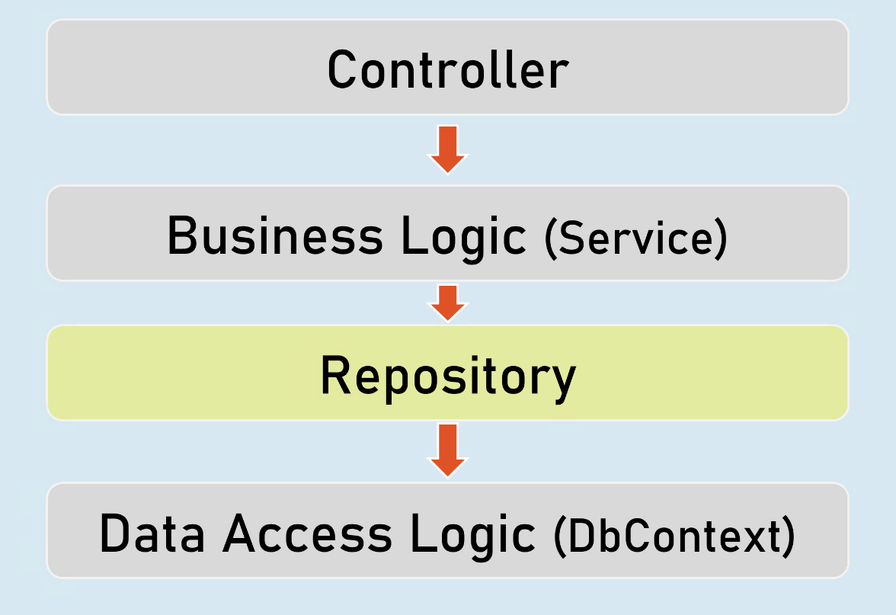

# Unit Testing [Advanced, Moq & Repository Pattern] - Section Cheatsheet 
## Best Practices of Unit Tests
### Isolated / Stand-alone

(separated from any other dependencies such as file system or database)


### Test single method at-a-time

(should not test more than one method in a single test case)


### Unordered

(can be executed in any order)


### Fast

(Tests should take little time to run (about few milliseconds))


### Repeatable

(Tests can run repeatedly but should give same result, if no changes in the actual source code)


### Timely

(Time taken for writing a test case should not take longer time, than then time taken for writing the code that is being tested)


## Mocking the DbContext
### Test Double

A "test double" is an object that look and behave like their production equivalent objects.


A "test double" is an object that look and behave like their production equivalent objects.


### Fake

An object that providers an alternative (dummy) implementation of an interface


### Mock

An object on which you fix specific return value for each individual method or property, without actual / full implementation of it.


### Mocking the DbContext
```c#
Install-Package Moq
Install-Package EntityFrameworkCoreMock.Moq
```

### Mocking the DbContext:
```c#
var dbContextOptions = new DbContextOptionsBuilder<DbContextClassName>().Options;
 
//mock the DbContext
DbContextMock<DbContextClass> dbContextMock = new DbContextMock<DbContextClass>(dbContextOptions);
var initialData = new List<ModelClass>() { … };
 
//mock the DbSet
var dbSetMock = dbContextMock.CreateDbSetMock(temp => temp.DbSetName, initialData);
 
//create service instance with mocked DbContext
var service = newServiceClass(dbContextMock.Object);
```


## AutoFixture
AutoFixture generates objects of the specified classes and their properties with some fake values based their data types.


### Normal object creation
```c#
new ModelClass() {
 Property1 = value,
 Property2 = value 
}
```

### With AutoFixture

`Fixture.Create<ModelClass>(); //initializes all properties of the specified model class with dummy values`


### AutoFixture

`Install-Package AutoFixture`


### Working with AutoFixture:
```c#
var fixture = new Fixture();
 
//Simple AutoFixture
var obj1 = fixture.Create<ModelClass>();
 
//Customization with AutoFixture
var obj2 = fixture.Build<ModelClass>()
 .With(temp => temp.Property1, value)
 .With(temp => temp.Property2, value)
 .Create();
 
```


## Fluent Assertions
Fluent Assertions are a set of extension methods to make the assertions in unit testing more readable and human-friendly.

`Install-Package FluentAssertions`


### Assert
```c#
//Equal
Assert.Equal(expected, actual);
 
//Not Equal
Assert.NotEqual(expected, actual);
 
//Null
Assert.Null(actual);
 
//Not Null
Assert.NotNull(actual);
 
//True
Assert.True(actual);
 
//False
Assert.False(actual);
 
//Empty
Assert.Empty(actual);
 
//Not Empty
Assert.NotEmpty(actual);
 
//Null or empty
Assert.True(string.IsNullOrEmpty(actual)); //string
Assert.True(actual == null || actual.Length == 0); //collection
 
//Should not be null or empty
Assert.False (string.IsNullOrEmpty(actual)); //string
Assert.False(actual == null || actual.Length == 0); //collection
 
//number should be positive
Assert.True(actual > 0);
 
//number should be negative
Assert.True(actual < 0);
 
//number should be >= expected
Assert.True(actual >= expected);
 
//number should be <= expected
Assert.True(actual <= expected);
 
//number should be in given range
Assert.True(actual >= minimum && actual <= maximum);
 
//number should not be in given range
Assert.True(actual < minimum || actual > maximum);
 
//check data type
Assert.IsType<ExpectedType>(actual);
 
//Compare properties of two objects (Equals method SHOULD BE overridden)
Assert.Equal(expected, actual);
 
//Compare properties (should not be equal) of two objects (Equals method SHOULD BE overridden)
Assert.NotEqual(expected, actual);
```


### Fluent Assertion
```c#
//Equal
actual.Should().Be(expected);
 
//Not Equal
actual.Should().NotBe(expected);
 
//Null
actual.Should().BeNull();
 
//Not Null
actual.Should().NotBeNull();
 
//True
actual.Should().BeTrue();
 
//False
actual.Should().BeFalse();
 
//Empty
actual.Should().BeEmpty();
 
//Not Empty
actual.Should().NotBeEmpty();
 
//Null or empty
actual.Should().BeNullOrEmpty();
 
//Should not be null or empty
actual.Should().NotBeNullOrEmpty();
 
//number should be positive
actual.Should().BePositive();
 
//number should be negative
actual.Should().BeNegative();
 
//number should be >= expected
actual.Should().BeGreaterThanOrEqualTo(expected);
 
//number should be <= expected
actual.Should().BeLessThanOrEqualTo(expected);
 
//number should be in given range
actual.Should().BeInRange(minimum, maximum);
 
//number should not be in given range
actual.Should().NotBeInRange(minimum, maximum);
 
//number should be in given range
actual.Should().BeInRange(minimum, maximum);
 
//number should not be in given range
actual.Should().NotBeInRange(minimum, maximum);
 
//check data type (same type)
actual.Should().BeOfType<ExpectedType>();
 
//check data type (same type or derived type)
actual.Should().BeAssignableTo<ExpectedType>();
 
//Compare properties of two objects (Equals method NEED NOT be overridden)
actual.Should().BeEquivalentTo(expected);
 
//Compare properties (should not equal) of two objects (Equals method NEED NOT be overridden)
actual.Should().BeNotEquivalentTo(expected);
```


### Fluent Assertions - Collections:
```c#
actualCollection.Should().BeEmpty();
actualCollection.Should().NotBeEmpty();
 
actualCollection.Should().HaveCount(expectedCount);
actualCollection.Should().NotHaveCount(expectedCount);
 
actualCollection.Should().HaveCountGreaterThanOrEqualTo(expectedCount);
actualCollection.Should().HaveCountLessThanOrEqualTo(expectedCount);
 
actualCollection.Should().HaveSameCount(expectedCollection);
actualCollection.Should().NotHaveSameCount(expectedCollection);
 
actualCollection.Should().BeEquivalentTo(expectedCollection);
actualCollection.Should().NotBeEquivalentTo(expectedCollection);
 
actualCollection.Should().ContainInOrder(expectedCollection);
actualCollection.Should().NotContainInOrder(expectedCollection);
 
actualCollection.Should().OnlyHaveUniqueItems(expectedCount);
actualCollection.Should().OnlyContain(temp => condition);
 
actualCollection.Should().BeInAscendingOrder(temp => temp.Property);
actualCollection.Should().BeInDescendingOrder(temp => temp.Property);
 
actualCollection.Should().NotBeInAscendingOrder(temp => temp.Property);
actualCollection.Should().NotBeInDescendingOrder(temp => temp.Property);
 
delegateObj.Should().Throw<ExceptionType>();
delegateObj.Should().NotThrow<ExceptionType>();
 
await delegateObj.Should().ThrowAsync<ExceptionType>();
await delegateObj.Should().NotThrowAsync<ExceptionType>();

```


## Repository
Repository (or Repository Pattern) is an abstraction between Data Access Layer (EF DbContext) and business logic layer (Service) of the application.


### Unit Testing


## Benefits of Repository Pattern
### Loosely-coupled business logic (service) & data access.

(You can independently develop them).


### Changing data store

(You can create alternative repository implementation for another data store, when needed).


### Unit Testing

(Mocking the repository is much easier (and preferred) than mocking DbContext).


## Mocking the Repository


`Install-Package Moq`


### Mocking the Repository:
```c#
//mock the repository
Mock<IRepository> repositoryMock = new Mock<IRepository>();
 
//mock a method repository method
repositoryMock.Setup(temp => temp.MethodName(It.Any<ParameterType>()))
 .Returns(return_value);
 
//create service instance with mocked repository
var service = newServiceClass(repositoryMock.Object);


```


### Mock<IPersonsRepository>

Used to mock the methods of IPersonsRepository.


### IPersonsRepository

Represents the mocked object that was created by Mock<T>.


## Unit Testing the Controller


### Unit Testing the Controller:
```c# 
//Arrange
ControllerName controller = new ControllerName();
 
//Act
IActionResult result = controller.ActionMethod();
 
//Assert
result.Should().BeAssignableTo<ActionResultType>(); //checking type of action result
result.ViewData.Model.Should().BeAssignableTo<ExpectedType>(); //checking type of model
result.ViewData.Model.Should().Be(expectedValue); //you can also use any other assertion


```


## EFCore In-Memory Provider


`Install-Package Microsoft.EntityFrameworkCore.InMemory`


### Using In-memory provider:
```c#
var dbContextOptions =
 new DbContextOptionsBuilder<DbContextClassName>()
 .UseInMemoryDatabase("database_name");
 .Options;
 
var dbContext = newDbContextClassName(dbContextOptions);

```


## Integration Test

```c#
//Create factory
WebApplicationFactory factory = new WebApplicationFactory();
 
//Create client
HttpClient client = factory.CreateClient();
 
//Send request client
HttpResponseMessage response = await client.GetAsync("url");
 
//Assert
result.Should().BeSuccessful(); //Response status code should be 200 to 299
```

# Interview Questions

## Name some Unit Testing benefits for developers that you personally experienced?
- Unit Tests allow you to make big changes to code quickly. You know it works now because you've run the tests, when you make the changes you need to make, you need to get the tests working again. This saves hours.

- TDD helps you to realize when to stop coding. Your tests give you confidence that you've done enough for now and can stop tweaking and move on to the next thing.

- The tests and the code work together to achieve better code. Your code could be bad / buggy. Your TEST could be bad / buggy. In TDD you are banking on the chances of both being bad / buggy being low. Often it's the test that needs fixing but that's still a good outcome.

- TDD helps with coding constipation. When faced with a large and daunting piece of work ahead writing the tests will get you moving quickly.

- Unit Tests help you really understand the design of the code you are working on. Instead of writing code to do something, you are starting by outlining all the conditions you are subjecting the code to and what outputs you'd expect from that.

- Unit Tests give you instant visual feedback, we all like the feeling of all those green lights when we've done. It's very satisfying. It's also much easier to pick up where you left off after an interruption because you can see where you got to - that next red light that needs fixing.

- Contrary to popular belief unit testing does not mean writing twice as much code or coding slower. It's faster and more robust than coding without tests once you've got the hang of it. Test code itself is usually relatively trivial and doesn't add a big overhead to what you're doing. This is one you'll only believe when you're doing it :)

- I think it was Fowler who said: "Imperfect tests, run frequently, are much better than perfect tests that are never written at all". I interpret this as giving me permission to write tests where I think they'll be most useful even if the rest of my code coverage is woefully incomplete.

- Good unit tests can help document and define what something is supposed to do

- Unit tests help with code re-use. Migrate both your code and your tests to your new project. Tweak the code till the tests run again.
## What is Mocking?
Mocking is primarily used in unit testing. An object under test may have dependencies on other (complex) objects. To isolate the behavior of the object you want to replace the other objects by mocks that simulate the behavior of the real objects. This is useful if the real objects are impractical to incorporate into the unit test.

In short, mocking is creating objects that simulate the behavior of real objects.
## What is the difference between Unit Tests and Functional Tests?
**Unit Test** - Testing an individual unit, such as a method (function) in a class, with all dependencies mocked up.

**Integration Test** - Checking if different modules are working fine when combined together as a group. This will test many methods and may interact with dependencies like Databases or Web Services.

- Integration tests tell what's not working. But they are of no use in guessing where the problem could be.

- Unit tests are the sole tests that tell you where exactly the bug is. To draw this information, they must run the method in a mocked environment, where all other dependencies are supposed to correctly work.
## How to unit test an object with database queries?
If your objects are tightly coupled to your data layer, it is difficult to do proper unit testing. Your objects should be persistent ignorant. You should have a data access layer, that you would make requests to, that would return objects.

Then mock out your calls to the database. This way, you can leave that DB dependents part out of your unit tests, test them in isolation or write integration tests.

## Should unit tests be written for Getter and Setters?
Properties (getters/setters) are good examples of code that usually doesn’t contain any logic, and doesn’t require testing. But watch out: once you add any check inside the property, you’ll want to make sure that logic is being tested.

In other words, if your getters and setters do more than just get and set (i.e. they're properly complex methods), then yes, they should be tested. But don't write a unit test case just to test a getter or setters, that's a waste of time.
## How would you unit test private methods?
If you want to unit test a private method, something may be wrong. Unit tests are (generally speaking) meant to test the interface of a class, meaning its public (and protected) methods. You can of course "hack" a solution to this (even if just by making the methods public), but you may also want to consider:


- If the method you'd like to test is really worth testing, it may be worth to move it into its own class.

- Add more tests to the public methods that call the private method, testing the private method's functionality. (As the commentators indicated, you should only do this if these private methods' functionality is really a part in with the public interface. If they actually perform functions that are hidden from the user (i.e. the unit test), this is probably bad).
## Is writing Unit Tests worth it for already exciting functionality?
It's absolutely worth it. If you write tests that cover the functionality you're adding or modifying, you'll get an immediate benefit. If you wait for a re-write, you may never have automated tests.


You shouldn't spend a lot of time writing tests for existing things that already work. Most of the time, you don't have a specification for the existing code, so the main thing you're testing is your reverse-engineering ability. On the other hand, if you're going to modify something, you need to cover that functionality with tests so you'll know you made the changes correctly. And of course, for new functionality, write tests that fail, then implement the missing functionality.
## What is Code Coverage?
Code coverage is a metric that determines the number of lines of code validated successfully by a testing process, which helps to analyze how software is verified in depth. Of course, the ultimate aim of any software company is the development of software products for businesses. But, in order to achieve that goal, companies must ensure that all the essential quality features of the software they develop are accurate, maintainable, effective, trustworthy, and safe
## When and where should I use Mocking?
**Rule of thumb**:

If the function you are testing needs a complicated object as a parameter, and it would be a pain to simply instantiate this object (if, for example, it tries to establish a TCP connection), use a mock.

Typically you write a mock object if:

- The real object is too complex to incorporate it in a unit testing (For example a networking communication, you can have a mock object that simulate been the other peer)

- The result of your object is non-deterministic
## Explain how and why to use repository pattern in Asp.Net Core?
Repository (or Repository Pattern) is an abstraction between Data Access Layer (EF DbContext) and business logic layer (Service) of the application.

Repositories are classes or components that encapsulate the logic required to access data sources. They centralize common data access functionality, providing better maintainability and decoupling the infrastructure or technology used to access databases from the domain model layer.

A Repository Pattern allows all of your code to use objects without having to know how the objects are persisted. All of the knowledge of persistence, including mapping from tables to objects, is safely contained in the repository.

### Under the covers:

- For reading, it creates the query satisfying the supplied criteria and returns the result set.

- For writing, it issues the commands necessary to make the underlying persistence engine (e.g. an SQL database) save the data.


Very often, you will find SQL queries scattered in the codebase and when you come to add a column to a table you have to search code files to try and find usages of a table. The impact of the change is far-reaching
## How does EF Core support Transactions?
In EF Core, whenever you execute SaveChanges() to insert, update or delete data into the database, it wraps that operation in a transaction. So, you don’t need to open a transaction scope explicitly.

If multiple CUD operations are done, and if one operation is failed due to exception, all the executed operations are rolled back automatically, by the transaction.
## How do you execute plain SQL in Entity Framework Core?
### For non-query operations such as INSERT, UPDATE, DELETE:
```c#
DbContext.Database.ExecuteSqlRaw(string sql, params object[ ] parameters)
```


### For query operations such as SELECT:
```c#
DbSet.FromSqlRaw(string sql, params object[] parameters)
```
