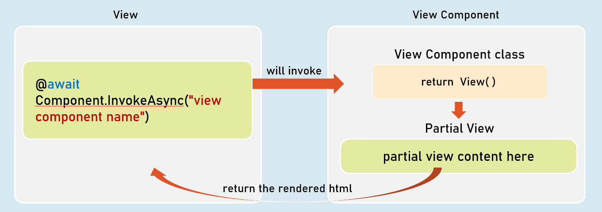
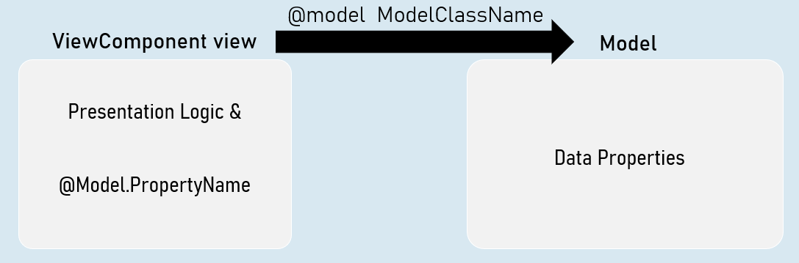
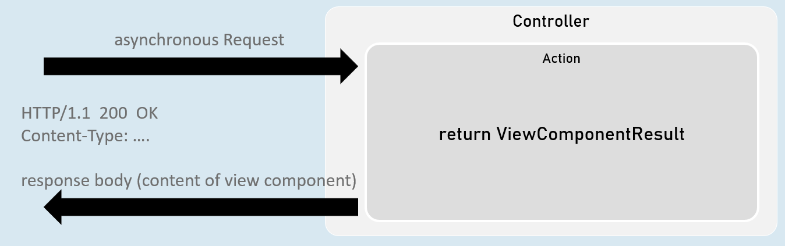

# View Components Cheat Shet
## View Components
View Component is a combination of a class (derived from Microsoft.AspNetCore.ViewComponent) that supplied data, and a partial view to render that data.





### Invoking View Component
```c#
@await Component.InvokeAsync("view component name");
--or--
<vc:view-component-name />
```

### View Components

- View component renders a chunk rather than a whole response.

- Includes the same separation-of-concerns and testability benefits found with a controller and view.

- Should be either suffixed with the word "ViewComponent" or should have [ViewComponent] attribute.

- Optionally, it can inherit from System.AspNetCore.Mvc.ViewComponent.


## View Components with ViewData
The ViewComponent class can share ViewData object to the ViewComponent view.


.png)


## Strongly Typed ViewComponent
Strongly Typed ViewComponent's view is tightly bound to a specified model class.

So, it gets all the benefits of a strongly typed view.




## ViewComponents with Parameters
You can supply one or more parameters to the view component class.

The parameters are received by InvokeAsync method of the view component class.

All the parameters of view component are mandatory (must supply a value).


## Invoking ViewComponent with parameters
```c#
@await Component.InvokeAsync("view component name", new { param = value });

-- or --

<vc:view-component-name param="value" />
```


## ViewComponentResult
ViewComponent can represent the content of a view component .

Generally useful to fetch view component's content into the browser, by making an asynchronous request (XMLHttpRequest / fetch request) from the browser.





```c#
return new ViewComponentResult() { ViewName = "view component name", Arguments = new { param1 = value, param2 = value } };
[or]
return ViewComponent("view component name", new { param1 = value, param2 = value } });
```