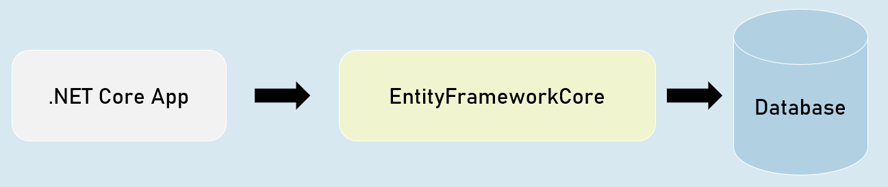
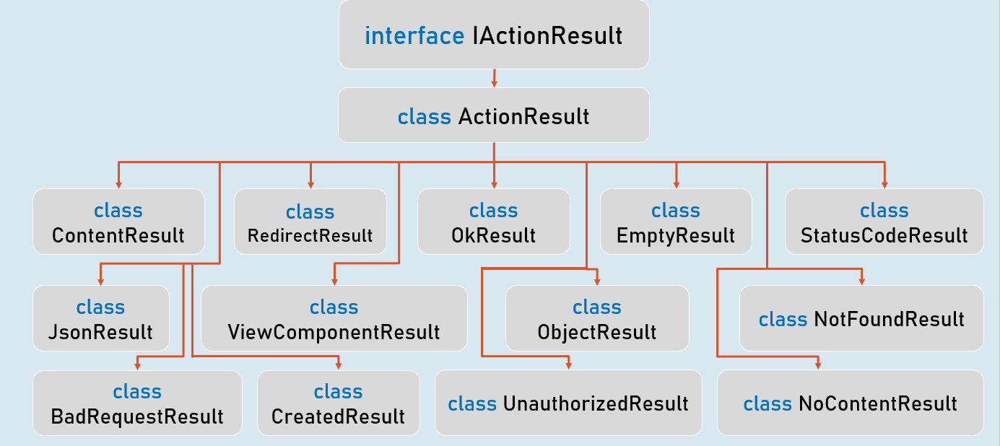

# ASP.NET Core Web API Section Cheat Sheet (PPT)
## Introduction to Web API
ASP.NET Core Web API is a component (part) of ASP.NET Core, which is used create HTTP-based RESTful services (also known as HTTP services) that can be consumed (invoked) by wide range of client applications such as single-page web applications, mobile applications etc.


## Asp.Net Core:

- Asp.Net Core MVC

- Asp.Net Core Web API

- Asp.Net Core Blazor

- Asp.Net Core Razor Pages


## RESTful / Web API Services
RESTful services (Representational State Transfer) is an architecture style that defines to create HTTP services that receives HTTP GET, POST, PUT, DELETE requests; perform CRUD operations on the appropriate data source; and returns JSON / XML data as response to the client.


## Web API Controllers
### Should be either or both:

- The class name should be suffixed with "Controller". Eg: ProductsController

- The [ApiController] attribute is applied to the same class or to its base class.


### Controller
```c#
[ApiController]
class ClassNameController
{
   //action methods here
}
```

### Optional:

- Is a public class.

- Inherited from Microsoft.AspNetCore.Mvc.ControllerBase.


## Introduction to EntityFrameworkCore
EntityFrameworkCore is light-weight, extensible and cross-platform framework for accessing databases in .NET applications.

It is the most-used database framework for Asp.Net Core Apps.




### EFCore Models


## Pros & Cons of EntityFrameworkCore
### 1. Shorter Code

The CRUD operations / calling stored procedures are done with shorter amount of code than ADO.NET.


### 2. Performance

EFCore performs slower than ADO.NET.

So ADO.NET or its alternatives (such as Dapper) are recommended for larger & high-traffic applications.


### 3. Strongly-Typed

The columns as created as properties in model class.


So the Intellisense offers columns of the table as properties, while writing the code.

Plus, the developer need not convert data types of values; it's automatically done by EFCore itself.


## ProblemDetails
### ProblemDetails
```c#
public class ProblemDetails
{
   string? Type { get; set; } //URI references that identifies the problem type
   string? Title { get; set; } //Summary of the problem type
   int? Status { get; set; } //HTTP response status code
   string? Detail { get; set; } //Explanation of the problem
}
```

### ValidationProblemDetails
```c#
public class ValidationProblemDetails : ProblemDetails
{
   string? Type { get; set; } //URI references that identifies the problem type
   string? Title { get; set; } //Summary of the problem type
   int? Status { get; set; } //HTTP response status code
   string? Detail { get; set; } //Explanation of the problem
   IDictionary<string, string[]> Errors { get; set; } //List of validation errors
}
```


## IActionResult [vs] ActionResult
### IActionResult
```c#
public interface IActionResult
{
   Task ExecuteResultAsync(ActionContext context); //converts an object into response
}
```

### ActionResult<T>
```c#
public sealed class ActionResult<T>
{
   IActionResult Convert(); //converts the object into ObjectResult
}
```


## IActionResult



## ObjectResult


# Interview Questions

## What is ASP.NET Web API?
It is a component of ASP.NET Core used to create RESTful HTTP services.
## How do you define a Web API controller in ASP.NET Web API?
Defining a Web API controller in ASP.NET Web API can be accomplished in two ways:
- Using the `[ApiController]` attribute in the class
- Using the `Controller` suffix in the class name e.j. `HomeController`
## Explain the basic syntax of a Web API controller.
- The controller name should be suffixed with the `Controller` word: `HomeController`
- The `[Route]` attribute must be defined in the controller-level attributes
- The `[ApiController]` attribute must be defined in the controller-level attributes 
## What are Action Results in ASP.NET Web API?

## What is the difference between IActionResult and ActionResult<T>?

## Explain the usage of the ProblemDetails class in ASP.NET Web API.

## Can you create a custom base class for Web API controllers? If so, how?

## How do you integrate Entity Framework Core with ASP.NET Web API?

## How can you return data from EF Core queries in Web API controller actions?

## What is the purpose of the ActionResult class in Web API?