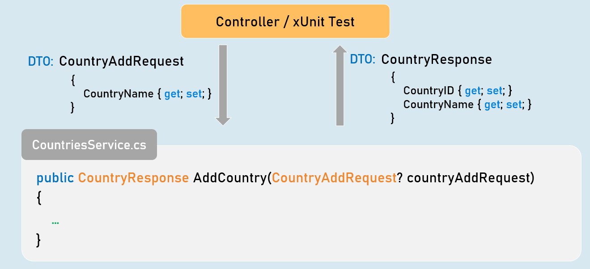
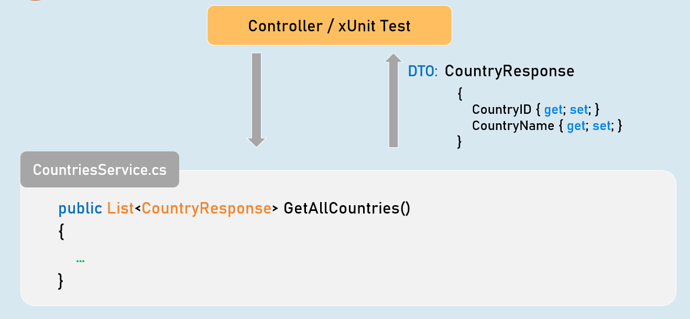
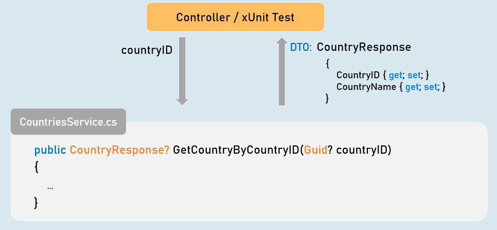
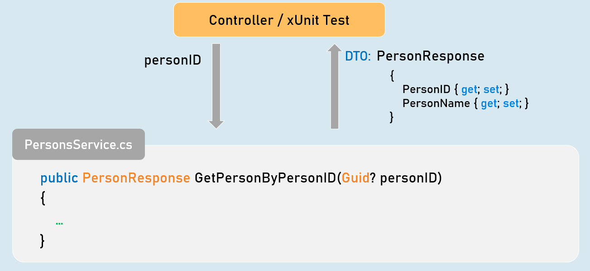
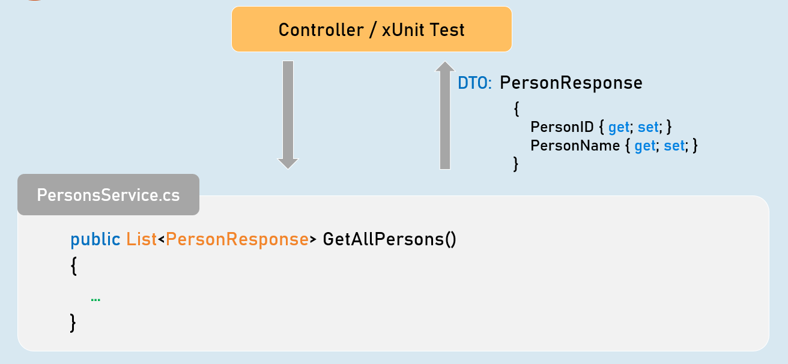
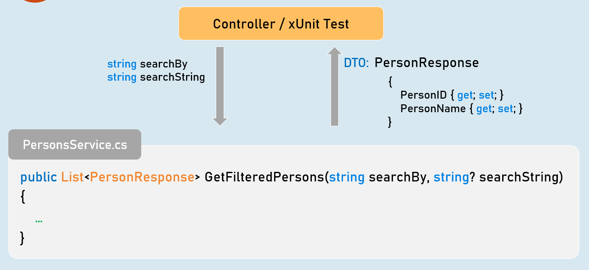
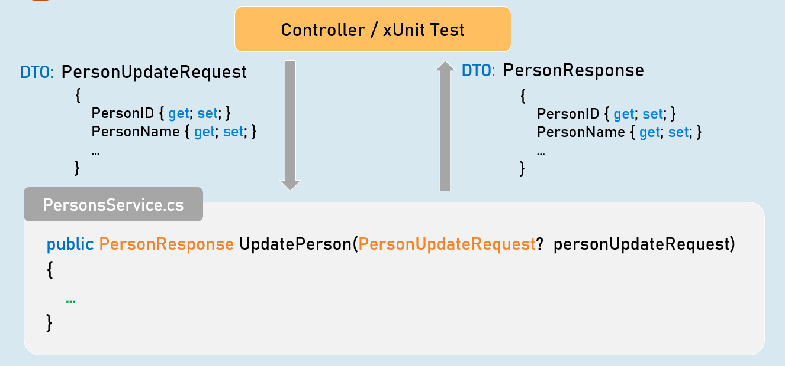
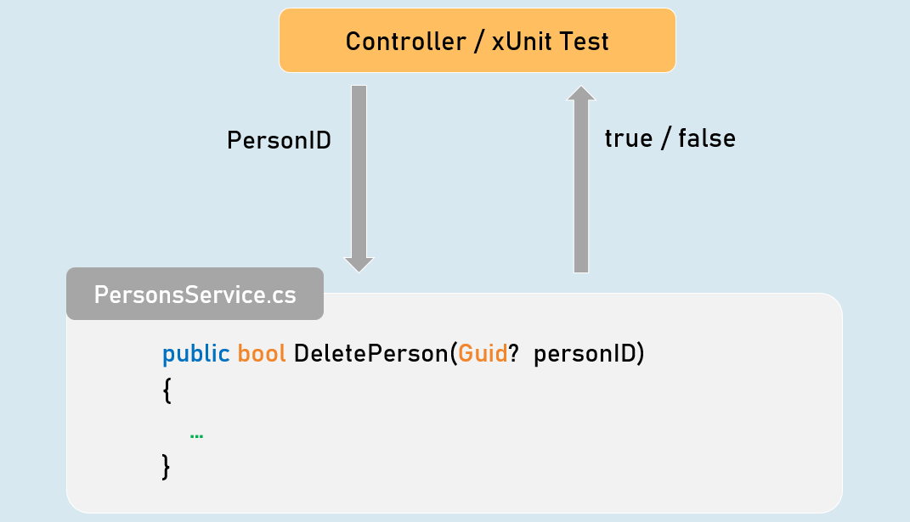

# XUnit Section CheatSheet 
## Introduction to xUnit
> xUnit is the free, open source unit testing tool for .NET Framework.

- Easy and extensible.

- Best to use with a mocking framework called "Moq".


Add Country - xUnit Test

```c#
public CountryResponse AddCountry(CountryAddRequest? countryAddRequest)
{
 //Check if "countryAddRequest" is not null.
 //Validate all properties of "countryAddRequest"
 //Convert "countryAddRequest" from "CountryAddRequest" type to "Country".
 //Generate a new CountryID
 //Then add it into List<Country>
 //Return CountryResponse object with generated CountryID
}
```


## Get All Countries - xUnit Test


```c#
public List<CountryResponse> GetAllCountries()
{
 //Convert all countries from "Country" type to "CountryResponse" type.
 //Return all CountryResponse objects
}
```


## Get Country by Country ID - xUnit Test


```c#
public CountryResponse? GetCountryByCountryID(Guid? countryID)
{
 //Check if "countryID" is not null.
 //Get matching country from List<Country> based countryID.
 //Convert matching country object from "Country" to "CountryResponse" type.
 //Return CountryResponse object
}
```


## Add Person - xUnit Test

![addperson(assets/addperson.png)

```c#
public PersonResponse AddPerson(PersonAddRequest? personAddRequest)
{
 //Check if "personAddRequest" is not null.
 //Validate all properties of "personAddRequest".
 //Convert "personAddRequest" from "PersonAddRequest" type to "Person".
 //Generate a new PersonID.
 //Then add it into List<Person>.
 //Return PersonResponse object with generated PersonID.
}
```


## Get Person by Person ID - xUnit Test


```c#
public PersonResponse GetPersonByPersonID(Guid? personID)
{
 //Check if "personID" is not null.
 //Get matching person from List<Person> based personID.
 //Convert matching person object from "Person" to "PersonResponse" type.
 //Return PersonResponse object
}
```


## Get All People - xUnit Test


```c#
public List<PersonResponse> GetAllPersons()
{
 //Convert all persons from "Person" type to "PersonResponse" type.
 //Return all PersonResponse objects
}
```


## Get Filtered People - xUnit Test


```c#
public List<PersonResponse> GetFilteredPersons(string searchBy, string? searchString)
{
 //Check if "searchBy" is not null.
 //Get matching persons from List<Person> based on given searchBy and searchString.
 //Convert the matching persons from "Person" type to "PersonResponse" type.
 //Return all matching PersonResponse objects
}
```


## Get Sorted People - xUnit Test


```c#
public List<PersonResponse> GetSortedPersons(List<PersonResponse> allPersons,
string sortBy, SortOrderEnum sortOrder)
{
 //Check if "sortBy" is not null.
 //Get sorted persons from "allPersons" based on given "sortBy" and "sortOrder".
 //Convert the sorted persons from "Person" type to "PersonResponse" type.
 //Return all sorted PersonResponse objects
}
```


## Update Person - xUnit Test


```c#
public PersonResponse UpdatePerson(PersonUpdateRequest? personUpdateRequest)
{
 //Check if "personUpdateRequest" is not null.
 //Validate all properties of "personUpdateRequest"
 //Get the matching "Person" object from List<Person> based on PersonID.
 //Check if matching "Person" object is not null
 //Update all details from "PersonUpdateRequest" object to "Person" object
 //Convert the person object from "Person" to "PersonResponse" type
 //Return PersonResponse object with updated details
}
```


## Delete Person - xUnit Test.


```c#
public bool DeletePerson(Guid? personID)
{
 //Check if "personID" is not null.
 //Get the matching "Person" object from List<Person> based on PersonID.
 //Check if matching "Person" object is not null
 //Delete the matching "Person" object from List<Person>
 //Return Boolean value indicating whether person object was deleted or not
}
}
```

# Interview Questinos 
## Tell some brief about Unit testing?
A unit test is a way to test a unit, the smallest code in a system that can logically be isolated. This is a function, a subroutine, a procedure, or a property in most programming languages. The single part of the definition is significant. The unit test should not test / access external data sources or external services other than the one that is being tested.

Author Michael Feathers says in his book “Working Effectively with Legacy Code” that tests are not unit tests when relying on external systems: “If you talk to the database, you talk through the network, touch the file system, you need a system configuration, or you cannot run it simultaneously with any other test.”
## Who can perform Unit Testing?
The developers usually perform unit testing during the development phase. At the same time, unit testing is usually done by automation engineers and QA experts if developers are occupied with other development tasks.


## What is TDD?
TDD is a development methodology which focuses on writing tests first, and then code to make those tests pass. This approach can help to ensure that your code is well-tested and of high quality.

	